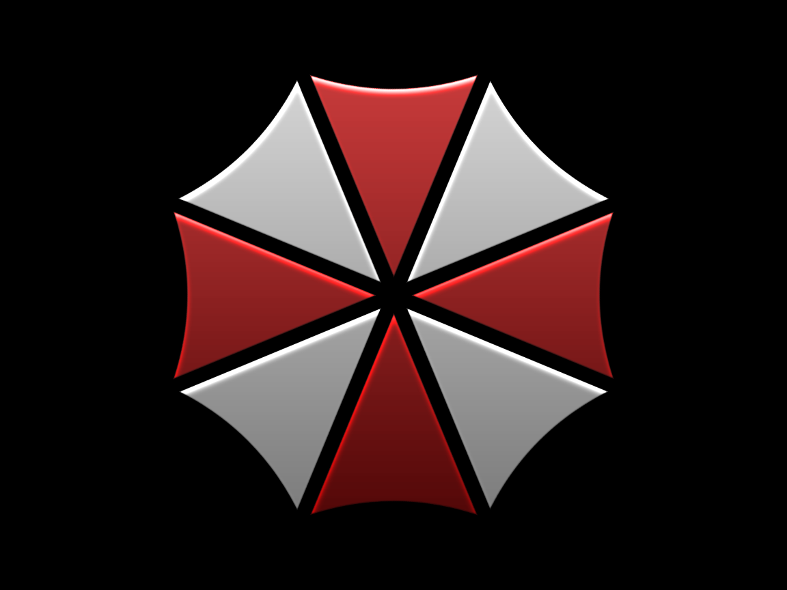
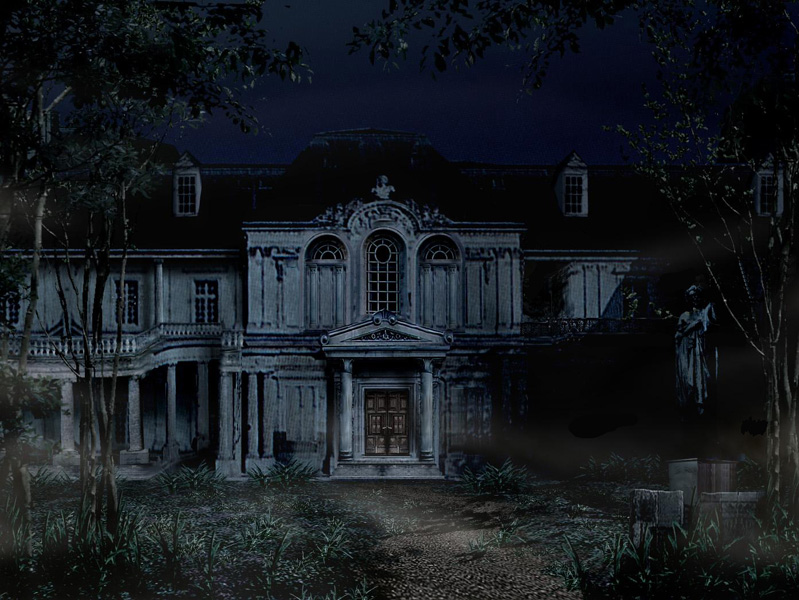
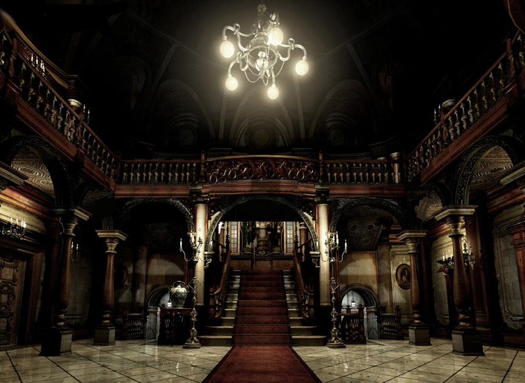
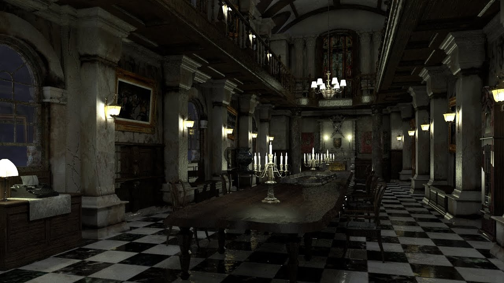

# Biohazard



## Summary

[Biohazard](https://tryhackme.com/room/biohazard "Biohazard CTF On TryHackMe") is a CTF hosted on the [TryHackMe website](https://tryhackme.com/ "TryHackMe Website") and created by the user [DesKel](https://tryhackme.com/p/DesKel "DesKel User Profile On TryHackMe").

This room requires basic knowledge of the following topics:

* Port scanning with tools like ```NMAP```.

* Viewing ```HTML``` Source Code.

* Decoding data from ```Base64```, ```Base58```, ```Base32```, ```Hexadecimal``` and ```Binary```.

* Deciphering ciphertexts from classical ciphers such as ```ROT13``` and ```Vigenere```.

* Retrieving files from an ```FTP``` server.

* Viewing a files strings with tools like the Linux ```strings``` command.

* Extracting hidden files from an image with tools like ```StegHide```.

* Viewing a files metadata with tools like ```ExifTool```.

* Carving embedded files out of an image with tools like ```BinWalk```.

* Decrypting a ```PGP``` file with a given passcode.

* Connecting to a remote server via ```SSH```.

* Linux commands such as ```ls -la```, ```cd```, ```cat```, ```strings```, ```su```, ```sudo```, ```whoami```.

[Back To Top](#biohazard "Jump To Top")

---

## Contents

* [Port Scanning](#port-scanning "Jump To Section")

* [Team Name](#team-name "Jump To Section")

* [Emblem Flag](#emblem-flag "Jump To Section")

* [Lock Pick Flag](#lock-pick-flag "Jump To Section")

* [Music Sheet Flag](#music-sheet-flag "Jump To Section")

* [Gold Emblem Flag](#gold-emblem-flag "Jump To Section")

* [Shield Key Flag](#shield-key-flag "Jump To Section")

* [Blue Gem Flag](#blue-gem-flag "Jump To Section")

* [FTP Username](#ftp-username "Jump To Section")

* [FTP Password](#ftp-password "Jump To Section")

* [Hidden Directory](#hidden-directory "Jump To Section")

* [Encrypted File Password](#encrypted-file-password "Jump To Section")

* [Helmet Key Flag](#helmet-key-flag "Jump To Section")

* [SSH Username](#ssh-username "Jump To Section")

* [SSH Password](#ssh-password "Jump To Section")

* [Bravo Team Leader](#bravo-team-leader "Jump To Section")

* [Chris Location](#chris-location "Jump To Section")

* [Traitor](#traitor "Jump To Section")

* [Traitors Password](#traitors-password "Jump To Section")

* [Ultimate Form Name](#ultimate-form-name "Jump To Section")

* [Root Flag](#root-flag "Jump To Section")

[Back To Top](#biohazard "Jump To Top")

---

## Port Scanning

As always we can start of by doing a port scan of the target machine by using ```nmap``` in aggressive mode (```-A```).

```
$ nmap -A <IP_Address>

Nmap scan report for <IP_Address>
Host is up (0.16s latency).
Not shown: 997 closed ports
PORT   STATE SERVICE VERSION
21/tcp open  ftp     vsftpd 3.0.3
22/tcp open  ssh     OpenSSH 7.6p1 Ubuntu 4ubuntu0.3 (Ubuntu Linux; protocol 2.0)
80/tcp open  http    Apache httpd 2.4.29 ((Ubuntu))
|_http-server-header: Apache/2.4.29 (Ubuntu)
|_http-title: Beginning of the end
Service Info: OSs: Unix, Linux; CPE: cpe:/o:linux:linux_kernel

Nmap done: 1 IP address (1 host up) scanned in 21.08 seconds
```

After running the port scan we'll see three open ports.

* ```PORT 21``` -FTP (File Transfer Protocol)

* ```PORT 22``` - SSH (Secure Shell)

* ```PORT 80``` - HTTP (HyperText Transfer Protocol)

Seeing as how the ```FTP``` server doesn't allow for anonymous login and we don't have credentials for remote login via ```SSH```, our next step is to check the website at port 80.

[Back To Top](#biohazard "Jump To Top")

---
## Team Name



Upon visiting the website we'll be greeted with the following text:

> July 1998, Evening

> The STARS alpha team, Chris, Jill, Barry, Weasker and Joseph is in the operation on searching the STARS bravo team in the nortwest of Racoon city.

> Unfortunately, the team was attacked by a horde of infected zombie dog. Sadly, Joseph was eaten alive.

> The team decided to run for the nearby mansion and the nightmare begin..........

Here is where we'll find the team name asked for:

```STARS alpha team```

We can also see a link to the next step in the CTF.

```http://<IP_Address>/mansionmain/```

[Back To Top](#biohazard "Jump To Top")

---

## Emblem Flag



Navigating to ```http://<IP_Address>/mansionmain/``` and viewing the ```HTML``` source code we'll find a clue in the form of a comment:

```html
<!-- It is in the /diningRoom/ -->
```



Visiting ```http://<IP_Address>/diningRoom/``` we'll find a clickable link to get an emblem. Clicking on the link will redirect us to ```http://<IP_Address>/diningRoom/emblem.php```, where we'll see the following text:

> emblem{fec832623ea498e20bf4fe1821d58727}

> Look like you can put something on the emblem slot, refresh /diningRoom/

Although this emblem is the first flag for this CTF section, trying to use it in the input we get when we refresh ```/diningRoom``` we'll see that it does not work and we get the following error message:

> Nothing happen

This comes into play later, for now it's not important.

```emblem{fec832623ea498e20bf4fe1821d58727}```

While we're on the ```/diningRoom``` page we should also check the ```HTML``` source code for our next clue.

[Back To Top](#biohazard "Jump To Top")

---

## Lock Pick Flag

Viewing the ```HTML``` source code for ```http://<IP_Address>/diningRoom/```, we'll find the following comment:

```html
<!-- SG93IGFib3V0IHRoZSAvdGVhUm9vbS8= -->
```

Decoding this from ```Base 64```, we'll see the following message:

> How about the /teaRoom/

[Back To Top](#biohazard "Jump To Top")

---

## Music Sheet Flag


[Back To Top](#biohazard "Jump To Top")

---

## Gold Emblem Flag


[Back To Top](#biohazard "Jump To Top")

---

## Shield Key Flag


[Back To Top](#biohazard "Jump To Top")

---

## Blue Gem Flag


[Back To Top](#biohazard "Jump To Top")

---

## FTP Username


[Back To Top](#biohazard "Jump To Top")

---

## FTP Password


[Back To Top](#biohazard "Jump To Top")

---

## Hidden Directory


[Back To Top](#biohazard "Jump To Top")

---

## Encrypted File Password


[Back To Top](#biohazard "Jump To Top")

---

## Helmet Key Flag


[Back To Top](#biohazard "Jump To Top")

---

## SSH Username


[Back To Top](#biohazard "Jump To Top")

---

## SSH Password


[Back To Top](#biohazard "Jump To Top")

---

## Bravo Team Leader


[Back To Top](#biohazard "Jump To Top")

---

## Chris Location


[Back To Top](#biohazard "Jump To Top")

---

## Traitor


[Back To Top](#biohazard "Jump To Top")

---

## Traitor's Password


[Back To Top](#biohazard "Jump To Top")

---

## Ultimate Form Name


[Back To Top](#biohazard "Jump To Top")

---

## Root Flag


[Back To Top](#biohazard "Jump To Top")
