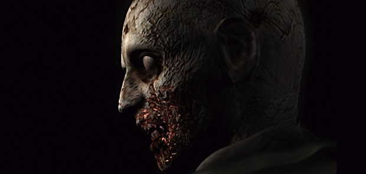
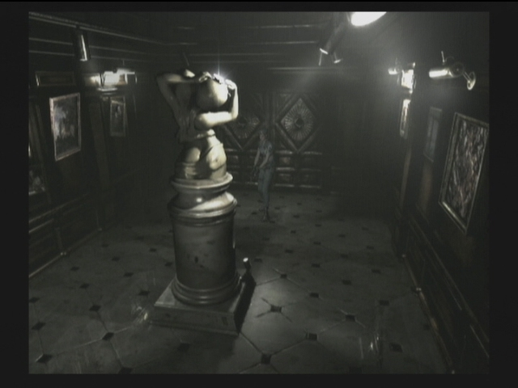
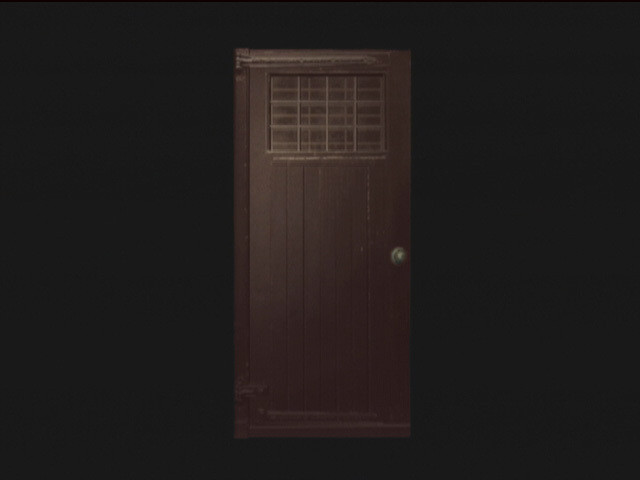
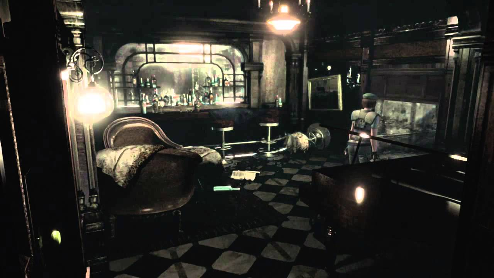
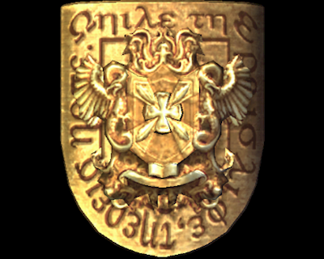
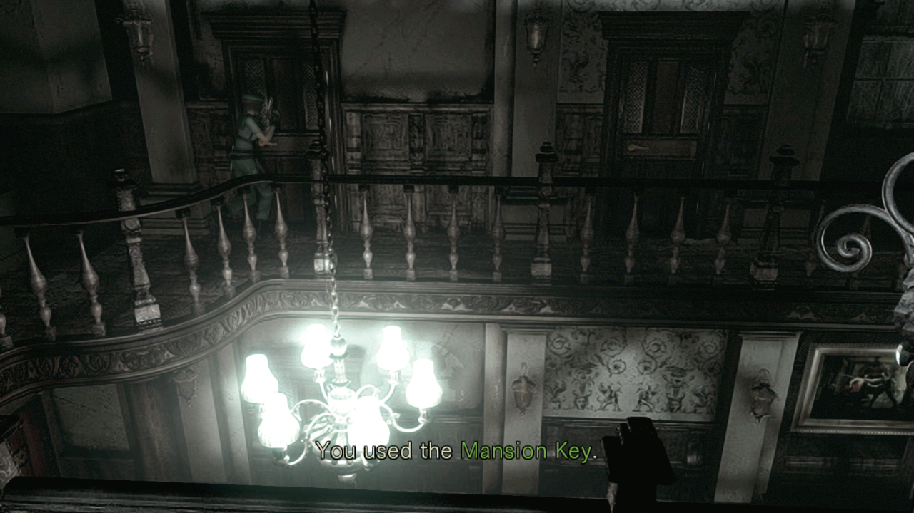
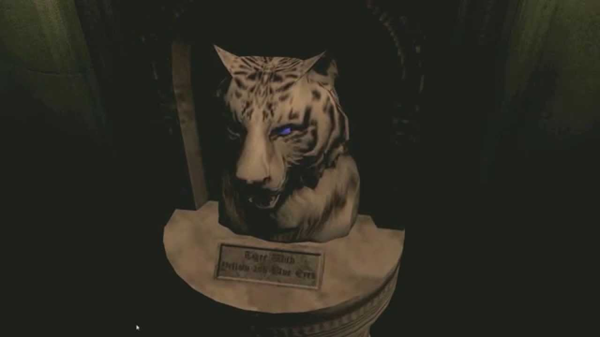
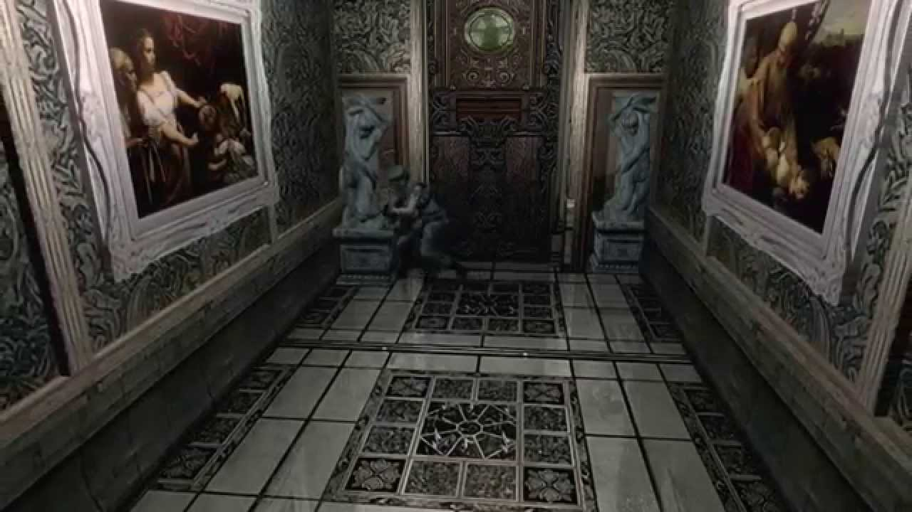
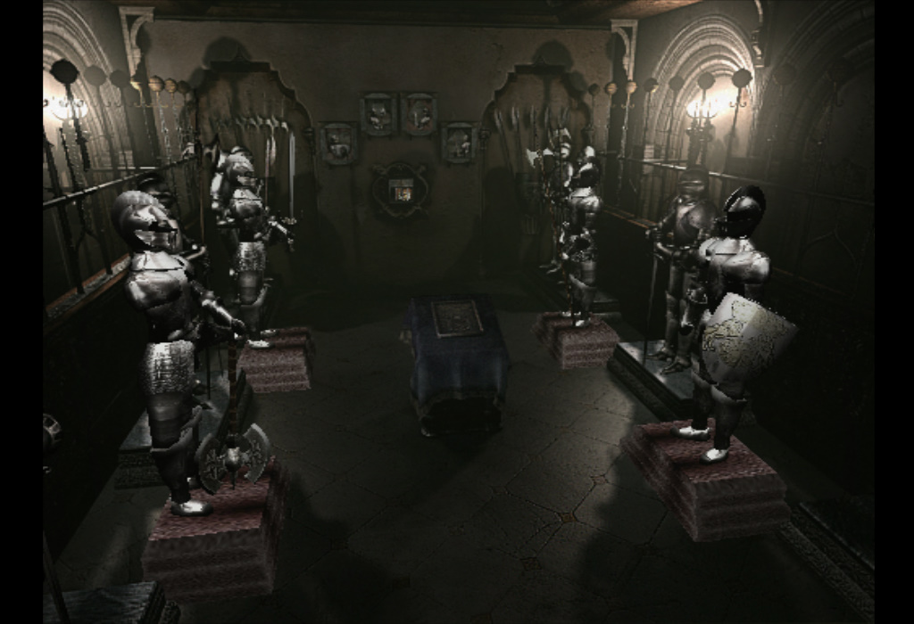
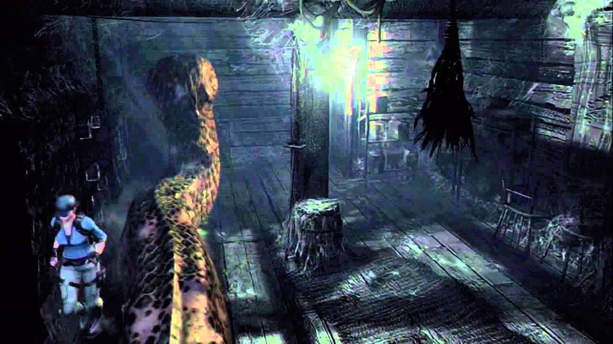

# Biohazard


## Summary

[Biohazard](https://tryhackme.com/room/biohazard "Biohazard CTF On TryHackMe") is a CTF hosted on the [TryHackMe website](https://tryhackme.com/ "TryHackMe Website") and created by the user [DesKel](https://tryhackme.com/p/DesKel "DesKel User Profile On TryHackMe").

This room requires basic knowledge of the following topics:

* Port scanning with tools like ```NMAP```.

* Viewing ```HTML``` Source Code.

* Decoding data from ```Base64```, ```Base58```, ```Base32```, ```Hexadecimal``` and ```Binary```.

* Deciphering ciphertexts from classical ciphers such as ```ROT13``` and ```Vigenere```.

* Retrieving files from an ```FTP``` server.

* Viewing a files strings with tools like the Linux ```strings``` command.

* Extracting hidden files from an image with tools like ```StegHide```.

* Viewing a files metadata with tools like ```ExifTool```.

* Carving embedded files out of an image with tools like ```BinWalk```.

* Decrypting a ```PGP``` file with a given passcode.

* Connecting to a remote server via ```SSH```.

* Linux commands such as ```ls -la```, ```cd```, ```cat```, ```strings```, ```su```, ```sudo```, ```whoami```.

[Back To Top](#biohazard "Jump To Top")

---

## Contents

* [Port Scanning](#port-scanning "Jump To Section")

* [Team Name](#team-name "Jump To Section")

* [Emblem Flag](#emblem-flag "Jump To Section")

* [Lock Pick Flag](#lock-pick-flag "Jump To Section")

* [Music Sheet Flag](#music-sheet-flag "Jump To Section")

* [Gold Emblem Flag](#gold-emblem-flag "Jump To Section")

* [Shield Key Flag](#shield-key-flag "Jump To Section")

* [Blue Gem Flag](#blue-gem-flag "Jump To Section")

* [FTP Username](#ftp-username "Jump To Section")

* [FTP Password](#ftp-password "Jump To Section")

* [Hidden Directory](#hidden-directory "Jump To Section")

* [Encrypted File Password](#encrypted-file-password "Jump To Section")

* [Helmet Key Flag](#helmet-key-flag "Jump To Section")

* [SSH Username](#ssh-username "Jump To Section")

* [SSH Password](#ssh-password "Jump To Section")

* [Bravo Team Leader](#bravo-team-leader "Jump To Section")

* [Chris Location](#chris-location "Jump To Section")

* [Traitor](#traitor "Jump To Section")

* [Traitors Password](#traitors-password "Jump To Section")

* [Ultimate Form Name](#ultimate-form-name "Jump To Section")

* [Root Flag](#root-flag "Jump To Section")

[Back To Top](#biohazard "Jump To Top")

---

## Port Scanning

As always we can start of by doing a port scan of the target machine by using ```nmap``` in aggressive mode (```-A```).

```
$ nmap -A <IP_Address>

Nmap scan report for <IP_Address>
Host is up (0.16s latency).
Not shown: 997 closed ports
PORT   STATE SERVICE VERSION
21/tcp open  ftp     vsftpd 3.0.3
22/tcp open  ssh     OpenSSH 7.6p1 Ubuntu 4ubuntu0.3 (Ubuntu Linux; protocol 2.0)
80/tcp open  http    Apache httpd 2.4.29 ((Ubuntu))
|_http-server-header: Apache/2.4.29 (Ubuntu)
|_http-title: Beginning of the end
Service Info: OSs: Unix, Linux; CPE: cpe:/o:linux:linux_kernel

Nmap done: 1 IP address (1 host up) scanned in 21.08 seconds
```

After running the port scan we'll see three open ports.

* ```PORT 21``` -FTP (File Transfer Protocol)

* ```PORT 22``` - SSH (Secure Shell)

* ```PORT 80``` - HTTP (HyperText Transfer Protocol)

Seeing as how the ```FTP``` server doesn't allow for anonymous login and we don't have credentials for remote login via ```SSH```, our next step is to check the website at port 80.

[Back To Top](#biohazard "Jump To Top")

---
## Team Name


Upon visiting the website we'll be greeted with the following text:

> July 1998, Evening

> The STARS alpha team, Chris, Jill, Barry, Weasker and Joseph is in the operation on searching the STARS bravo team in the nortwest of Racoon city.

> Unfortunately, the team was attacked by a horde of infected zombie dog. Sadly, Joseph was eaten alive.

> The team decided to run for the nearby mansion and the nightmare begin..........

Here is where we'll find the team name asked for:

```STARS alpha team```

We can also see a link to the next step in the CTF.

```http://<IP_Address>/mansionmain/```

[Back To Top](#biohazard "Jump To Top")

---

## Emblem Flag


Navigating to ```http://<IP_Address>/mansionmain/``` and viewing the ```HTML``` source code we'll find a clue in the form of a comment:

```html
<!-- It is in the /diningRoom/ -->
```


Visiting ```http://<IP_Address>/diningRoom/``` we'll find a clickable link to get an emblem. Clicking on the link will redirect us to ```http://<IP_Address>/diningRoom/emblem.php```, where we'll see the following text:

> emblem{fec832623ea498e20bf4fe1821d58727}

> Look like you can put something on the emblem slot, refresh /diningRoom/

Although this emblem is the first flag for this CTF section, trying to use it in the input we get when we refresh ```/diningRoom``` we'll see that it does not work and we get the following error message:

> Nothing happen

This comes into play later, for now it's not important.

```emblem{fec832623ea498e20bf4fe1821d58727}```

While we're on the ```/diningRoom``` page we should also check the ```HTML``` source code for our next clue.

[Back To Top](#biohazard "Jump To Top")

---

## Lock Pick Flag



Viewing the ```HTML``` source code for ```http://<IP_Address>/diningRoom/```, we'll find the following comment:

```html
<!-- SG93IGFib3V0IHRoZSAvdGVhUm9vbS8= -->
```

Decoding this from ```Base 64```, we'll see the following message:

> How about the /teaRoom/

Once we visit the tea room at  ```http://<IP_Address>/teaRoom/``` we'll see a link that leads to  ```http://<IP_Address>/teaRoom/master_of_unlock.html```. Clicking the link will lead us to the following Lock Pick flag:

```lock_pick{037b35e2ff90916a9abf99129c8e1837}```

We'll also see the following text, letting us know that our next stop should be the art room:

> Barry also suggested that Jill should visit the /artRoom/

[Back To Top](#biohazard "Jump To Top")

---

## Music Sheet Flag



Visiting the art room at ```http://<IP_Address>/artRoom/```, we'll see a link to ```http://<IP_Address>/artRoom/MansionMap.html```. Clicking the link we'll see a site map with the following directories:

* ```/diningRoom/```

* ```/teaRoom/```

* ```/artRoom/```

* ```/barRoom/```

* ```/diningRoom2F/```

* ```/tigerStatusRoom/```

* ```/galleryRoom/```

* ```/studyRoom/```

* ```/armorRoom/```

* ```/attic/```

Checking out the bar room at ```http://<IP_Address>/barRoom/``` we'll be met with an image of a door and an input where we can use the lock pick flag we found in the last section of this writeup.



After opening the door with ```lock_pick{037b35e2ff90916a9abf99129c8e1837}```, we'll be redirected to the actual bar room at ```http://<IP_Address>/barRoom357162e3db904857963e6e0b64b96ba7/```.



Once we're inside the bar room, we'll find another input that expects a flag. We'll also see a link to ```http://<IP_Address>/barRoom357162e3db904857963e6e0b64b96ba7/musicNote.html```. Following the link, we'll see the following string:

```NV2XG2LDL5ZWQZLFOR5TGNRSMQ3TEZDFMFTDMNLGGVRGIYZWGNSGCZLDMU3GCMLGGY3TMZL5```

Decoding the string above from Base 32 will reveal the following flag that we can use in the input for the bar room:

```music_sheet{362d72deaf65f5bdc63daece6a1f676e}```

After we've submitted the flag for the bar room, we'll be redirected to the hidden bar room at ```http://<IP_Address>/barRoom357162e3db904857963e6e0b64b96ba7/barRoomHidden.php```.

[Back To Top](#biohazard "Jump To Top")

---

## Gold Emblem Flag



Once we've been redirected from the bar room to the secret bar room at ```http://<IP_Address>/barRoom357162e3db904857963e6e0b64b96ba7/barRoomHidden.php``` we'll see a link to collect the gold emblem at ```http://<IP_Address>/barRoom357162e3db904857963e6e0b64b96ba7/gold_emblem.php```.

```gold_emblem{58a8c41a9d08b8a4e38d02a4d7ff4843}```

[Back To Top](#biohazard "Jump To Top")

---

## Shield Key Flag

After collecting the gold emblem and refreshing the page for the hidden bar room, you'll notice that the emblem is not accepted and instead we get the following error message:

> Nothing happen

This is the same error message we got after trying to input the first emblem into the page at ```http://<IP_Address>/diningRoom/```. If we try switching the emblems we'll see that they're accepted.

For the page at ```http://<IP_Address>/barRoom357162e3db904857963e6e0b64b96ba7/barRoomHidden.php``` we'll use the first emblem:

```emblem{fec832623ea498e20bf4fe1821d58727}```

Which gives us the name ```rebecca```.

For the page back at ```http://<IP_Address>/diningRoom/```, we'll use the gold emblem:

```gold_emblem{58a8c41a9d08b8a4e38d02a4d7ff4843}```

Which gives us the following string:

```klfvg ks r wimgnd biz mpuiui ulg fiemok tqod. Xii jvmc tbkg ks tempgf tyi_hvgct_jljinf_kvc```

Decrypting the above string using the [Vigenere cipher](https://en.wikipedia.org/wiki/Vigen%C3%A8re_cipher "WikiPedia Page For Vigenere Cipher") with the name we found earlier (```rebecca```), will reveal the following text:

```there is a shield key inside the dining room. The html page is called the_great_shield_key```

Visiting the page referenced in the decrypted message will lead us to ```http://<IP_Address>/diningRoom/the_great_shield_key.html```, where we'll find the following flag:

```shield_key{48a7a9227cd7eb89f0a062590798cbac}```

[Back To Top](#biohazard "Jump To Top")

---

## Blue Gem Flag



Moving onto the directory ```/diningRoom2F/``` and viewing the ```HTML``` source code for the page we'll find the following comment:

```html
<!-- Lbh trg gur oyhr trz ol chfuvat gur fgnghf gb gur ybjre sybbe. Gur trz vf ba gur qvavatEbbz svefg sybbe. Ivfvg fnccuver.ugzy -->
```

Deciphering the above text from [ROT 13](https://en.wikipedia.org/wiki/ROT13 "Wikipedia Page For ROT 13") reveals the following text:

> You get the blue gem by pushing the status to the lower floor. The gem is on the diningRoom first floor. Visit sapphire.html

Following the page referenced in the decrypted text will lead us to ```http://<IP_Address>/diningRoom/sapphire.html```, where we'll find the following flag:

```blue_jewel{e1d457e96cac640f863ec7bc475d48aa}```

[Back To Top](#biohazard "Jump To Top")

---

## FTP Username



Moving onto the ```/tigerStatusRoom/``` directory we'll see an input that expects a blue gem for the tiger statue, the same gem we just found in the [Blue Gem section](#blue-gem-flag "Blue Gem Section") of this writeup.

```blue_jewel{e1d457e96cac640f863ec7bc475d48aa}```

After placing the blue gem into the input we'll be redirected to ```http://<IP_Address>/tigerStatusRoom/gem.php```, where we'll see the following text:

> crest 1:

> S0pXRkVVS0pKQkxIVVdTWUpFM0VTUlk9

> Hint 1: Crest 1 has been encoded twice

> Hint 2: Crest 1 contanis 14 letters

> Note: You need to collect all 4 crests, combine and decode to reavel another path

> The combination should be crest 1 + crest 2 + crest 3 + crest 4. Also, the combination is a type of encoded base and you need to decode it

Taking the string ```S0pXRkVVS0pKQkxIVVdTWUpFM0VTUlk9``` and decoding it from ```Base 64``` results in the string ```KJWFEUKJJBLHUWSYJE3ESRY=``` which can be decoded once again from ```Base 32``` to reveal the first of four crests.

* CREST 1: ```RlRQIHVzZXI6IG```

Now we just need the other 3 crests.



Our next stop is the ```/galleryRoom/``` where we'll find a link that leads to ```http://<IP_Address>/galleryRoom/note.txt```, where we'll find the following text:

> crest 2:

> GVFWK5KHK5WTGTCILE4DKY3DNN4GQQRTM5AVCTKE

> Hint 1: Crest 2 has been encoded twice

> Hint 2: Crest 2 contanis 18 letters

> Note: You need to collect all 4 crests, combine and decode to reavel another path

> The combination should be crest 1 + crest 2 + crest 3 + crest 4. Also, the combination is a type of encoded base and you need to decode it

Decoding the string ```GVFWK5KHK5WTGTCILE4DKY3DNN4GQQRTM5AVCTKE``` from ```Base 32``` results in the string ```5KeuGWm3LHY85cckxhB3gAQMD``` which can be decoded again from ```Base 58``` to reveal the second of four crests.

* CREST 2: ```h1bnRlciwgRlRQIHBh```

Now we need to find the last two crests.


For now we'll have to skip the ```/studyRoom/``` directory and head to the ```/armorRoom/```. After navigating to ```http://<IP_Address/armorRoom/``` we'll see text that tells us that the door for the armor room is engraved with a shield symbol. So we'll have to use the shield key we obtained in the [Shield Key section](#shield-key-flag "Shield Key Section") of this writeup as the input for this page.

```shield_key{48a7a9227cd7eb89f0a062590798cbac}```



Once we've opened the door we'll be redirected to the armor room at ```http://<IP_Address>/armorRoom547845982c18936a25a9b37096b21fc1/``` where we'll find a link that leads to ```http://<IP_Address>/armorRoom547845982c18936a25a9b37096b21fc1/note.txt```. Following this link we'll see the following text:

> crest 3:

> MDAxMTAxMTAgMDAxMTAwMTEgMDAxMDAwMDAgMDAxMTAwMTEgMDAxMTAwMTEgMDAxMDAwMDAgMDAxMTAxMDAgMDExMDAxMDAgMDAxMDAwMDAgMDAxMTAwMTEgMDAxMTAxMTAgMDAxMDAwMDAgMDAxMTAxMDAgMDAxMTEwMDEgMDAxMDAwMDAgMDAxMTAxMDAgMDAxMTEwMDAgMDAxMDAwMDAgMDAxMTAxMTAgMDExMDAwMTEgMDAxMDAwMDAgMDAxMTAxMTEgMDAxMTAxMTAgMDAxMDAwMDAgMDAxMTAxMTAgMDAxMTAxMDAgMDAxMDAwMDAgMDAxMTAxMDEgMDAxMTAxMTAgMDAxMDAwMDAgMDAxMTAwMTEgMDAxMTEwMDEgMDAxMDAwMDAgMDAxMTAxMTAgMDExMDAwMDEgMDAxMDAwMDAgMDAxMTAxMDEgMDAxMTEwMDEgMDAxMDAwMDAgMDAxMTAxMDEgMDAxMTAxMTEgMDAxMDAwMDAgMDAxMTAwMTEgMDAxMTAxMDEgMDAxMDAwMDAgMDAxMTAwMTEgMDAxMTAwMDAgMDAxMDAwMDAgMDAxMTAxMDEgMDAxMTEwMDAgMDAxMDAwMDAgMDAxMTAwMTEgMDAxMTAwMTAgMDAxMDAwMDAgMDAxMTAxMTAgMDAxMTEwMDA=

> Hint 1: Crest 3 has been encoded three times

> Hint 2: Crest 3 contanis 19 letters

> Note: You need to collect all 4 crests, combine and decode to reavel another path

> The combination should be crest 1 + crest 2 + crest 3 + crest 4. Also, the combination is a type of encoded base and you need to decode it

The string within the above text can be decoded from ```Base 64``` which results in the following ```binary```:

```
00110110 00110011 00100000 00110011 00110011 00100000 00110100 01100100 00100000 00110011 00110110 00100000 00110100 00111001 00100000 00110100 00111000 00100000 00110110 01100011 00100000 00110111 00110110 00100000 00110110 00110100 00100000 00110101 00110110 00100000 00110011 00111001 00100000 00110110 01100001 00100000 00110101 00111001 00100000 00110101 00110111 00100000 00110011 00110101 00100000 00110011 00110000 00100000 00110101 00111000 00100000 00110011 00110010 00100000 00110110 00111000
```

The binary when decoded reveals the following ```hexadecimal``` encoded string:

```63 33 4d 36 49 48 6c 76 64 56 39 6a 59 57 35 30 58 32 68```

The final decode reveals the third of four crests.

* CREST 3: ```c3M6IHlvdV9jYW50X2h```

On our search for the last crest we'll need to stop by the ```/attic/```.


After navigating to ```http://<IP_Address>/attic/``` we'll find another locked door. Once again, this door has been engraved with a shield symbol so we'll have to use the key we obtained in the [Shield Key section](#shield-key-flag "Shield Key Section") of this writeup as the input for this page.

```shield_key{48a7a9227cd7eb89f0a062590798cbac}```

After opening the door with the shield key we'll be redirected to the attic at ```http://<IP_Address>/attic909447f184afdfb352af8b8a25ffff1d/```.



Once we've made our way into the attic we'll see a link that leads to ```http://<IP_Address>/attic909447f184afdfb352af8b8a25ffff1d/note.txt```, where we'll find the following text:

> crest 4:

> gSUERauVpvKzRpyPpuYz66JDmRTbJubaoArM6CAQsnVwte6zF9J4GGYyun3k5qM9ma4s

> Hint 1: Crest 2 has been encoded twice

> Hint 2: Crest 2 contanis 17 characters

> Note: You need to collect all 4 crests, combine and decode to reavel another path

> The combination should be crest 1 + crest 2 + crest 3 + crest 4. Also, the combination is a type of encoded base and you need to decode it

The string ```gSUERauVpvKzRpyPpuYz66JDmRTbJubaoArM6CAQsnVwte6zF9J4GGYyun3k5qM9ma4s``` can be decoded from ```Base 58``` which results in the string ```70 5a 47 56 66 5a 6d 39 79 5a 58 5a 6c 63 67 3d 3d```  which can be decoded again from ```hexadecimal``` to reveal the final crest.

* Crest 4: ```pZGVfZm9yZXZlcg==```

Now that we've collected the final crest, we're left with the following four pieces:

* Crest 1: ```RlRQIHVzZXI6IG```

* Crest 2: ```h1bnRlciwgRlRQIHBh```

* Crest 3: ```c3M6IHlvdV9jYW50X2h```

* Crest 4: ```pZGVfZm9yZXZlcg==```

Putting the pieces together we'll be left with the following assembled crest:

```RlRQIHVzZXI6IGh1bnRlciwgRlRQIHBhc3M6IHlvdV9jYW50X2hpZGVfZm9yZXZlcg==```

Decoding the crest reveals the following message:

```FTP user: hunter, FTP pass: you_cant_hide_forever```

With that, we've finally found our ```FTP``` username and password.

* FTP User - ```hunter```

[Back To Top](#biohazard "Jump To Top")

---

## FTP Password

In the above section of this writeup, titled [FTP Username](#ftp-username "FTP Username Section"), it took a long time but we finally collected the following four crests:

* Crest 1: ```RlRQIHVzZXI6IG```

* Crest 2: ```h1bnRlciwgRlRQIHBh```

* Crest 3: ```c3M6IHlvdV9jYW50X2h```

* Crest 4: ```pZGVfZm9yZXZlcg==```

When placed together, the following ```Base 64``` encoded string was revealed:

```RlRQIHVzZXI6IGh1bnRlciwgRlRQIHBhc3M6IHlvdV9jYW50X2hpZGVfZm9yZXZlcg==```

After decoding the string, the username and password for the ```FTP``` server was revealed.

```FTP user: hunter, FTP pass: you_cant_hide_forever```

[Back To Top](#biohazard "Jump To Top")

---

## Hidden Directory


[Back To Top](#biohazard "Jump To Top")

---

## Encrypted File Password


[Back To Top](#biohazard "Jump To Top")

---

## Helmet Key Flag


[Back To Top](#biohazard "Jump To Top")

---

## SSH Username


[Back To Top](#biohazard "Jump To Top")

---

## SSH Password


[Back To Top](#biohazard "Jump To Top")

---

## Bravo Team Leader


[Back To Top](#biohazard "Jump To Top")

---

## Chris Location


[Back To Top](#biohazard "Jump To Top")

---

## Traitor


[Back To Top](#biohazard "Jump To Top")

---

## Traitor's Password


[Back To Top](#biohazard "Jump To Top")

---

## Ultimate Form Name


[Back To Top](#biohazard "Jump To Top")

---

## Root Flag


[Back To Top](#biohazard "Jump To Top")
