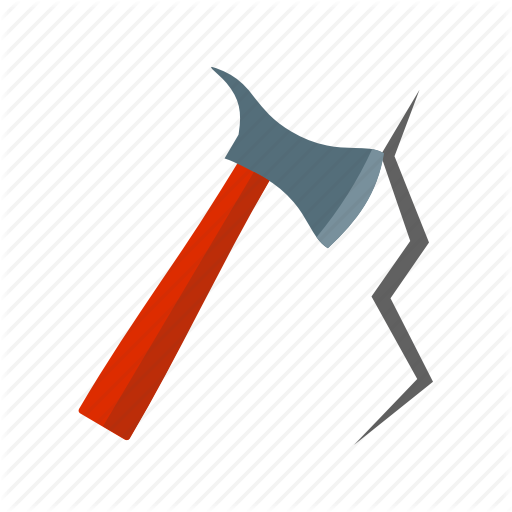

# Break It

---

## Summary

[Break It](https://tryhackme.com/room/breakit "Break It CTF On TryHackMe") is a CTF hosted on [TryHackMe](https://tryhackme.com/ "TryHackMe") and created by [DesKel](https://tryhackme.com/p/DesKel "DesKel's TryHackMe Profile"). This room requires knowledge of bases, ciphers, and bit shifts.

## Contents

* Bases

    * Super Easy

    * Easy

    * Moderate

    * Hard

    * Insane

* Bases And Ciphers

    * Easy

    * Moderate

    * Hard

    * Insane

* Bases, Ciphers, and Bit Shifts

    * Moderate

    * Hard

    * Insane

---

## Bases

### Super Easy

[Back To Top](#break-it "Jump To Top")

### Easy

[Back To Top](#break-it "Jump To Top")

### Moderate

[Back To Top](#break-it "Jump To Top")

### Hard

[Back To Top](#break-it "Jump To Top")

### Insane

[Back To Top](#break-it "Jump To Top")

---

## Bases And Ciphers

### Easy

[Back To Top](#break-it "Jump To Top")

### Moderate

[Back To Top](#break-it "Jump To Top")

### Hard

[Back To Top](#break-it "Jump To Top")

### Insane

[Back To Top](#break-it "Jump To Top")

---

## Bases, Ciphers, and Bit Shifts

### Moderate

[Back To Top](#break-it "Jump To Top")

### Hard

[Back To Top](#break-it "Jump To Top")

### Insane

[Back To Top](#break-it "Jump To Top")
