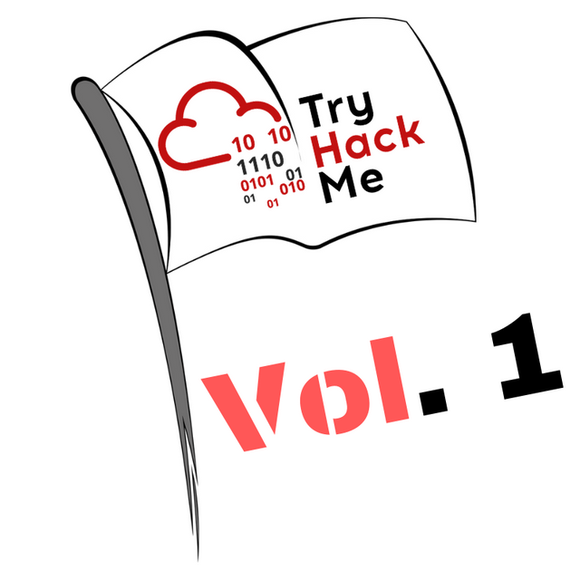
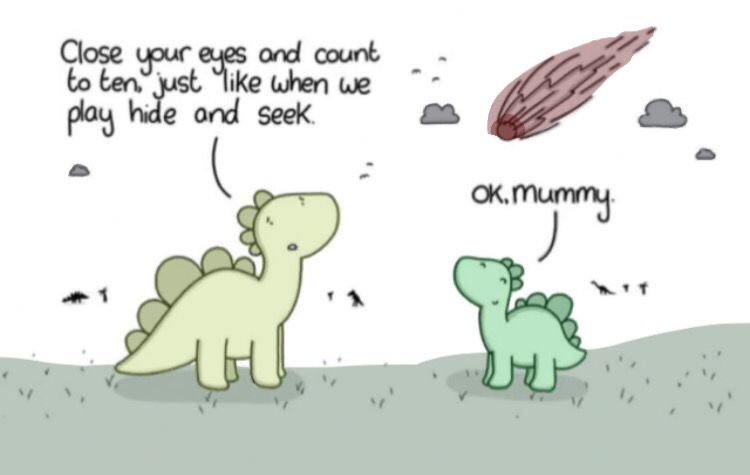
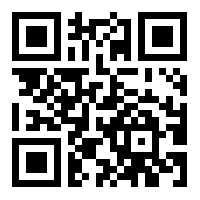
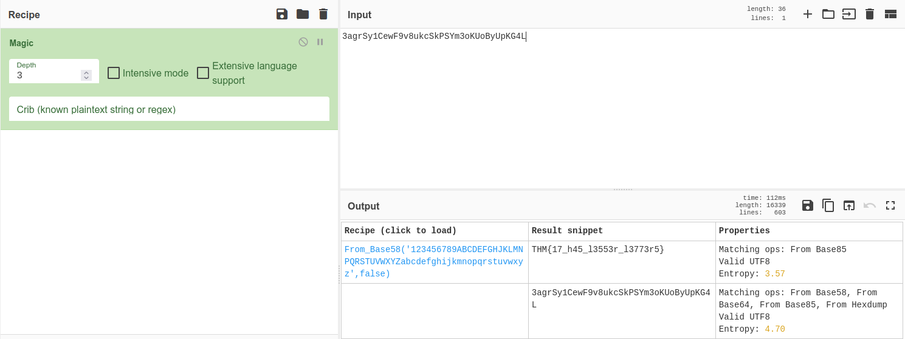

# CTF Collection, Volume 1



## Summary

[CTF Collection, Volume 1](https://tryhackme.com/room/ctfcollectionvol1 "CTF Collection, Volume 1 on TryHackMe") is a begginer <abbr title="Capture The Flag">CTF</abbr> with 20 challenges created by [DesKel](https://tryhackme.com/p/DesKel "Deskel TryHackMe"). You can find the room on [TryHackMe's official website](https://tryhackme.com/ "TryHackMe Website") along with other <abbr title="Capture The Flag">CTF's</abbr>.

---

## Challenges

* [What does the base said?](#what-does-the-base-said "Jump To Challenge Section")

* [Meta meta](#meta-meta "Jump To Challenge Section")

* [Mon, are we going to be okay?](#mon-are-we-going-to-be-okay "Jump To Challenge Section")

* [Erm......Magick](#ermmagick "Jump To Challenge Section")

* [QRrrrr](#qrrrrr "Jump To Challenge Section")

* [Reverse it or read it?](#reverse-it-or-read-it "Jump To Challenge Section")

* [Another decoding stuff](#another-decoding-stuff "Jump To Challenge Section")

* [Left or right](#left-or-right "Jump To Challenge Section")

* [Make a comment](#make-a-comment "Jump To Challenge Section")

* [Can you fix it?](#can-you-fix-it "Jump To Challenge Section")

* [Read it](#read-it "Jump To Challenge Section")

* [Spin my head](#spin-my-head "Jump To Challenge Section")

* [An exclusive!](#an-exclusive "Jump To Challenge Section")

* [Binary walk](#binary-walk "Jump To Challenge Section")

* [Darkness](#darkness "Jump To Challenge Section")

* [A sounding QR](#a-sounding-qr "Jump To Challenge Section")

* [Dig up the past](#dig-up-the-past "Jump To Challenge Section")

* [Uncrackable!](#uncrackable "Jump To Challenge Section")

* [Small bases](#small-bases "Jump To Challenge Section")

* [Read the packet](#read-the-packet "Jump To Challenge Section")

---

## What does the base said?

For this challenge we have to decode the following string...

```VEhNe2p1NTdfZDNjMGQzXzdoM19iNDUzfQ==```

The double equals signs on the end are a hint that this string is encoded in ```Base64```.

Using a Base64 decoder online such as [CyberChef](https://cyberchef.org/ "Cyber Chef Website") reveals the following decoded string...

```THM{ju57_d3c0d3_7h3_b453}```

### [BACK TO TOP](#ctf-collection-volume-1 "Jump To Top")

---

## Meta meta

For this challenge we're given an image of Earth from space titled [Findme.jpg](./Assets/Findme.jpg "Findme Image").


The title ("meta meta") hints that the flag is hidden within the metadata of the image. This can be confirmed by using ```exiftool``` and  finding ```THM{3x1f_0r_3x17}``` under the ```Owner Name```.

```
$ exiftool Findme.jpg
ExifTool Version Number         : 12.40
File Name                       : Findme.jpg
Directory                       : .
File Size                       : 34 KiB
File Permissions                : -rw-rw-r--
File Type                       : JPEG
File Type Extension             : jpg
MIME Type                       : image/jpeg
JFIF Version                    : 1.01
X Resolution                    : 96
Y Resolution                    : 96
Exif Byte Order                 : Big-endian (Motorola, MM)
Resolution Unit                 : inches
Y Cb Cr Positioning             : Centered
Exif Version                    : 0231
Components Configuration        : Y, Cb, Cr, -
Flashpix Version                : 0100
Owner Name                      : THM{3x1f_0r_3x17}
Comment                         : CREATOR: gd-jpeg v1.0 (using IJG JPEG v62), quality = 60.
Image Width                     : 800
Image Height                    : 480
Encoding Process                : Progressive DCT, Huffman coding
Bits Per Sample                 : 8
Color Components                : 3
Y Cb Cr Sub Sampling            : YCbCr4:2:0 (2 2)
Image Size                      : 800x480
Megapixels                      : 0.384
```

### [BACK TO TOP](#ctf-collection-volume-1 "Jump To Top")

---

## Mon, are we going to be okay?

For this challenge we're given an image of two Stegosauruses about to be hit by a meteor. A hint at using steganography again, specifically a tool called [steghide](https://www.kali.org/tools/steghide/ "Kali Linux Steghide Manual").



To extract any hidden files from this image we're going to use ```steghide``` with two arguments, ```--extract``` and ```-sf```.

When prompted for the password we're going to press enter, leaving the password field empty.

If succesful we should see steghide extract a text file named [Final_message.txt](./Assets/Final_message.txt "Text file that was embedded in Extinction.jpg").

```
$ steghide extract -sf Extinction.jpg
Enter passphrase: 
wrote extracted data to "Final_message.txt".
```

Within the text file we can find our flag.

```
It going to be over soon. Sleep my child.

THM{500n3r_0r_l473r_17_15_0ur_7urn}
```

### [BACK TO TOP](#ctf-collection-volume-1 "Jump To Top")

---

## Erm......Magick

For this challenge we're given no files to download, no _visible_ text to analyze, decrypt, or decipher.

All we have is the text "Huh, where is the flag?".

Interestingly, this lack of clues ends up being our biggest clue.

We know that a flag exists but we can't see it. So where is it? If there is not a single visible clue here, then what we are looking for must be "invisible".

Let's find what this challenge section really contains by using the Dev Tools in our browser.

If we inspect the ```Huh, where is the flag?``` text we'll see it's written within a paragraph tag (```<p>```) and it's not the only thing in there.

```html
<p>Huh, where is the flag? <span style="color:rgb(255, 255, 255);"><span style="background-color:rgb(255, 255, 255);">THM{wh173_fl46}</span></span><br></p>
```

There's our flag, hidden within the same paragraph and styled with white font on a white background, ```THM{wh173_fl46}```.

### [BACK TO TOP](#ctf-collection-volume-1 "Jump To Top")

---

## QRrrrr

For this challenge we're given a QR code and all we need to do is scan it on order to get the flag.



I didn't want to scan the code for security reasons so instead I used [this website](https://zxing.org/w/decode.jspx "QR Decoder Website") and uploaded the file, where it returned the following flag...

```THM{qr_m4k3_l1f3_345y}```

### [BACK TO TOP](#ctf-collection-volume-1 "Jump To Top")

---

## Reverse it or read it?

For this challenge we're given an executable file named [hello.hello](./Assets/hello.hello "hello.hello executable file") and told to "reverse or read it".

In order to "read it" we can use the ```strings``` command and parse through the output for any strings that may resemble a flag.

But since we know all flags start with ```THM``` we can pipe the output from ```strings``` to ```grep``` for cleaner output.

```
$ strings hello.hello | grep THM

THM{345y_f1nd_345y_60}
```

### [BACK TO TOP](#ctf-collection-volume-1 "Jump To Top")

---

## Another decoding stuff

For this challenge we're given the encoded string ```3agrSy1CewF9v8ukcSkPSYm3oKUoByUpKG4L```.

One quick way to solve this, if you don't know what kind of encoding was used, is to use the ```Magic``` operation in [CyberChef](https://cyberchef.org/ "Cyber Chef Website").



The ```Magic``` operation identifies ```3agrSy1CewF9v8ukcSkPSYm3oKUoByUpKG4L``` as the ```Base58``` encoding of the flag ```THM{17_h45_l3553r_l3773r5}```.

### [BACK TO TOP](#ctf-collection-volume-1 "Jump To Top")

---

## Left or right

For this challenge we're given the flag in its encrypted version
(```MAF{atbe_max_vtxltk}```) and told that "ROT13 is too mainstream".

This encrypted flag looks like a basic substitution cipher which we can confirm by using the ```ROT13 Bruteforce``` operation in [CyberChef](https://cyberchef.org/ "Cyber Chef Website").

The output shows this encrypted flag was rotated with a key of 7. Which is the original key used for the famous Caesar Cipher.

Here is the result of shifting all characters 7 positions.

```THM{hail_the_caesar}```

### [BACK TO TOP](#ctf-collection-volume-1 "Jump To Top")

---

## Make a comment


### [BACK TO TOP](#ctf-collection-volume-1 "Jump To Top")

---

## Can you fix it?


### [BACK TO TOP](#ctf-collection-volume-1 "Jump To Top")

---

## Read it


### [BACK TO TOP](#ctf-collection-volume-1 "Jump To Top")

---

## Spin my head


### [BACK TO TOP](#ctf-collection-volume-1 "Jump To Top")

---

## An exclusive!


### [BACK TO TOP](#ctf-collection-volume-1 "Jump To Top")

---

## Binary walk


### [BACK TO TOP](#ctf-collection-volume-1 "Jump To Top")

---

## Darkness


### [BACK TO TOP](#ctf-collection-volume-1 "Jump To Top")

---

## A sounding QR


### [BACK TO TOP](#ctf-collection-volume-1 "Jump To Top")

---

## Dig up the past


### [BACK TO TOP](#ctf-collection-volume-1 "Jump To Top")

---

## Uncrackable!


### [BACK TO TOP](#ctf-collection-volume-1 "Jump To Top")

---

## Small bases


### [BACK TO TOP](#ctf-collection-volume-1 "Jump To Top")

---

## Read the packet

---

### [BACK TO TOP](#ctf-collection-volume-1 "Jump To Top")