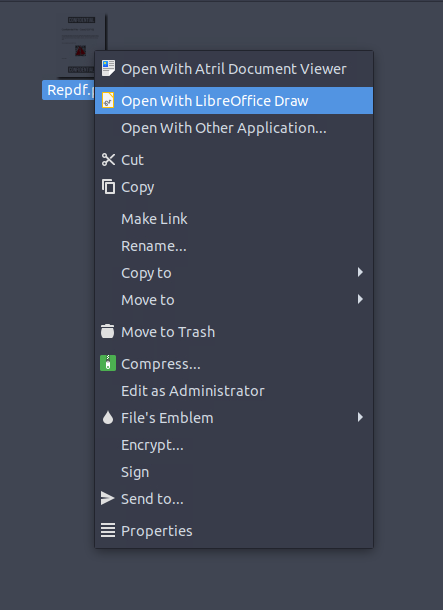
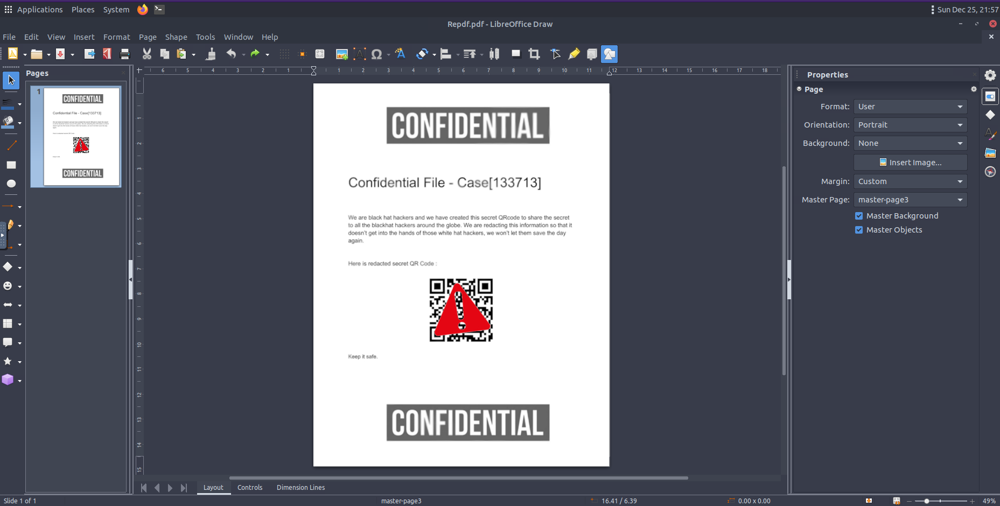
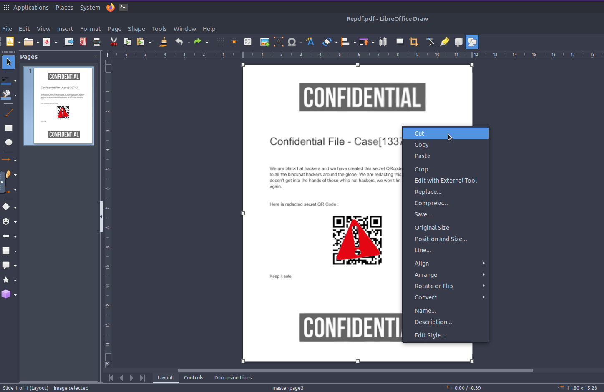
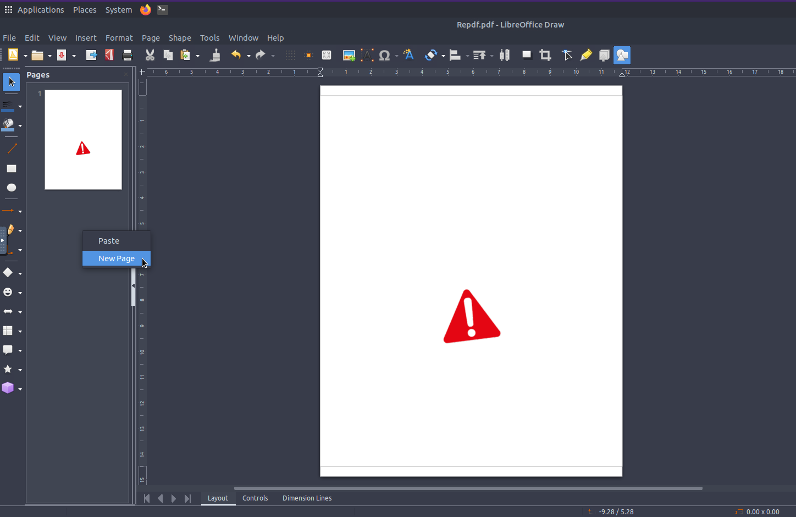
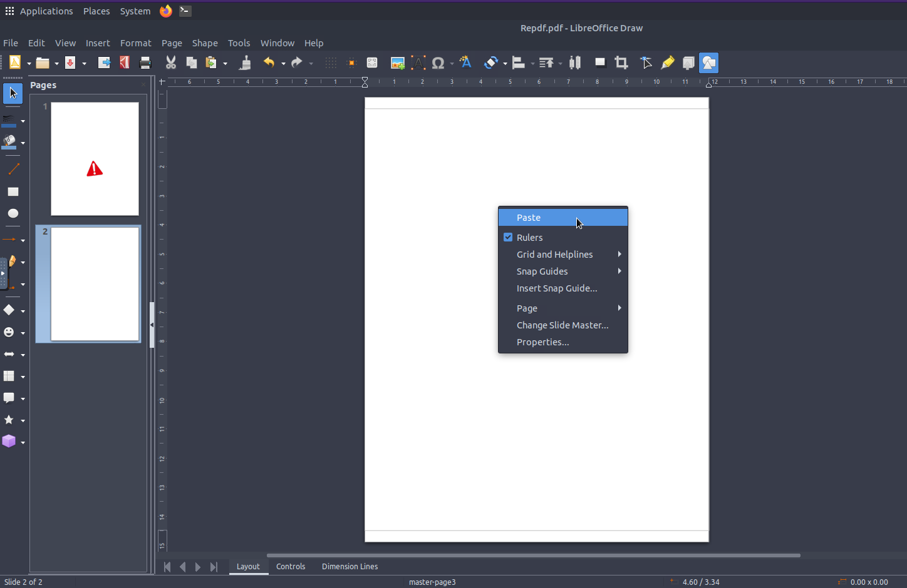
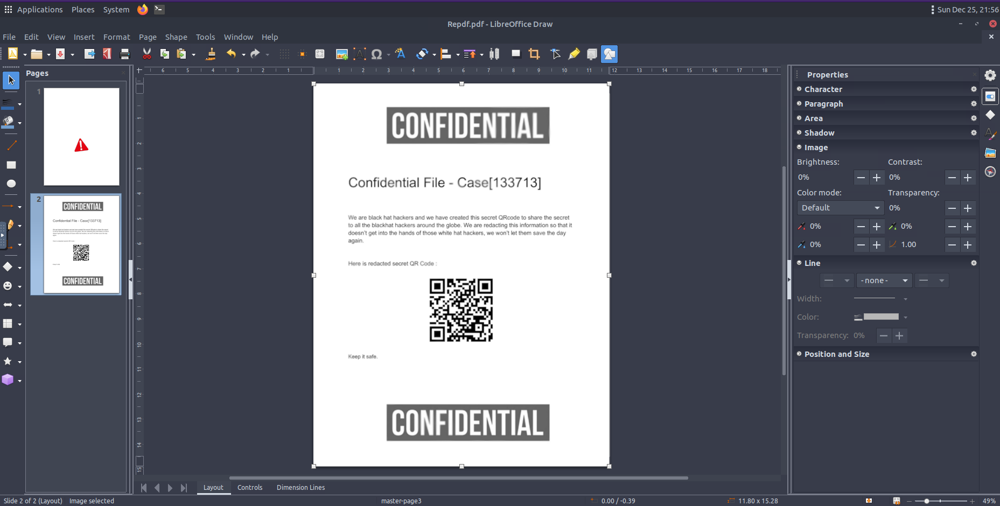

# Confidential

## Summary

[Confidential](https://tryhackme.com/room/confidential "Confidential room on TryHackMe") is a CTF created by [CMNatic](https://twitter.com/CMNatic "CMNatic's Twitter") and hosted on [TryHackMe](https://tryhackme.com/ "TryHackMe Website"). There is only one task and that is to scan a QR code given to us in a PDF that has been obstructed by an image (PNG).

---

## Task 1 - Confidential

Start by launching the machine and clicking the ```Split View``` button at the top of the screen to access the VM.

Once the VM has loaded click on ```Places``` at the top of the VM. Navigate to the ```Home``` folder and open the ```Confidential``` folder. This is where our PDF can be found (```/home/ubuntu/confidential/Repdf.pdf```).

Right click the PDF and select the ```Open With LibreOffice Draw``` option.





Now that we've opened up the PDF in LibreOffice Draw we can simply just drag the PNG away from the QR code.

Or we can right-click the PDF, select ```cut``` and paste the PDF into a new page without the PNG like so...

### Step 1 - Cut



### Step 2 - Create New Page



### Step 3 - Paste



### Step 4 - Scan QR



After scanning the QR Code we'll get the following flag. 

```flag{e08e6ce2f077a1b420cfd4a5d1a57a8d}```