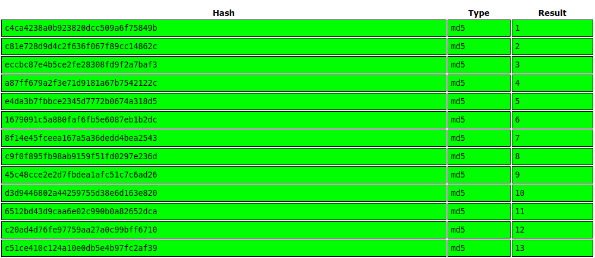

# Corridor

## Summary

[Corridor](https://tryhackme.com/room/corridor "Corridor CTF on TryHackMe") is a begginer friendly CTF hosted on [TryHackMe](https://tryhackme.com/ "TryHackMe Website") and created by [CMNatic](https://twitter.com/CMNatic "CMNatic Twitter Page"), [John Hammond](https://twitter.com/_johnhammond "John Hammonds Twitter"), and [Tim Taylor](https://tryhackme.com/p/timtaylor "Tim Taylors TryHackMe Profile").

There is only one task and one flag, which can be found by taking advantage of an insecure object reference vulnerability ([IDOR](https://portswigger.net/web-security/access-control/idor "Port Swigger Information On IDOR Vulnerabilites")).

IDOR are a type of **access control** vulnerability and listed in the [OWASP Top 10](https://owasp.org/www-project-top-ten/ "OWASP Top 10 List") for most critical security risks to web applications.

An example of an insecure direct object reference would be when a user (username- JimmyJohn) navigates away from his profile URL:

```https://www.example-site.com/user?name=jimmyjohn```

To the URL of another user:

```https://www.example-site.com/user?name=admin```

Or by requesting files that are not intended for the public by requesting them directly through the URL.

```https://www.example-site.com/files/file-not-meant-for-you.txt```

---

## Task 1 - Escape the Corridor

Once we start the machine and navigate to the IP Address given to us we should see an image of a corridor with 13 doors. Each of these doors is clickable and all lead to a different directory on the same site, where the directory name is a different hash.


If we want to take advantage of the IDOR vulnerability and visit a directory that wasn't meant for us, we'll first need to know what the inputs for these 13 hashes were.

* c4ca4238a0b923820dcc509a6f75849b
* c81e728d9d4c2f636f067f89cc14862c
* eccbc87e4b5ce2fe28308fd9f2a7baf3
* a87ff679a2f3e71d9181a67b7542122c
* e4da3b7fbbce2345d7772b0674a318d5
* 1679091c5a880faf6fb5e6087eb1b2dc
* 8f14e45fceea167a5a36dedd4bea2543
* c9f0f895fb98ab9159f51fd0297e236d
* 45c48cce2e2d7fbdea1afc51c7c6ad26
* d3d9446802a44259755d38e6d163e820
* 6512bd43d9caa6e02c990b0a82652dca
* c20ad4d76fe97759aa27a0c99bff6710
* c51ce410c124a10e0db5e4b97fc2af39

For this step, take all the hashes and paste them into [Crack Station](https://crackstation.net/ "Crack Station Website") where you'll find out these are just the hash values of the numbers 1-13.



Now that we know the values of the directories are in the range (1-13) we can try directories outside that range and see what we uncover.

We'll start by getting the MD5 hashes of the numbers 0 and 14.

* 0 --> MD5 --> cfcd208495d565ef66e7dff9f98764da
* 14 --> MD5 --> aab3238922bcc25a6f606eb525ffdc56

If we visit ```<IP_Address>/aab3238922bcc25a6f606eb525ffdc56``` (directory 14) we'll see the room does not exist.

But if we visit ```<IP_Address>/cfcd208495d565ef66e7dff9f98764da``` (directory 0) we'll see this directory _does_ exist and contains the following flag.

```flag{2477ef02448ad9156661ac40a6b8862e}```
