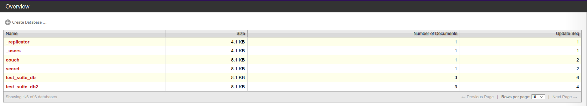
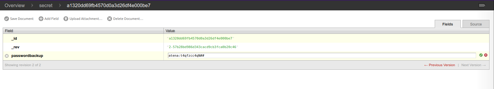

# Couch

## Summary

[Couch](https://tryhackme.com/room/couch "Couch Room On TryHackMe") is a begginer friendly CTF hosted by [TryHackMe](https://tryhackme.com/room/couch "TryHackMe Official Website") and created by [Cesar Calderon A.K.A Stuxnet](https://twitter.com/__stux "Stuxnet Twitter Profile").

Room Description:

> Hack into a vulnerable database server that collects and stores data in JSON-based document formats, in this semi-guided challenge.

This CTF requires basic knowledge of:

* Basic Linux commands such as ```ping```, .

* Port scanning with tools like ```NMAP```.

* Reading application documentation.

* Connecting to a remote server via ```SSH```.

* Starting a ```Docker``` container.

---

## Contents

* [Getting Started](#getting-started "Jump To Getting Started")

* [Port Scan](#port-scan "Jump To Port Scan")

    * [Scan the machine. How many ports are open?](#open-ports "Jump To Open Ports")

    * [What is the database management system installed on the server?](#database-discovery "Jump To Database Discovery")

    * [What port is the database management system running on?](#database-port "Jump To Database Port")

    * [What is the version of the management system installed on the server?](#database-version "Jump To Database Version")

* [Reading DataBase Documentation](#database-documentation "Jump To Database Documentation")

    * [What is the path for the web administration tool for this database management system?](#administrator-path "Jump To Administrator Path")

    * [What is the path to list all databases in the web browser of the database management system?](#all-databases "Jump To All Databases")

* [Finding SSH Credentials](#ssh-credentials "Jump To SSH Credentials")

    * [What are the credentials found in the web administration tool?](#credentials "Jump To Credentials")

* [First Flag](#first-flag "Jump To First Flag")

    * [Compromise the machine and locate user.txt](#usertxt "Jump To user.txt")

* [Root Flag](#root-flag "Jump To Root Flag")

    * [Escalate privileges and obtain root.txt](#roottxt "Jump To root.txt")

---

## Getting Started

As always we start by checking that the target machine is up and running by pinging the target IP Address.

```
$ ping <IP_Address>

PING <IP_Address> (<IP_Address>) 56(84) bytes of data.
64 bytes from <IP_Address>: icmp_seq=1 ttl=61 time=160 ms
64 bytes from <IP_Address>: icmp_seq=2 ttl=61 time=159 ms
64 bytes from <IP_Address>: icmp_seq=3 ttl=61 time=160 ms
64 bytes from <IP_Address>: icmp_seq=4 ttl=61 time=160 ms

--- <IP_Address> ping statistics ---
4 packets transmitted, 4 received, 0% packet loss, time 3002ms
rtt min/avg/max/mdev = 159.318/159.807/160.327/0.362 ms
```

[Back To Top](#couch "Jump To Top")

---

## Port Scan

Once we've verified the machine is active we can move on to a port scan using ```nmap``` with the ```-p-``` flag, this will make sure we scan **every** port.

```
$ nmap -p- -T4 <IP_Address>

Nmap scan report for <IP_Address>
Host is up (0.16s latency).
Not shown: 65533 closed ports
PORT     STATE SERVICE
22/tcp   open  ssh
5984/tcp open  couchdb
```

### Open Ports

The results from the above ```nmap``` scan return **2** open ports.

### Database Discovery

One of which is Adobe's open source NoSQL database named ```couchdb```.

### Database Port

This service can usually be found on ```PORT 5984```, which we can verify by looking at the above ```nmap``` scan.

### Database Version

One way we can find the exact version of the ```couchdb``` database is to perform another ```nmap``` scan, but this time in aggressive mode (```-A```) and only on ```PORT 5984```, by using the ```-p``` flag followed by the port number for the database.

```
$ nmap -p 5984 -A <IP_Address>

Nmap scan report for <IP_Address>
Host is up (0.16s latency).

PORT     STATE SERVICE VERSION
5984/tcp open  http    CouchDB httpd 1.6.1 (Erlang OTP/18)
|_http-server-header: CouchDB/1.6.1 (Erlang OTP/18)
|_http-title: Site doesn't have a title (text/plain; charset=utf-8).
Service Info: OS: Linux; CPE: cpe:/o:linux:linux_kernel
```

The results from the above scan show us that the version number for the ```couchdb``` database is ```1.6.1```.

[Back To Top](#couch "Jump To Top")

---

## Database Documentation

Now that we know what database and version number are running on the target system we can start by looking up the documentation and see if we can find anything beneficial to us.

[CouchDB Documentation](https://docs.couchdb.org/en/stable/intro/tour.html "Adobe's CouchDB Documentation")

### Administrator Path

Scrolling through the [CouchDB Documentation](https://docs.couchdb.org/en/stable/intro/tour.html "Adobe's CouchDB Documentation") we'll see that the web administration tool can be found at ```http://<IP_Address>:5984/_utils/```.

```_utils```

### All Databases

We can also see in the same documentation that the path to list all databases is ```http://<IP_Address>:5984/_all_dbs```.

```_all_dbs```

[Back To Top](#couch "Jump To Top")

---

## SSH Credentials

If we visit the web admin tool for the database at ```http://<IP_Address>:5984/_utils/``` we'll see 6 databases.



Out of all 6 databases one really stands out, the one named ```secret```.

If we click on that database we'll see a single entry, ```a1320dd69fb4570d0a3d26df4e000be7```.

And if we click on that we'll be taken to ```http://<IP_Address>:5984/_utils/document.html?secret/a1320dd69fb4570d0a3d26df4e000be7```, where we'll find a field titled ```passwordbackup``` with the value ```atena:t4qfzcc4qN##```.



### Credentials

Now that we have a set of credentials (```atena:t4qfzcc4qN##```), we should check if we can use them to login to the server via ```SSH```.

[Back To Top](#couch "Jump To Top")

---

## First Flag

Using the credentials we found above we can ```SSH``` into the remote server with the username ```atena``` and the password ```t4qfzcc4qN##```.

```
$ ssh atena@<IP_Address>

atena@<IP_Address>'s password: t4qfzcc4qN##
Welcome to Ubuntu 16.04.7 LTS (GNU/Linux 4.4.0-193-generic x86_64)

 * Documentation:  https://help.ubuntu.com
 * Management:     https://landscape.canonical.com
 * Support:        https://ubuntu.com/advantage

atena@ubuntu:~$
```

### user.txt

Now that we're in we can start looking for the first flag by listing all contents in the current directory (```/home/atena```).

```
atena@ubuntu:~$ ls -la
total 48
drwxr-xr-x 6 atena atena 4096 Dec 18  2020 .
drwxr-xr-x 3 root  root  4096 Oct 24  2020 ..
-rw------- 1 atena atena 3171 Dec 18  2020 .bash_history
-rw-r--r-- 1 atena atena  220 Oct 24  2020 .bash_logout
-rw-r--r-- 1 atena atena 3771 Oct 24  2020 .bashrc
drwxr-xr-x 3 root  root  4096 Oct 24  2020 .bundle
drwx------ 2 atena atena 4096 Oct 24  2020 .cache
drwx------ 2 root  root  4096 Oct 24  2020 .gnupg
drwxrwxr-x 2 atena atena 4096 Dec 18  2020 .nano
-rw-r--r-- 1 atena atena  655 Oct 24  2020 .profile
-rw-r--r-- 1 atena atena    0 Oct 24  2020 .sudo_as_admin_successful
-rw-rw-r-- 1 atena atena   22 Dec 18  2020 user.txt
-rw-r--r-- 1 root  root   183 Oct 24  2020 .wget-hsts
```

Here we'll find the ```user.txt``` file, and if we cat it we'll find our first flag.

```
atena@ubuntu:~$ cat user.txt

THM{1ns3cure_couchdb}
```

[Back To Top](#couch "Jump To Top")

---

## Root Flag

### root.txt

[Back To Top](#couch "Jump To Top")
