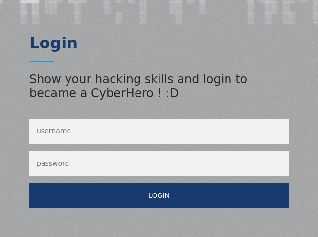
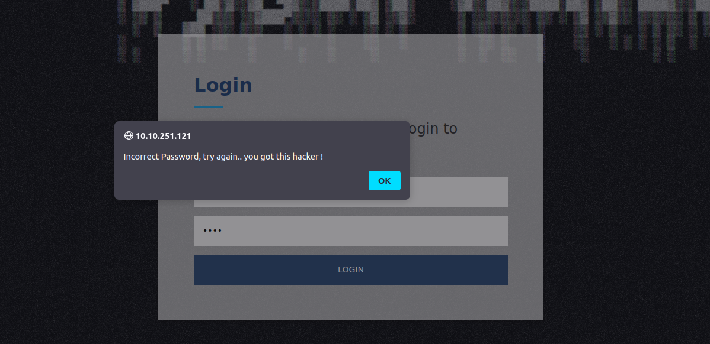
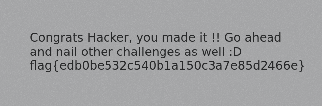

# CyberHeroes


## Summary

[CyberHeroes](https://tryhackme.com/room/cyberheroes "CyberHeroes TryHackMe Room") is a begginer friendly CTF hosted by [TryHackMe](https://tryhackme.com/ "TryHackMe Website") and created by the [TryHackMe Admins](https://tryhackme.com/p/tryhackme "TryHackMe Admin Profile") in collaboration with [CMNatic](https://github.com/CMNatic "CMNatic GitHub Profile").

This CTF requires basic knowledge of:

* Using your browsers built in developer console (```Dev Tools```).
* Reading/Understanding ```HTML```.
* Reading/Understanding ```JavaScript```.

---

## Contents

* [Getting Started](#getting-started "Jump To Getting Started")
* [Poking Around The Website](#the-website "Jump To The Website")
* [Understanding The Script We Found](#the-script "Jump To The Script")
* [Logging In](#logging-in "Jump To Logging In")

---

## Getting Started

Unlike other CTF's this one tells us exactly where to start. So we won't be doing any reconnaissance or port scans. We just need to head straight over to the website and find a way to login.

[Back To Top](#cyberheroes "Jump To Top")

---

## The Website

Once we've visited the website we'll be greeted with the landing page for the "Cyber Heroes", on the left we'll see the navbar which contains a link to the login page. Since the challenge is to figure out a way to login, this should be the first place we check.



We can always start by trying default credentials such as ```admin:admin```, ```admin:password```, or even any dummy values just to test the way the login form reacts.

After you've provided any username/password you should see a JavaScript alert pop up in your browser informing you that the credentials provided are incorrect.



Our next logical step is to check where the script for this alert is and read whatever code is contained within that file.

We can start by viewing the HTML source code, specifically the parts that relate to this form.

```html
<div class="form">
    <h4 id="flag"></h4>
    <form id="todel" class="">
        <div class="section-title">
        <h2>Login</h2>
        <h4>Show your hacking skills and login to became a CyberHero ! :D</h4>
        </div>
        <input type="text" id="uname" placeholder="username">
        <input type="password" id="pass" placeholder="password">
    </form>
    <button id="rm" onclick="authenticate()">login</button>
</div>
```

Reading through the ```HTML``` for the login form we'll see the inline JavaScript function named ```authenticate()``` that gets executed on submit.

```html
<button id="rm" onclick="authenticate()">login</button>
```

And if we scroll through the HTML down towards the bottom of the file we'll find the ```<script>``` tags where the authenticate function is defined.

```html
<script>
    function authenticate() {
      a = document.getElementById('uname')
      b = document.getElementById('pass')
      const RevereString = str => [...str].reverse().join('');
      if (a.value=="h3ck3rBoi" & b.value==RevereString("54321@terceSrepuS")) { 
        var xhttp = new XMLHttpRequest();
        xhttp.onreadystatechange = function() {
          if (this.readyState == 4 && this.status == 200) {
            document.getElementById("flag").innerHTML = this.responseText ;
            document.getElementById("todel").innerHTML = "";
            document.getElementById("rm").remove() ;
          }
        };
        xhttp.open("GET", "RandomLo0o0o0o0o0o0o0o0o0o0gpath12345_Flag_"+a.value+"_"+b.value+".txt", true);
        xhttp.send();
      }
      else {
        alert("Incorrect Password, try again.. you got this hacker !")
      }
    }
</script>
```

[Back To Top](#cyberheroes "Jump To Top")

---

## The Script

Now that we found the authentication script for the form we should parse it for anything that may help us.

```js
function authenticate() {
    a = document.getElementById('uname')
    b = document.getElementById('pass')
    const RevereString = str => [...str].reverse().join('');
    if (a.value=="h3ck3rBoi" & b.value==RevereString("54321@terceSrepuS")) { 
    var xhttp = new XMLHttpRequest();
    xhttp.onreadystatechange = function() {
        if (this.readyState == 4 && this.status == 200) {
        document.getElementById("flag").innerHTML = this.responseText ;
        document.getElementById("todel").innerHTML = "";
        document.getElementById("rm").remove() ;
        }
    };
    xhttp.open("GET", "RandomLo0o0o0o0o0o0o0o0o0o0gpath12345_Flag_"+a.value+"_"+b.value+".txt", true);
    xhttp.send();
    }
    else {
    alert("Incorrect Password, try again.. you got this hacker !")
    }
}
```

One thing we notice right away are the variables a and b, which store the provided username and password.

```js
a = document.getElementById('uname')
b = document.getElementById('pass')
```

The next line of code defines an Arrow Function named ```ReverseString``` that takes a string (```str```), spreads the letters into an array, reverses them and joins them back together.

```js
const RevereString = str => [...str].reverse().join('');
```

The next line (and most important to us), checks if the username is equal to ```h3ck3rBoi``` and if the password, when reversed, is equal to ```54321@terceSrepuS```, in which case we're redirected to our flag.

```js
if (a.value=="h3ck3rBoi" & b.value==RevereString("54321@terceSrepuS"){
    // SUCCESS
}
```

And with that, we have everything we need to login.

[Back To Top](#cyberheroes "Jump To Top")

---

## Logging In

Using the credentials ```h3ck3rBoi:SuperSecret@12345``` to login we'll see the following...



```flag{edb0be532c540b1a150c3a7e85d2466e}```

[Back To Top](#cyberheroes "Jump To Top")
