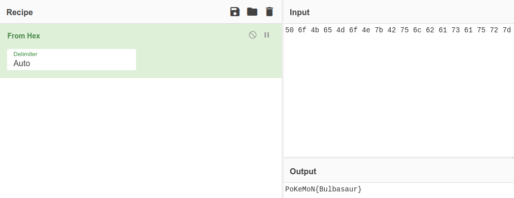
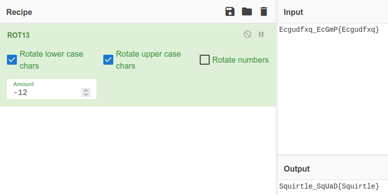
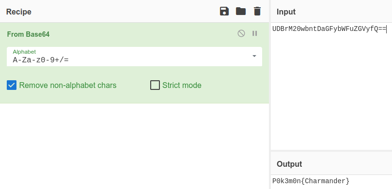

# Gotta Catch'em All!

## Summary

[Gotta Catch'em ALL!](https://tryhackme.com/room/pokemon "Gotta Catch'em ALL TryHackMe Room") is a Pokemon themed <abbr title="Capture The Flag">CTF</abbr> created by [GhostlyPy](https://github.com/hifumi1337 "GhostlyPi's GitHub"). You can find this and other rooms on the [TryHackMe](https://tryhackme.com/ "TryHackMe Website") website.

---

## Sections

* [Find the Grass-Type Pokemon](#find-the-grass-type-pokemon "Jump To Section")

* [Find the Water-Type Pokemon](#find-the-water-type-pokemon "Jump To Section")

* [Find the Fire-Type Pokemon](#find-the-fire-type-pokemon "Jump To Section")

* [Who is Root's Favorite Pokemon?](#who-is-roots-favorite-pokemon "Jump To Section")

---

## Find the Grass-Type Pokemon

Starting off with a port scan of the ip address using ```nmap``` in aggressive mode ```-A``` so we can see what ports and services are running:

```
$ nmap -A <IP Address>

PORT   STATE SERVICE VERSION
22/tcp open  ssh     OpenSSH 7.2p2 Ubuntu 4ubuntu2.8 (Ubuntu Linux; protocol 2.0)
80/tcp open  http    Apache httpd 2.4.18 ((Ubuntu))
```

So we just have SSH on port 22 and HTTP on port 80.

Next we can check the website where we find a default Apache2 welcome page.

> If you can read this page, it means that the Apache HTTP server installed at this site is working properly. You should replace this file (located at /var/www/html/index.html) before continuing to operate your HTTP server.

> If you are a normal user of this web site and don't know what this page is about, this probably means that the site is currently unavailable due to maintenance. If the problem persists, please contact the site's administrator.

Checking the HTML source code for this page we see two interesting things.

1. JavaScript that console logs a bunch of Pokemon names.

	```javascript
	<script type="text/javascript">
		const randomPokemon = [
			'Bulbasaur', 'Charmander', 'Squirtle',
			'Snorlax',
			'Zapdos',
			'Mew',
			'Charizard',
			'Grimer',
			'Metapod',
			'Magikarp'
		];
		const original = randomPokemon.sort((pokemonName) => {
			const [aLast] = pokemonName.split(', ');
		});

		console.log(original);
	</script>
	```

2. And what looks like login credentials masquerading as HTML tags (username:password). 

	```html
	<pokemon>:<hack_the_pokemon>
	<!--(Check console for extra surprise!)-->
	```

Using these login credentials we can try to SSH in.

```
ssh pokemon@<IP Address>
pokemon@<IP Address>'s password:hack_the_pokemon
```

Now that we're in we can check to see where we are in the file system (```pwd```) and what files exist in the current directory (```ls -l```).

```
pokemon@root:~$ pwd
/home/pokemon

pokemon@root:~$ ls -l
drwxr-xr-x 2 pokemon pokemon 4096 Jun 24  2020 Desktop
drwxr-xr-x 2 pokemon pokemon 4096 Jun 22  2020 Documents
drwxr-xr-x 2 pokemon pokemon 4096 Jun 22  2020 Downloads
-rw-r--r-- 1 pokemon pokemon 8980 Jun 22  2020 examples.desktop
drwxr-xr-x 2 pokemon pokemon 4096 Jun 22  2020 Music
drwxr-xr-x 2 pokemon pokemon 4096 Jun 22  2020 Pictures
drwxr-xr-x 2 pokemon pokemon 4096 Jun 22  2020 Public
drwxr-xr-x 2 pokemon pokemon 4096 Jun 22  2020 Templates
drwxr-xr-x 3 pokemon pokemon 4096 Jun 22  2020 Videos
```

Looking through all these directories you'll find that only two of these are not empty. The ```Desktop``` and ```Videos``` directories.

Let's start with viewing the contents of ```Desktop``` (```ls -la```), moving into that directory (```cd Desktop```) and unzipping the P0kEmOn.zip file (```unzip P0KEmOn.zip```).

```
pokemon@root:~$ ls -la Desktop
drwxr-xr-x  2 pokemon pokemon 4096 Jun 24  2020 .
drwxr-xr-x 19 pokemon pokemon 4096 Nov 15 10:26 ..
-rw-rw-r--  1 pokemon pokemon  383 Jun 22  2020 P0kEmOn.zip

pokemon@root:~$ cd Desktop

pokemon@root:~/Desktop$ unzip P0kEmOn.zip
Archive:  P0kEmOn.zip
   creating: P0kEmOn/
  inflating: P0kEmOn/grass-type.txt
```

Now let's read the contents of the unzipped file with the ```cat``` command:

```
pokemon@root:~/Desktop$ cat ./P0kEmOn/grass-type.txt
50 6f 4b 65 4d 6f 4e 7b 42 75 6c 62 61 73 61 75 72 7d
```

The file contains hexadecimal which we can decode by pasting it into CyberChef and selecting ```From Hex```:



Which reveals the Grass-Type flag:

> PoKeMoN{Bulbasaur}

### [Back To Top](#gotta-catchem-all "Jump To Top")

---

## Find the Water-Type Pokemon

After looking through the other directories on ```/home/pokemon``` we can find Ashes login credentials in the ```/home/pokemon/Videos``` directory (more on that later) but no water Pokemon. The hint says "Maybe the website has an answer", and we know the Apache2 default welcome page is stored at ```/var/www/html/index.html```. So let's see what else exists in that directory.

```
pokemon@root:~$ ls -la /var/www/html
drwxr-xr-x 2 root    root  4096 Jun 22  2020 .
drwxr-xr-x 3 root    root  4096 Jun 22  2020 ..
-rw-r--r-- 1 root    root 11217 Jun 24  2020 index.html
-rw-r--r-- 1 pokemon root    24 Jun 22  2020 water-type.txt
```

There's the webpage (```index.html```), and another text document (```water-type.txt```).

Let's ```cat``` it to find the flag.

```
pokemon@root:~$ cat /var/www/html/water-type.txt
Ecgudfxq_EcGmP{Ecgudfxq}
```

Looks like a Caesar Cipher, so let's paste it into CyberChef and select ```ROT13``` and increase or decrease the ```Amount``` (key) until we can decrypt it.



So it turns out the key to this Caesar Cipher is 14 (or -12 if you were decreasing the key from the default 13 like I did).

> Squirtle_SqUaD{Squirtle}

---

## Find the Fire-Type Pokemon

If the first and second flags were in files called ```grass-type.txt``` and ```water-type.txt``` maybe we can just use the ```find``` command for a file called ```fire-type.txt```.

```
pokemon@root:~$ find / -type f -name fire-type.txt 2>/dev/null
/etc/why_am_i_here?/fire-type.txt
```

Let's ```cat``` that file to find the flag.

```
pokemon@root:~$ cat /etc/why_am_i_here\?/fire-type.txt
UDBrM20wbntDaGFybWFuZGVyfQ==
```

This time it looks like Base64. If we paste it into CyberChef and select ```From Base64```:



We get the third flag:

> P0k3m0n{Charmander}

---

## Who is Root's Favorite Pokemon?

Finally, back to the other non-empty directory we found in the beggining (```/home/pokemon/Videos```).

If we follow it all the way to the end we'll find a C++ file.

```
pokemon@root:~$ ls -la Videos
drwxr-xr-x  3 pokemon pokemon 4096 Jun 22  2020 .
drwxr-xr-x 19 pokemon pokemon 4096 Nov 15 10:26 ..
drwxrwxr-x  3 pokemon pokemon 4096 Jun 22  2020 Gotta

pokemon@root:~$ ls -la Videos/Gotta
drwxrwxr-x 3 pokemon pokemon 4096 Jun 22  2020 .
drwxr-xr-x 3 pokemon pokemon 4096 Jun 22  2020 ..
drwxrwxr-x 3 pokemon pokemon 4096 Jun 22  2020 Catch

pokemon@root:~$ ls -la Videos/Gotta/Catch/
drwxrwxr-x 3 pokemon pokemon 4096 Jun 22  2020 .
drwxrwxr-x 3 pokemon pokemon 4096 Jun 22  2020 ..
drwxrwxr-x 3 pokemon pokemon 4096 Jun 22  2020 Them

pokemon@root:~$ ls -la Videos/Gotta/Catch/Them
drwxrwxr-x 3 pokemon pokemon 4096 Jun 22  2020 .
drwxrwxr-x 3 pokemon pokemon 4096 Jun 22  2020 ..
drwxrwxr-x 2 pokemon pokemon 4096 Jun 22  2020 ALL!

pokemon@root:~$ ls -la Videos/Gotta/Catch/Them/ALL!
drwxrwxr-x 2 pokemon pokemon 4096 Jun 22  2020 .
drwxrwxr-x 3 pokemon pokemon 4096 Jun 22  2020 ..
-rw-r--r-- 1 pokemon root      78 Jun 22  2020 Could_this_be_what_Im_looking_for?.cplusplus
```

If we ```cat``` this file we can see what looks like login credentials (ash:pikpika).

```c
cat Videos/Gotta/Catch/Them/ALL\!/Could_this_be_what_Im_looking_for\?.cplusplus
# include <iostream>

int main() {
	std::cout << "ash : pikapika"
	return 0;
}
```

Let's ```su``` into the ```ash``` user so we can read the file he owns in the ```home``` directory (```/home/roots-pokemon.txt```).

```
pokemon@root:~$ su ash
Password: pikapika
```

You should see the following output:

```
To run a command as administrator (user "root"), use "sudo <command>".
See "man sudo_root" for details.

bash: /home/ash/.bashrc: Permission denied
ash@root:/home/pokemon$ 
```

To verify we are indeed Ash we can use the ```whoami``` command.

```
ash@root:/home/pokemon$ whoami
ash
```

Now we can read the ```roots-pokemon.txt``` file to find the last flag.

```
ash@root:/home/pokemon$ cat /home/roots-pokemon.txt
Pikachu!
```

---

### [Back To Top](#gotta-catchem-all "Jump To Top")
