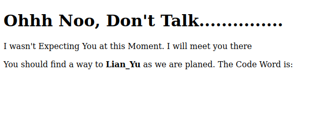
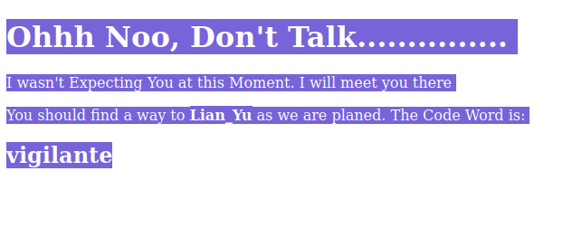

# Lian Yu


## Summary

[Lian Yu](https://tryhackme.com/room/lianyu "Lian Yu CTF on TryHackMe") is a begginer friendly, Arrowverse themed CTF hosted by [TryHackMe](https://tryhackme.com/ "TryHackMe Official Website") and created by [Deamon](https://twitter.com/User6825 "Deamon's Twitter Profile").

This CTF requires basic knowledge of:

* Port scanning with tools like ```nmap```.
* Directory/file scanning with tools like ```gobuster```.
* Viewing ```HTML``` source code.
* Getting files from an ```FTP``` server.
* Editing a files hex signature with tools like ```hexedit```.
* Extracting files from a JPEG with tools like ```steghide```.
* Connecting to remote server with ```SSH```.
* Linux privilege escalation with tools like ```GTFOBins```.

---

## Contents

* [Flag 1 - What is the Web Directory you found?](#flag-1 "Jump To Flag 1")

* [Flag 2 - What is the file name you found?](#flag-2 "Jump To Flag 2")

* [Flag 3 - What is the FTP Password?](#flag-3 "Jump To Flag 3")

* [Flag 4 - What is the file name with SSH password?](#flag-4 "Jump To Flag 4")

* [Flag 5 - user.txt](#flag-5 "Jump To Flag 5")

* [Flag 6 - root.txt](#flag-6 "Jump To Flag 6")

---

## Flag 1

As always we'll ```ping``` the target machine to make sure it's up and running.

```
$ ping <IP_Address>
PING <IP_Address> (<IP_Address>) 56(84) bytes of data.
64 bytes from <IP_Address>: icmp_seq=1 ttl=61 time=172 ms
64 bytes from <IP_Address>: icmp_seq=2 ttl=61 time=170 ms
64 bytes from <IP_Address>: icmp_seq=3 ttl=61 time=184 ms
64 bytes from <IP_Address>: icmp_seq=4 ttl=61 time=170 ms
^C
--- <IP_Address> ping statistics ---
4 packets transmitted, 4 received, 0% packet loss, time 3003ms
rtt min/avg/max/mdev = 169.717/173.950/184.273/6.037 ms
```

Once we've verified the target machine is running we can move on to a port scan using ```nmap``` in aggressive mode by using the ```-A``` flag. This will return ports found, perform OS and version detection, and run additional scripts that may return useful information.

```
$ nmap -A <IP_Address>

Host is up (0.17s latency).
Not shown: 996 closed ports
PORT    STATE SERVICE VERSION
21/tcp  open  ftp     vsftpd 3.0.2
22/tcp  open  ssh     OpenSSH 6.7p1 Debian 5+deb8u8 (protocol 2.0)
80/tcp  open  http    Apache httpd
|_http-server-header: Apache
|_http-title: Purgatory
111/tcp open  rpcbind 2-4 (RPC #100000)
| rpcinfo: 
|   program version    port/proto  service
|   100000  2,3,4        111/tcp   rpcbind
|   100000  2,3,4        111/udp   rpcbind
|   100000  3,4          111/tcp6  rpcbind
|   100000  3,4          111/udp6  rpcbind
|   100024  1          37549/udp   status
|   100024  1          39577/tcp   status
|   100024  1          42645/tcp6  status
|_  100024  1          42882/udp6  status
Service Info: OSs: Unix, Linux; CPE: cpe:/o:linux:linux_kernel
```

After running the port scan we discover the following ports and services.

* 21 - ```FTP``` (File Transfer Protocol)
* 22 - ```SSH``` (Secure Shell)
* 80 - ```HTTP``` (HyperText Transfer Protocol)
* 111 - ```RPCBIND``` (Remote Procedure Call)

Our next step is to check the website hosted at port 80 where we'll be greeted with an image of "Lian Yu", a large mountainous island from the DC Universe, along with some background information on the characters from the show "Arrow".

Reviewing the source code shows nothing of interest, so our next move is using a tool like ```GoBuster``` to scan the target IP for hidden directories with a word list like [directory-list-2.3-small.txt](https://github.com/danielmiessler/SecLists/blob/master/Discovery/Web-Content/directory-list-2.3-small.txt "Small Directory Word List").

```
$ gobuster -w /path/to/wordlist -u http://<IP_Address>/

=====================================================
Gobuster v2.0.1              OJ Reeves (@TheColonial)
=====================================================
[+] Mode         : dir
[+] Url/Domain   : http://<IP_Address>/
[+] Threads      : 10
[+] Wordlist     : /path/to/wordlist
[+] Status codes : 200,204,301,302,307,403
[+] Timeout      : 10s
=====================================================
2023/01/10 10:19:55 Starting gobuster
=====================================================
/island (Status: 301)
```

After heading to the newly discovered directory named ```/island``` we should see a message that reads...

```
Ohhh Noo, Don't Talk...............
I wasn't Expecting You at this Moment. I will meet you there
You should find a way to Lian_Yu as we are planed. The Code Word is: 
```

But no code word can be seen. After that the page just goes blank.



If we highlight the text on the page we'll see the code word.



Alternatively we can view the HTML source code where we can see an ```<h2>``` element styled with white font, a method for trying to camouflage into the white background of the page.

```html
<!DOCTYPE html>
<html>
	<body>
		<h1> Ohhh Noo, Don't Talk............... </h1>
		<p> I wasn't Expecting You at this Moment. I will meet you there </p><!-- go!go!go! -->
		<p>You should find a way to <b> Lian_Yu</b> as we are planed. The Code Word is: </p><h2 style="color:white"> vigilante</h2>
	</body>
</html>
```

Either way will lead to the code word "```vigilante```" which, unfortunately for us, can't be used anywhere yet. So we'll have to further enumerate the machine to see what we can find.

Running another directory scan with ```gobuster``` on ```<IP_Address>/island/``` with the [directory-list-2.3-small.txt](https://github.com/danielmiessler/SecLists/blob/master/Discovery/Web-Content/directory-list-2.3-small.txt "Small Directory Word List") will reveal another directory, this one named ```/2100```.

```
$ gobuster -w /path/to/wordlist -u http://<IP_Address>/island/

=====================================================
Gobuster v2.0.1              OJ Reeves (@TheColonial)
=====================================================
[+] Mode         : dir
[+] Url/Domain   : http://<IP_Address>/island/
[+] Threads      : 10
[+] Wordlist     : /path/to/wordlist
[+] Status codes : 200,204,301,302,307,403
[+] Timeout      : 10s
=====================================================
2023/01/10 11:13:45 Starting gobuster
=====================================================
/2100 (Status: 301)
```

### [Back To Top](#lian-yu "Jump To Top")

---

## Flag 2

After visiting http://<IP_Address>/island/2100 we'll be greeted with the following screen.


At the time of writing, the video is no longer available. But it doesn't matter because what is important to us can be found in an HTML comment within the source code of this page.

```html
<!DOCTYPE html>
<html>
<body>

<h1 align=center>How Oliver Queen finds his way to Lian_Yu?</h1>


<p align=center >
<iframe width="640" height="480" src="https://www.youtube.com/embed/X8ZiFuW41yY">
</iframe> <p>
<!-- you can avail your .ticket here but how?   -->

</header>
</body>
</html>
```

The writer states that we can use our ```.ticket``` _here_. 

"Here" reffers to the current directory (```/island/2100```) and our ```.ticket``` looks a lot like a file extension.

So once again we'll have to use ```gobuster```, except this time instead of scanning for directories we'll have to scan for web _pages_ with the ```.ticket``` extension.

This can be done the same way we did the directory scans and simply adding the ```-x``` flag to specify an extension followed by the extension type, which in this case is ```ticket```.

```
$ gobuster -w /path/to/wordlist -u http://<IP_Address>/island/2100/ -x ticket

=====================================================
Gobuster v2.0.1              OJ Reeves (@TheColonial)
=====================================================
[+] Mode         : dir
[+] Url/Domain   : http://<IP_Address>/island/2100/
[+] Threads      : 10
[+] Wordlist     : /path/to/wordlist
[+] Status codes : 200,204,301,302,307,403
[+] Extensions   : ticket
[+] Timeout      : 10s
=====================================================
2023/01/10 18:23:14 Starting gobuster
=====================================================
/green_arrow.ticket (Status: 200)
```

The results of the ```gobuster``` scan show a file named ```green_arrow.ticket``` has been found at the ```/2100``` directory.

### [Back To Top](#lian-yu "Jump To Top")

---

## Flag 3


### [Back To Top](#lian-yu "Jump To Top")

---

## Flag 4


### [Back To Top](#lian-yu "Jump To Top")

---

## Flag 5


### [Back To Top](#lian-yu "Jump To Top")

---

## Flag 6


---

### [Back To Top](#lian-yu "Jump To Top")
