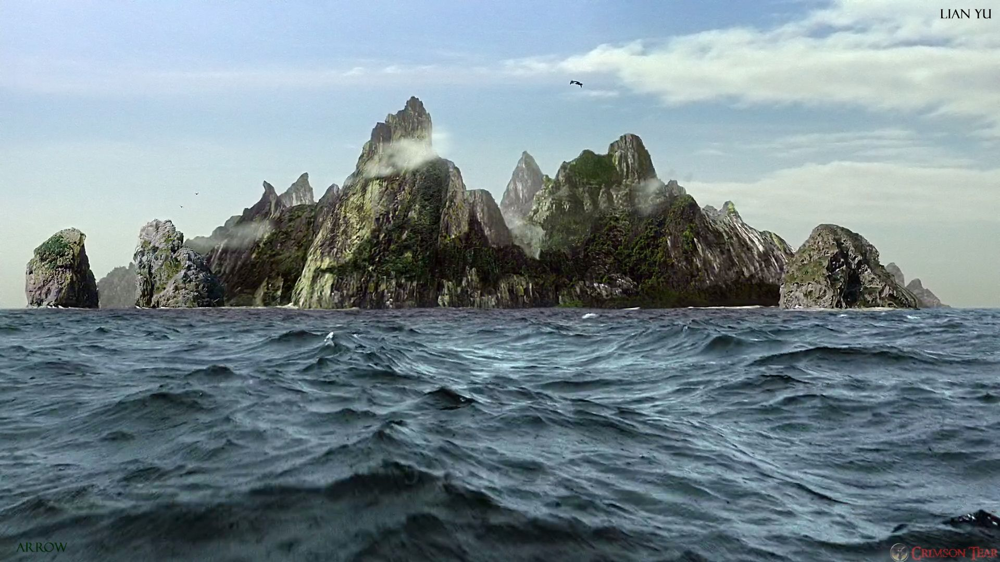

# Lian Yu



## Summary

[Lian Yu](https://tryhackme.com/room/lianyu "Lian Yu CTF on TryHackMe") is a begginer friendly, Arrowverse themed CTF hosted by [TryHackMe](https://tryhackme.com/ "TryHackMe Official Website") and created by [Deamon](https://twitter.com/User6825 "Deamon's Twitter Profile").

This CTF requires basic knowledge of:

* Port scanning with tools like ```nmap```.
* Directory/file scanning with tools like ```gobuster```.
* Viewing ```HTML``` source code.
* Getting files from an ```FTP``` server.
* Editing a files hex signature with tools like ```hexedit```.
* Extracting files from a JPEG with tools like ```steghide```.
* Connecting to remote server with ```SSH```.
* Linux privilege escalation with tools like ```GTFOBins```.

---

## Contents

* [Flag 1 - What is the Web Directory you found?](#flag-1 "Jump To Flag 1")

* [Flag 2 - What is the file name you found?](#flag-2 "Jump To Flag 2")

* [Flag 3 - What is the FTP Password?](#flag-3 "Jump To Flag 3")

* [Flag 4 - What is the file name with SSH password?](#flag-4 "Jump To Flag 4")

* [Flag 5 - user.txt](#flag-5 "Jump To Flag 5")

* [Flag 6 - root.txt](#flag-6 "Jump To Flag 6")

---

## Flag 1


### [Back To Top](#lian-yu "Jump To Top")

---

## Flag 2


### [Back To Top](#lian-yu "Jump To Top")

---

## Flag 3


### [Back To Top](#lian-yu "Jump To Top")

---

## Flag 4


### [Back To Top](#lian-yu "Jump To Top")

---

## Flag 5


### [Back To Top](#lian-yu "Jump To Top")

---

## Flag 6


---

### [Back To Top](#lian-yu "Jump To Top")
