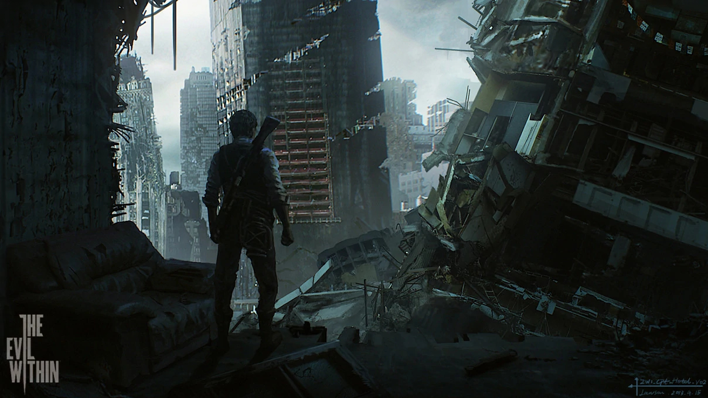

# The Evil Within

## Summary

[Psycho Break](https://tryhackme.com/room/psychobreak "Psycho Break room on TryHackMe") is a <abbr title="Capture The Flag">CTF</abbr> created by [Shafdo](https://github.com/shafdo "Shafdos GitHub") and inspired by the survival horror video game ["The Evil Within"](https://en.wikipedia.org/wiki/The_Evil_Within "The Evil Within Wikipedia"). This room can be found on [TryHackMe](https://tryhackme.com/ "TryHackMe Website") along with other CTF's.

---

## Sections

* [Task 1 - Recon](#task-1---recon "Jump To Task 1")
* [Task 2 - Web](#task-2---web "Jump To Task 2")
* [Task 3 - Help Mee](#task-3---help-mee "Jump To Task 3")
* [Task 4 - Crack It Open](#task-4---crack-it-open "Jump To Task 4")
* [Task 5 - Go Capture The Flag](#task-5---go-capture-the-flag "Jump To Task 5")
* [Task 6 - Copyright Material](#task-6---copyright-material "Jump To Task 6")

---

## Task 1 - Recon

### How many ports are open?

### What is the operating system that runs on the target machine?

#### [BACK TO TOP](#the-evil-within "Jump To Top")

---

## Task 2 - Web

### Key to the looker room

### Key to access the map

### The Keeper Key

### What is the filename of the text file (without the file extension)

#### [BACK TO TOP](#the-evil-within "Jump To Top")

---

## Task 3 - Help Mee

### Who is locked up in the cell?

### There is something weird with the .wav file. What does it say?

### What is the FTP Username

### What is the FTP User Password

#### [BACK TO TOP](#the-evil-within "Jump To Top")

---

## Task 4 - Crack It Open

### The key used by the program

### What do the crazy long numbers mean when there decrypted.

#### [BACK TO TOP](#the-evil-within "Jump To Top")

---

## Task 5 - Go Capture The Flag

### user.txt

### root.txt

### **Bonus**: Defeat Ruvik

#### [BACK TO TOP](#the-evil-within "Jump To Top")
