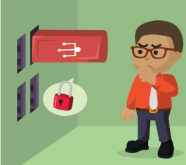
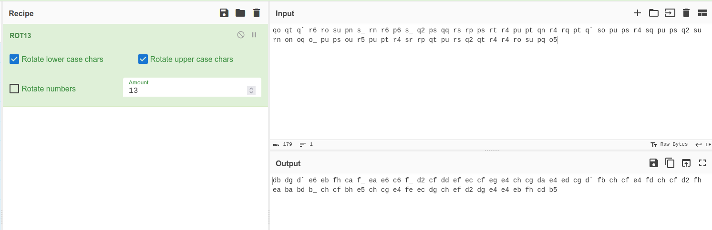
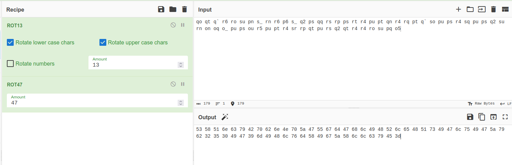
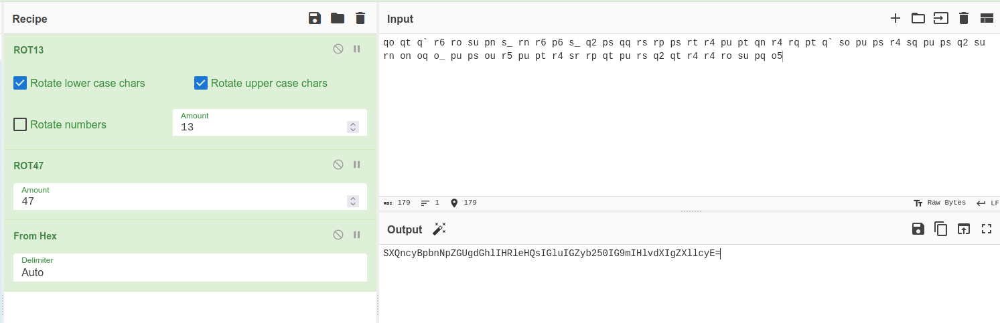
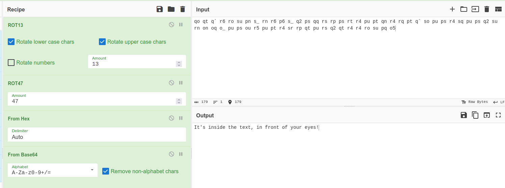
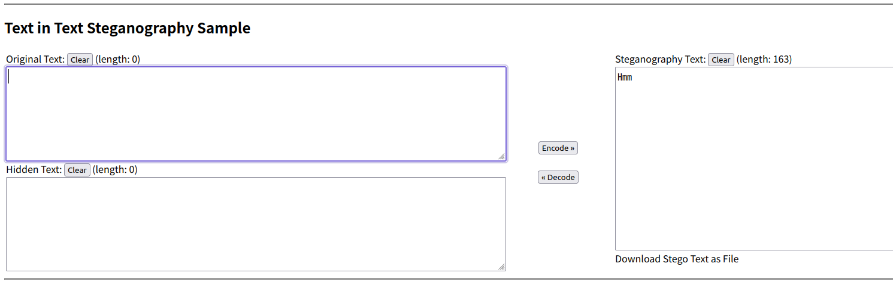
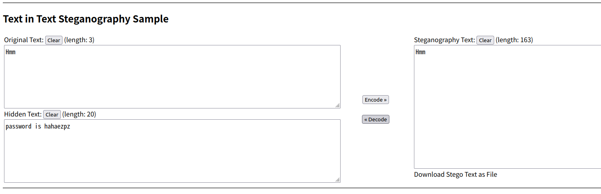

# The Impossible Challenge



## Summary

[The Impossible Challenge](https://tryhackme.com/room/theimpossiblechallenge "The Impossible Challenge CTF On TryHackMe") is a CTF hosted on the [TryHackMe website](https://tryhackme.com/ "TryHackMe Website") and created by the user [0Day](https://tryhackme.com/p/0day "0Day Profile On TryHackMe"). The description for this room simply reads... "Hmm", and the only hint given is "Hmm, I'm thinking Steg".

## Contents

* [Getting Started](#getting-started "Jump To Section")

* [Decoding the Encoded Text](#decoding-the-encoded-text "Jump To Section")

* [Finding the Hidden Message](#finding-the-hidden-message "Jump To Section")

* [Getting the Flag](#getting-the-flag "Jump To Section")

* [Bonus - Helpful Resources](#bonus---helpful-resources "Jump To Section")

## Getting Started

Diving into the CTF we'll be given a password protected ZIP file named [Impossible.zip](./Assets/Impossible.zip "Password Protected ZIP File Named Impossible.zip") and the following encoded text:

```
qo qt q` r6 ro su pn s_ rn r6 p6 s_ q2 ps qq rs rp ps rt r4 pu pt qn r4 rq pt q` so pu ps r4 sq pu ps q2 su rn on oq o_ pu ps ou r5 pu pt r4 sr rp qt pu rs q2 qt r4 r4 ro su pq o5
```

We can try bruteforcing the password for the ZIP file but we won't be successful. So we'll have to move on to decoding the text given to us.

[Back To Top](#the-impossible-challenge "Jump To Top")

---

## Decoding the Encoded Text

Original text:

```
qo qt q` r6 ro su pn s_ rn r6 p6 s_ q2 ps qq rs rp ps rt r4 pu pt qn r4 rq pt q` so pu ps r4 sq pu ps q2 su rn on oq o_ pu ps ou r5 pu pt r4 sr rp qt pu rs q2 qt r4 r4 ro su pq o5
```

Taking the original text and decoding it from [ROT 13](https://en.wikipedia.org/wiki/ROT13 "Wikipedia Entry For ROT13") results in the following text:

```
db dg d` e6 eb fh ca f_ ea e6 c6 f_ d2 cf dd ef ec cf eg e4 ch cg da e4 ed cg d` fb ch cf e4 fd ch cf d2 fh ea ba bd b_ ch cf bh e5 ch cg e4 fe ec dg ch ef d2 dg e4 e4 eb fh cd b5
```



Decoding the text once again, but this time from [ROT 47](https://en.wikipedia.org/wiki/ROT13#Variants "Wikipedia Entry For ROT 47") results in the following text:

```
53 58 51 6e 63 79 42 70 62 6e 4e 70 5a 47 55 67 64 47 68 6c 49 48 52 6c 65 48 51 73 49 47 6c 75 49 47 5a 79 62 32 35 30 49 47 39 6d 49 48 6c 76 64 58 49 67 5a 58 6c 6c 63 79 45 3d
```



Again we'll decode the text but this time from Hex, which will result in the following text:

```
SXQncyBpbnNpZGUgdGhlIHRleHQsIGluIGZyb250IG9mIHlvdXIgZXllcyE=
```



Finally, one last decode. This time we'll decode the above text from Base 64, which results in the following text:

```
It's inside the text, in front of your eyes!
```



This rabbit hole ends up leading to another hint that tells us what we have been looking for has been in front of us the whole time.

[Back To Top](#the-impossible-challenge "Jump To Top")

---

## Finding the Hidden Message

Copying the room description "Hmm" and pasting it into a text editor you'll see random symbols around the word. You might also notice the character length is a lot longer than the three letters you see. These "random symbols" are actually unicode characters, more specifically "Zero-Width Unicode Characters". They have a genuine purpose when used in writing text in other languages but in this context they are being used to obfuscate a hidden message. Using the Unicode Stegonagraphy tool at https://330k.github.io/misc_tools/unicode_steganography.html will help us uncover this hidden message.

Once we've pasted the word into the decoder tool we'll see that the length is not three but rather 163.



After decoding the Unicode characters with the same tool we'll find the following hidden message:

> password is hahaezpz



[Back To Top](#the-impossible-challenge "Jump To Top")

---

## Getting the Flag

Now that we have the password, ```hahaezpz```, we can unzip the [Impossible.zip](./Assets/Impossible.zip "Impossible.zip File") file, where we'll find a file named [flag.txt](./Assets/flag.txt "flag.txt file") which reads:

```
You have solved the Impossible Challenge! Here is your flag THM{Zero_Width_Characters_EZPZ}
```

[Back To Top](#the-impossible-challenge "Jump To Top")

---

## Bonus - Helpful Resources

* [330k Unicode Stegonagraphy Tool](https://330k.github.io/misc_tools/unicode_steganography.html "330k Unicode Stegonagraphy Tool")

* [Neatnik Zero-Width Stegonagraphy Tool](https://neatnik.net/steganographr/ "Neatnik Zero-Width Stegonagraphy Tool")

* [Diffchecker - Tool to check differences between two files](https://www.diffchecker.com/ "Diffchecker Tool")

* [Hack-A-Day Article On Zero-Width Stegonagraphy](https://hackaday.com/2018/04/15/hide-secret-messages-in-plain-sight-with-zero-width-characters/ "Hack-A-Day Article On Zero-Width Stegonagraphy")

* [Null-Byte Article On Zero-Width Stegonagraphy](https://null-byte.wonderhowto.com/how-to/use-zero-width-characters-hide-secret-messages-text-even-reveal-leaks-0198692/ "Null-Byte Article On Zero-Width Stegonagraphy")

* [Zach Aysan Article On Zero-Width Stegonagraphy](https://www.zachaysan.com/writing/2017-12-30-zero-width-characters "Zach Aysan Article On Zero-Width Stegonagraphy")

[Back To Top](#the-impossible-challenge "Jump To Top")
