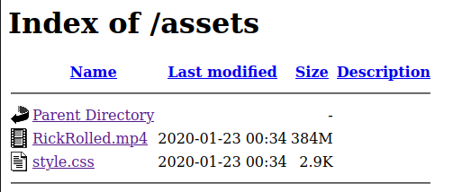
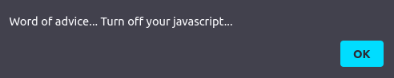
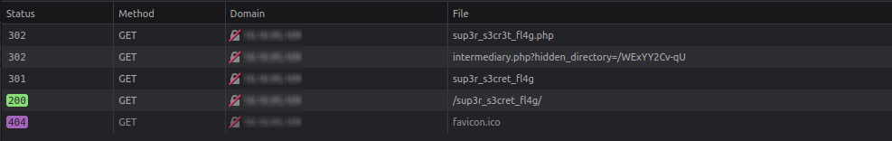
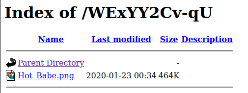

# Year Of The Rabbit


## Summary

[Year Of The Rabbit](https://tryhackme.com/room/yearoftherabbit "Year Of The Rabbit Room On  TryHackMe") is a begginer friendly CTF hosted by [TryHackMe](https://tryhackme.com/ "TryHackMe Official Website") and created by [Muirlandoracle](https://tryhackme.com/p/MuirlandOracle "Muirlandoracle TryHackMe Profile").

This CTF requires basic knowledge of:

* Port scanning with tools like ```nmap```.

* Directory/file scanning with tools like ```gobuster```.

* Viewing ```HTML``` source code.

* Viewing ```CSS``` source code.

* Intercepting HTTP requests with tools like ```BurpSuite```.

* Extracting image metadata with tools like ```ExifTool```.

* Using the Linux ```strings``` command to find suspicious text in images.

* Brute forcing an FTP server with tools like ```Hydra```.

* Getting files from an ```FTP``` server.

* Connecting to remote server with ```SSH```.

* Linux privilege escalation with tools like ```GTFOBins```.

---

## Contents

* [Getting Started](#getting-started "Jump To Getting Started")

* [Port Enumeration](#port-enumeration "Jump To Port Enumeration")

* [Directory Scanning](#directory-scanning "Jump To Directory Scanning")

* [Examining Files](#examining-files "Jump To Examining Files")

* [The Rabbit Hole](#the-rabbit-hole "Jump To The Rabbit Hole")

* [Finding The Hidden Directory](#the-hidden-directory "Jump To The Hidden Directory")

* [Metadata and Steganography](#metadata-and-steganography "Jump To Metadata and Steganography")

* [What is the user flag?](#flag-1 "Jump To Flag 1")

* [What is the root flag?](#flag-2 "Jump To Flag 2")

---

## Getting Started

Before we've started the machine we're given the following introductory text...

> Let's have a nice gentle start to the New Year!
Can you hack into the Year of the Rabbit box without falling down a hole?
(Please ensure your volume is turned up!)

So we know at some point we'll have to listen closely to something in order to advance to the next step.

But for now our first step is to start the machine and use the ```ping``` command to ensure the target machine is up and running.

```
$ ping <IP_Address>

PING <IP_Address> (<IP_Address>) 56(84) bytes of data.
64 bytes from <IP_Address>: icmp_seq=1 ttl=61 time=171 ms
64 bytes from <IP_Address>: icmp_seq=2 ttl=61 time=169 ms
64 bytes from <IP_Address>: icmp_seq=3 ttl=61 time=170 ms
64 bytes from <IP_Address>: icmp_seq=4 ttl=61 time=168 ms
^C
--- <IP_Address> ping statistics ---
4 packets transmitted, 4 received, 0% packet loss, time 3005ms
rtt min/avg/max/mdev = 168.085/169.433/170.750/0.963 ms
```

Now that we've ensured connectivity we can move on to port enumeration so that we can see what kind of services are running on the target machine.

### [Back To Top](#year-of-the-rabbit "Jump To Top")

---

## Port Enumeration

In order to discover what kind of services are running on the target machine we can use ```nmap``` in aggressive mode by using the ```-A``` flag. This will return open ports, services, as well as other useful information.

```
$ nmap -A <IP_Address>

Host is up (0.17s latency).
Not shown: 997 closed ports
PORT   STATE SERVICE VERSION
21/tcp open  ftp     vsftpd 3.0.2
22/tcp open  ssh     OpenSSH 6.7p1 Debian 5 (protocol 2.0)
80/tcp open  http    Apache httpd 2.4.10 ((Debian))
|_http-server-header: Apache/2.4.10 (Debian)
|_http-title: Apache2 Debian Default Page: It works
Service Info: OSs: Unix, Linux; CPE: cpe:/o:linux:linux_kernel
```

After running the scan we can see we have 3 open ports.

* Port 21 - ```FTP``` (File Transfer Protocol)

* Port 22 - ```SSH``` (Secure Shell)

* Port 80 - ```HTTP``` (HyperText Transfer Protocol)

And we can also see the website at port 80 has the default ```Apache2``` landing page.

Our next step should be to check the page for any additional information as well as use ```GoBuster``` to find any hidden directories.

### [Back To Top](#year-of-the-rabbit "Jump To Top")

---

## Directory Scanning

Once we navigate to the website we'll see the ```Apache2 Debian Default Page```. We won't find anything useful on this page or in the HTML source code. So our next step is a directory scan using ```GoBuster``` and a wordlist like [directory-list-2.3-small.txt](https://github.com/danielmiessler/SecLists/blob/master/Discovery/Web-Content/directory-list-2.3-small.txt "Small Directory Word List").

```
$ gobuster -u <IP_Address> -w /path/to/wordlist

=====================================================
Gobuster v2.0.1              OJ Reeves (@TheColonial)
=====================================================
[+] Mode         : dir
[+] Url/Domain   : http://<IP_Address>/
[+] Threads      : 10
[+] Wordlist     : /path/to/wordlist
[+] Status codes : 200,204,301,302,307,403
[+] Timeout      : 10s
=====================================================
2023/01/15 10:52:56 Starting gobuster
=====================================================
/assets (Status: 301)
```

After running the scan we should see a directory named ```/assets``` has been found.

### [Back To Top](#year-of-the-rabbit "Jump To Top")

---

## Examining Files

Once we have navigated to the newly discovered directory at ```http://<IP_Address>/assets``` we should see two files, ```RickRolled.mp4``` and ```style.css```.



The RickRolled video is obviously Rick Astley singing "Never Gonna Give You Up", but if you listen closely you'll hear hidden information within the song. More on that later, for now all we need to do is to examine the ```style.css``` file.

Viewing the CSS source code we can find the following comment right after the ```body, html``` selector...

```css
/* Nice to see someone checking the stylesheets.
    Take a look at the page: /sup3r_s3cr3t_fl4g.php
*/
```

### [Back To Top](#year-of-the-rabbit "Jump To Top")

---

## The Rabbit Hole

Visiting the file referenced in the CSS source code (```http://<IP_Address>/sup3r_s3cr3t_fl4g.php```) we'll be greeted by a JavaScript Alert that tells us to turn off JavaScript.



Once we press ```OK``` we'll be RickRolled again. The site will redirect us to Rick Astley's "[Never Gonna Give You Up](https://www.youtube.com/watch?v=dQw4w9WgXcQ "Never Gonna Give You Up Song On YouTube")" song on YouTube.

If we turn off JavaScript as suggested by the alert, we'll be greeted with text that reads...

```
Love it when people block Javascript...
This is happening whether you like it or not... The hint is in the video. If you're stuck here then you're just going to have to bite the bullet!
Make sure your audio is turned up!
```

And the Rick Astley Rick Roll video is back again, this time it's the one we found earlier in the ```/assets``` folder. So wether or not we have JavaScript enabled we're stuck in a rabbit hole of Rick Rolls.

If we listen to the song, around the ```56 second mark```, we can hear the following...

```I'll put you out of your misery, you're looking in the wrong place *burp*.```

The burp at the end is a somewhat subtle reference to the ```BurpSuite``` tool used for intercepting HTTP requests.

Logically our next step should be intercepting the request to ```http://<IP_Address>/sup3r_s3cr3t_fl4g.php``` with ```BurpSuite``` but there's actually an easier way to move on from this step and that's to use the ```Network``` tab in our ```Dev Console```.

### [Back To Top](#year-of-the-rabbit "Jump To Top")

---

## The Hidden Directory

If we open our ```Developer Console``` in the browser, switch over to the ```Network``` tab, and visit ```http://<IP_Address>/sup3r_s3cr3t_fl4g.php``` we'll see that this request redirects us to ```intermediary.php?hidden_directory=/WExYY2Cv-qU``` which then redirects us to the ```/sup3r_s3cret_fl4g/``` directory.



It all happens so fast, but for a brief moment we request a file named ```intermediary.php``` and pass it the parameter ```hidden_directory``` and value ```/WExYY2Cv-qU```.

The intended way to have discovered this hidden directory was to use ```BurpSuite``` to intercept the initial request and forward it until we saw the following request being made...

```http
GET /intermediary.php?hidden_directory=/WExYY2Cv-qU HTTP/1.1
Host: <IP_Address>
User-Agent: <Your_Browser>
Accept: text/html,application/xhtml+xml,application/xml;q=0.9,image/avif,image/webp,*/*;q=0.8
Accept-Language: en-US,en;q=0.5
Accept-Encoding: gzip, deflate
Connection: close
Upgrade-Insecure-Requests: 1
Sec-GPC: 1
DNT: 1
```

If we visit newly found directory at ```http://<IP_Address>/WExYY2Cv-qU/``` we'll find an image called ```Hot_Babe.png```.



### [Back To Top](#year-of-the-rabbit "Jump To Top")

---

## Metadata and Steganography

### [Back To Top](#year-of-the-rabbit "Jump To Top")

---

## Flag 1


### [Back To Top](#year-of-the-rabbit "Jump To Top")

---

## Flag 2

---

### [Back To Top](#year-of-the-rabbit "Jump To Top")
