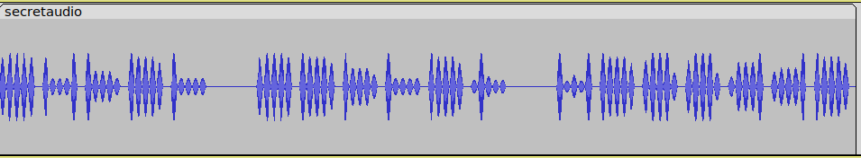
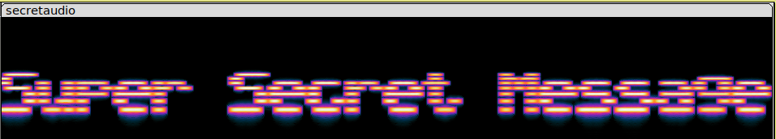
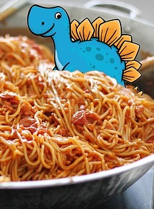

# c4ptur3 th3 fl4g

## Summary

"[c4ptur3 th3 fl4g](https://tryhackme.com/room/c4ptur3th3fl4g "TryHackMe c4ptur3 th3 fl4g Room")" is one of the many <abbr title="Capture The Flag">CTF</abbr> rooms available for free on the [TryHackMe website](https://tryhackme.com/ "TryHackMe Website"). The room is made up of four sections: Translation & Shifting, Spectrograms, Steganography, and Security Through Obscurity.

---

## Contents

* [Task 1 - Translation and Shifting](#task-1 "Jump To Task 1")
	* [Flag 1 - 1337 $P34K (Leet Speak)](#flag-1 "Jump To Flag 1")
	* [Flag 2 - Binary](#flag-2 "Jump To Flag 2")
	* [Flag 3 - Base32](#flag-3 "Jump To Flag 3")
	* [Flag 4 - Base64](#flag-4 "Jump To Flag 4")
	* [Flag 5 - Base16 (Hexadecimal)](#flag-5 "Jump To Flag 5")
	* [Flag 6 - ROT13 (Caesar Cipher)](#flag-6 "Jump To Flag 6")
	* [Flag 7 - ROT47](#flag-7 "Jump To Flag 7")
	* [Flag 8 - Morse](#flag-8 "Jump To Flag 8")
	* [Flag 9 - Decimal](#flag-9 "Jump To Flag 9")
	* [Flag 10 - Multi-Step](#flag-10 "Jump To Flag 10")
* [Task 2 - Spectograms](#task-2 "Jump To Task 2")
* [Task 3 - Steganography](#task-3 "Jump To Task 3")
* [Task 4 - Security Through Obscurity](#task-4 "Jump To Task 4")

---

## Task 1 - Translation and Shifting

Task 1 requires finding 10 flags by translating, shifting or decoding a given string. For this we can use [CyberChef](https://cyberchef.org/ "CyberChef Website").

### Flag 1

This ones fairly simple and we don't need CyberChef. It's a character replacement system called "[Leet Speak](https://en.wikipedia.org/wiki/Leet "Leet Speak Wikipedia")" that was originally used to evade censorship programs on early online forums. Big in early hacker movements, now it is used mostly ironically.

```
Problem: c4n y0u c4p7u23 7h3 f149?

Solution: can you capture the flag
```

### Flag 2

To find wether or not binary is being used to convey a message we can first translate the binary to its decimal equivalent and look up the decimal number on an <abbr title="American Standard Code for Information Interchange">ASCII</abbr> chart. Or we can just copy the binary into [CyberChef](https://cyberchef.org/ "CyberChef Website") and select "From Binary" in the operations area.

```
Problem: 01101100 01100101 01110100 01110011 00100000 01110100 01110010 01111001 00100000 01110011 01101111 01101101 01100101 00100000 01100010 01101001 01101110 01100001 01110010 01111001 00100000 01101111 01110101 01110100 00100001

Solution: lets try some binary out!
```

### Flag 3

Looking at the string two things should stand out:

1. It's in all caps
2. There's a bunch of equal signs padding the end.

This is an indicator it might be base encoded.

Pasting it into CyberChef and selecting "From Base32" reveals the hidden message.

```
Problem: MJQXGZJTGIQGS4ZAON2XAZLSEBRW63LNN5XCA2LOEBBVIRRHOM======

Solution: base32 is super common in CTF's
```

### Flag 4

Again another string with equal signs padding the end. But this time it's only 2. Base64 encoding will never use more than two equal signs. And sometimes won't use any. To read why base32 and base64 pad the end with equal signs you can read this [StackOverflow question](https://stackoverflow.com/questions/6916805/why-does-a-base64-encoded-string-have-an-sign-at-the-end "Base64 Question on Stack Overflow").

Plugging the string into CyberChef and selecting "From Base64" reveals the hidden message.

```
Problem: RWFjaCBCYXNlNjQgZGlnaXQgcmVwcmVzZW50cyBleGFjdGx5IDYgYml0cyBvZiBkYXRhLg==

Solution: Each Base64 digit represents exactly 6 bits of data.
```

### Flag 5

Looking at the problem below we see a series of digit pairs and somethings stand out.

* The digits range from numbers 0-9 and the letters a-f.

Just like [hexadecimal (Base 16)](https://en.wikipedia.org/wiki/Hexadecimal "Hexadecimal Wikipedia") digits.

Each digit pair represents a byte while the single digits represent half a byte (also called a [nibble](https://en.wikipedia.org/wiki/Nibble "Nibble Wikipedia")).

To convert a hex byte to its <abbr title="American Standard Code For Information Interchange">ASCII</abbr> equivalent, first convert the hex byte to its decimal representation. Then look up the decimal on an ASCII chart.

| **HEX** | **DECIMAL** | **ASCII** | **DESCRIPTION** |
|---------|-------------|-----------|-----------------|
| **68**  | 104         | h         | Lowercase h     |
| **65**  | 101         | e         | Lowercase e     |
| **78**  | 120         | x         | Lowercase x     |
| **61**  | 97          | a         | Lowercase a     |
| **64**  | 100         | d         | Lowercase d     |
| **65**  | 101         | e         | Lowercase e     |
| **63**  | 99          | c         | Lowercase c     |
| **69**  | 105         | i         | Lowercase i     |
| **6d**  | 109         | m         | Lowercase m     |
| **61**  | 97          | a         | Lowercase a     |
| **6c**  | 108         | l         | Lowercase l     |
| **20**  | 32          | SP        | Space           |
| **6f**  | 111         | o         | Lowercase o     |
| **72**  | 114         | r         | Lowercase r     |
| **20**  | 32          | SP        | Space           |
| **62**  | 98          | b         | Lowercase b     |
| **61**  | 97          | a         | Lowercase a     |
| **73**  | 115         | s         | Lowercase s     |
| **65**  | 101         | e         | Lowercase e     |
| **31**  | 49          | 1         | One             |
| **36**  | 54          | 6         | Six             |
| **3f**  | 63          | ?         | Question Mark   |

An alternative and much easier way to reveal the hidden message is to paste it into CyberChef and select "From Hex".

```
Problem: 68 65 78 61 64 65 63 69 6d 61 6c 20 6f 72 20 62 61 73 65 31 36 3f

Solution: hexadecimal or base16?
```

### Flag 6

Looking at this problem, something stands out. Punctuation. The string starts with an uppercase letter and ends with an exclamation point. The cipher maintains a letters case, and can't encipher symbols (remember this, because it comes up in the next flag). These are characteristics of a [Caesar Cipher](https://en.wikipedia.org/wiki/Caesar_cipher "Caesar Cipher Wikipedia").

Example-

* INPUT:

	* This, Is An Example, Of A CAESAR cipher rotated 7 PLACES!!!

* OUTPUT:

	* Aopz, Pz Hu Lehtwsl, Vm H JHLZHY jpwoly yvahalk 7 WSHJLZ!!!

The number 13 also hints that it might be a version of the Caesar called [ROT13](https://en.wikipedia.org/wiki/ROT13 "ROT13 Wikipedia").

ROT13 is a unique version of the Caesar Cipher because both decryption and encryption require the **same** step. Just rotating 13 places.

<table style="margin-left:auto; margin-right:auto; background-color:white;" class="wikitable">
<tbody><tr>
<td>Input
</td>
<td><kbd><span style="color: darkred">ABCDEFGHIJKLM</span><span style="color: darkblue">NOPQRSTUVWXYZ</span><span style="color: darkred">abcdefghijklm</span><span style="color: darkblue">nopqrstuvwxyz</span></kbd>
</td></tr>
<tr>
<td>Output
</td>
<td><kbd><span style="color: darkblue">NOPQRSTUVWXYZ</span><span style="color: darkred">ABCDEFGHIJKLM</span><span style="color: darkblue">nopqrstuvwxyz</span><span style="color: darkred">abcdefghijklm</span></kbd>
</td></tr></tbody></table>

Example-

* BEFORE ROT13:

	* I was ROTATED 13 times!

* AFTER ROT13:

	* V jnf EBGNGRQ 13 gvzrf!

* ROT13 AGAIN:

	* I was ROTATED 13 times!

Back to the problem string, paste the cipher text into CyberChef and select "ROT13" to reveal the message.

```
Problem: Ebgngr zr 13 cynprf!

Solution: Rotate me 13 places!
```

### Flag 7

At first this problem text looks like gibberish. But there's something that stands out. All the symbols. In [flag 6](#flag-6 "Jump To Flag 6") we talked about how the Caesar Cipher and ROT13 can't handle symbols. But there is a **rotational** cipher that can. It's called [ROT47](https://en.wikipedia.org/wiki/ROT13#Variants "ROT13 Wikipedia Section On ROT47") and handles all visible characters on the <abbr title="American Standard Code For Computer Information Interchange">ASCII</abbr> chart. Specifically characters in the range 33-126 (! to ~).

Plugging the cipher text into CyberChef and selecting "ROT47" will reveal the hidden message.

```
Problem: *@F DA:? >6 C:89E C@F?5 323J C:89E C@F?5 Wcf E:>6DX

Solution: You spin me right round baby right round (47 times)
```

### Flag 8

This one is immediately recognizable as [Morse Code](https://en.wikipedia.org/wiki/Morse_code "Morse Code Wikipedia"). Morse Code was created by famous American artist and co-inventor of the telegraph [Samuel Morse](https://en.wikipedia.org/wiki/Samuel_Morse "Samuel Morse Wikipedia").


| **LETTER** | **MORSE CODE** |
|:----------:|:--------------:|
| A          | .-             |
| B          | -...           |
| C          | -.-.           |
| D          | -..            |
| E          | .              |
| F          | ..-.           |
| G          | --.            |
| H          | ....           |
| I          | ..             |
| J          | .---           |
| K          | -.-            |
| L          | .-..           |
| M          | --             |
| N          | -.             |
| O          | ---            |
| P          | .--.           |
| Q          | --.-           |
| R          | .-.            |
| S          | ...            |
| T          | -              |
| U          | ..-            |
| V          | ...-           |
| W          | .--            |
| X          | -..-           |
| Y          | -.--           |
| Z          | --..           |


| **NUMBER** | **MORSE CODE** |
|:----------:|:--------------:|
| 0          | -----          |
| 1          | .----          |
| 2          | ..---          |
| 3          | ...--          |
| 4          | ....-          |
| 5          | .....          |
| 6          | -....          |
| 7          | --...          |
| 8          | ---..          |
| 9          | ----.          |

| **PUNCTUATION** | **MORSE CODE** |
|:---------------:|:--------------:|
| .               | .-.-.-         |
| ;               | -.-.-.         |
| /               | -..-.          |
| '               | .----.         |
| -               | -....-         |
| :               | ---...         |
| ,               | --..--         |
| ?               | ..--..         |

The morse code can be decoded by looking it up in the tables above or by pasting the input into CyberChef and selecting "From Morse Code".

```
Problem:
- . .-.. . -.-. --- -- -- ..- -. .. -.-. .- - .. --- -.

. -. -.-. --- -.. .. -. --.

Solution: telecommunication encoding
```

### Flag 9

All these numbers lie in the range 32-116. Quick ways to tell these are decimal:

1. Most numbers lie between 65-90 (lowercase a-z) or 97-122 (uppercase a-z) on the <abbr title="American Standard Code For Information Interchange">ASCII</abbr> chart.

2. The lowest number corresponds with the space character in ASCII.

Plugging the values into CyberChef and selecting "From Decimal" reveals the hidden message.

```
85 110 112 97 99 107 32 116 104 105 115 32 66 67 68

Unpack this BCD
```

### Flag 10

The last flag (and hardest) looks incomprehensible at first. But there are a couple things that stand out.

1. The massive amount of repeating strings.
	* LS0tLS0g
	* Li0tLS0g

2. The equal sign at the end of it all (suggesting base encoding).

Plugging this into CyberChef and selecting "From Base64" reveals the repeating strings were actually Morse Code. More importantly it was only two codes, 0 and 1.

* LS0tLS0g (Base64) -> "----- " (Morse) -> 0

* Li0tLS0g -> (Base64) -> ".---- " (Morse) -> 1

Taking the output and selecting "From Morse" reveals binary.

Taking that output and selecting "ROT47" reveals Decimal.

Taking that output and selecting "From Decimal".

Reveals the flag for this task:

* Let's make this a bit trickier...

To Recap - 

This task required a bunch of steps we used before. Specifiacally the ones we used for Base64, morse, ROT47, and decimal.

Which can be done easily in CyberChef by chaining together a recipe in the following order:

1. From Base64
2. From Morse Code
3. ROT47
4. From Decimal

```
Problem: LS0tLS0gLi0tLS0gLi0tLS0gLS0tLS0gLS0tLS0gLi0tLS0gLi0tLS0gLS0tLS0KLS0tLS0gLi0tLS0gLi0tLS0gLS0tLS0gLS0tLS0gLi0tLS0gLS0tLS0gLi0tLS0KLS0tLS0gLS0tLS0gLi0tLS0gLS0tLS0gLS0tLS0gLS0tLS0gLS0tLS0gLS0tLS0KLS0tLS0gLi0tLS0gLi0tLS0gLS0tLS0gLS0tLS0gLS0tLS0gLS0tLS0gLS0tLS0KLS0tLS0gLi0tLS0gLS0tLS0gLi0tLS0gLi0tLS0gLi0tLS0gLi0tLS0gLi0tLS0KLS0tLS0gLi0tLS0gLi0tLS0gLS0tLS0gLS0tLS0gLS0tLS0gLS0tLS0gLS0tLS0KLS0tLS0gLS0tLS0gLi0tLS0gLS0tLS0gLS0tLS0gLS0tLS0gLS0tLS0gLS0tLS0KLS0tLS0gLi0tLS0gLi0tLS0gLS0tLS0gLS0tLS0gLS0tLS0gLS0tLS0gLS0tLS0KLS0tLS0gLi0tLS0gLi0tLS0gLS0tLS0gLS0tLS0gLS0tLS0gLS0tLS0gLS0tLS0KLS0tLS0gLi0tLS0gLi0tLS0gLS0tLS0gLS0tLS0gLi0tLS0gLS0tLS0gLi0tLS0KLS0tLS0gLS0tLS0gLi0tLS0gLS0tLS0gLS0tLS0gLS0tLS0gLS0tLS0gLS0tLS0KLS0tLS0gLi0tLS0gLi0tLS0gLS0tLS0gLS0tLS0gLS0tLS0gLi0tLS0gLS0tLS0KLS0tLS0gLi0tLS0gLi0tLS0gLS0tLS0gLi0tLS0gLS0tLS0gLS0tLS0gLS0tLS0KLS0tLS0gLS0tLS0gLi0tLS0gLS0tLS0gLS0tLS0gLS0tLS0gLS0tLS0gLS0tLS0KLS0tLS0gLi0tLS0gLi0tLS0gLS0tLS0gLS0tLS0gLS0tLS0gLS0tLS0gLS0tLS0KLS0tLS0gLi0tLS0gLi0tLS0gLS0tLS0gLS0tLS0gLS0tLS0gLS0tLS0gLS0tLS0KLS0tLS0gLi0tLS0gLi0tLS0gLS0tLS0gLS0tLS0gLi0tLS0gLS0tLS0gLS0tLS0KLS0tLS0gLS0tLS0gLi0tLS0gLS0tLS0gLS0tLS0gLS0tLS0gLS0tLS0gLS0tLS0KLS0tLS0gLi0tLS0gLi0tLS0gLS0tLS0gLS0tLS0gLS0tLS0gLi0tLS0gLS0tLS0KLS0tLS0gLi0tLS0gLi0tLS0gLS0tLS0gLS0tLS0gLS0tLS0gLS0tLS0gLi0tLS0KLS0tLS0gLS0tLS0gLi0tLS0gLS0tLS0gLS0tLS0gLS0tLS0gLS0tLS0gLS0tLS0KLS0tLS0gLi0tLS0gLi0tLS0gLS0tLS0gLS0tLS0gLS0tLS0gLS0tLS0gLS0tLS0KLS0tLS0gLi0tLS0gLS0tLS0gLi0tLS0gLi0tLS0gLi0tLS0gLi0tLS0gLi0tLS0KLS0tLS0gLi0tLS0gLi0tLS0gLS0tLS0gLi0tLS0gLS0tLS0gLS0tLS0gLS0tLS0KLS0tLS0gLS0tLS0gLi0tLS0gLS0tLS0gLS0tLS0gLS0tLS0gLS0tLS0gLS0tLS0KLS0tLS0gLi0tLS0gLi0tLS0gLS0tLS0gLi0tLS0gLS0tLS0gLS0tLS0gLS0tLS0KLS0tLS0gLi0tLS0gLi0tLS0gLS0tLS0gLS0tLS0gLi0tLS0gLi0tLS0gLS0tLS0KLS0tLS0gLS0tLS0gLi0tLS0gLS0tLS0gLS0tLS0gLS0tLS0gLS0tLS0gLS0tLS0KLS0tLS0gLi0tLS0gLi0tLS0gLS0tLS0gLS0tLS0gLS0tLS0gLS0tLS0gLS0tLS0KLS0tLS0gLi0tLS0gLS0tLS0gLi0tLS0gLi0tLS0gLi0tLS0gLi0tLS0gLi0tLS0KLS0tLS0gLi0tLS0gLi0tLS0gLS0tLS0gLS0tLS0gLi0tLS0gLi0tLS0gLS0tLS0KLS0tLS0gLS0tLS0gLi0tLS0gLS0tLS0gLS0tLS0gLS0tLS0gLS0tLS0gLS0tLS0KLS0tLS0gLi0tLS0gLi0tLS0gLS0tLS0gLS0tLS0gLS0tLS0gLS0tLS0gLS0tLS0KLS0tLS0gLi0tLS0gLS0tLS0gLi0tLS0gLi0tLS0gLi0tLS0gLi0tLS0gLi0tLS0KLS0tLS0gLi0tLS0gLi0tLS0gLS0tLS0gLS0tLS0gLS0tLS0gLS0tLS0gLS0tLS0KLS0tLS0gLS0tLS0gLi0tLS0gLS0tLS0gLS0tLS0gLS0tLS0gLS0tLS0gLS0tLS0KLS0tLS0gLi0tLS0gLi0tLS0gLS0tLS0gLS0tLS0gLS0tLS0gLi0tLS0gLS0tLS0KLS0tLS0gLi0tLS0gLi0tLS0gLS0tLS0gLS0tLS0gLS0tLS0gLS0tLS0gLi0tLS0KLS0tLS0gLS0tLS0gLi0tLS0gLS0tLS0gLS0tLS0gLS0tLS0gLS0tLS0gLS0tLS0KLS0tLS0gLi0tLS0gLi0tLS0gLS0tLS0gLS0tLS0gLS0tLS0gLS0tLS0gLS0tLS0KLS0tLS0gLi0tLS0gLi0tLS0gLS0tLS0gLS0tLS0gLS0tLS0gLS0tLS0gLS0tLS0KLS0tLS0gLi0tLS0gLi0tLS0gLS0tLS0gLS0tLS0gLi0tLS0gLS0tLS0gLi0tLS0KLS0tLS0gLS0tLS0gLi0tLS0gLS0tLS0gLS0tLS0gLS0tLS0gLS0tLS0gLS0tLS0KLS0tLS0gLi0tLS0gLi0tLS0gLS0tLS0gLS0tLS0gLS0tLS0gLS0tLS0gLS0tLS0KLS0tLS0gLi0tLS0gLS0tLS0gLi0tLS0gLi0tLS0gLi0tLS0gLi0tLS0gLi0tLS0KLS0tLS0gLi0tLS0gLi0tLS0gLS0tLS0gLS0tLS0gLS0tLS0gLi0tLS0gLi0tLS0KLS0tLS0gLS0tLS0gLi0tLS0gLS0tLS0gLS0tLS0gLS0tLS0gLS0tLS0gLS0tLS0KLS0tLS0gLi0tLS0gLi0tLS0gLS0tLS0gLS0tLS0gLS0tLS0gLS0tLS0gLS0tLS0KLS0tLS0gLi0tLS0gLS0tLS0gLi0tLS0gLi0tLS0gLi0tLS0gLi0tLS0gLi0tLS0KLS0tLS0gLi0tLS0gLi0tLS0gLS0tLS0gLS0tLS0gLi0tLS0gLS0tLS0gLS0tLS0KLS0tLS0gLS0tLS0gLi0tLS0gLS0tLS0gLS0tLS0gLS0tLS0gLS0tLS0gLS0tLS0KLS0tLS0gLi0tLS0gLi0tLS0gLS0tLS0gLS0tLS0gLS0tLS0gLS0tLS0gLS0tLS0KLS0tLS0gLi0tLS0gLi0tLS0gLS0tLS0gLS0tLS0gLS0tLS0gLS0tLS0gLS0tLS0KLS0tLS0gLi0tLS0gLi0tLS0gLS0tLS0gLS0tLS0gLi0tLS0gLS0tLS0gLS0tLS0KLS0tLS0gLS0tLS0gLi0tLS0gLS0tLS0gLS0tLS0gLS0tLS0gLS0tLS0gLS0tLS0KLS0tLS0gLi0tLS0gLi0tLS0gLS0tLS0gLS0tLS0gLS0tLS0gLi0tLS0gLS0tLS0KLS0tLS0gLi0tLS0gLi0tLS0gLS0tLS0gLS0tLS0gLS0tLS0gLS0tLS0gLi0tLS0KLS0tLS0gLS0tLS0gLi0tLS0gLS0tLS0gLS0tLS0gLS0tLS0gLS0tLS0gLS0tLS0KLS0tLS0gLi0tLS0gLi0tLS0gLS0tLS0gLi0tLS0gLS0tLS0gLS0tLS0gLS0tLS0KLS0tLS0gLi0tLS0gLi0tLS0gLS0tLS0gLS0tLS0gLi0tLS0gLi0tLS0gLS0tLS0KLS0tLS0gLS0tLS0gLi0tLS0gLS0tLS0gLS0tLS0gLS0tLS0gLS0tLS0gLS0tLS0KLS0tLS0gLi0tLS0gLi0tLS0gLS0tLS0gLS0tLS0gLS0tLS0gLi0tLS0gLS0tLS0KLS0tLS0gLi0tLS0gLi0tLS0gLS0tLS0gLS0tLS0gLS0tLS0gLS0tLS0gLi0tLS0KLS0tLS0gLS0tLS0gLi0tLS0gLS0tLS0gLS0tLS0gLS0tLS0gLS0tLS0gLS0tLS0KLS0tLS0gLi0tLS0gLi0tLS0gLS0tLS0gLi0tLS0gLS0tLS0gLS0tLS0gLS0tLS0KLS0tLS0gLi0tLS0gLi0tLS0gLS0tLS0gLS0tLS0gLi0tLS0gLi0tLS0gLi0tLS0KLS0tLS0gLS0tLS0gLi0tLS0gLS0tLS0gLS0tLS0gLS0tLS0gLS0tLS0gLS0tLS0KLS0tLS0gLi0tLS0gLi0tLS0gLS0tLS0gLS0tLS0gLS0tLS0gLS0tLS0gLS0tLS0KLS0tLS0gLi0tLS0gLS0tLS0gLi0tLS0gLi0tLS0gLi0tLS0gLi0tLS0gLi0tLS0KLS0tLS0gLi0tLS0gLi0tLS0gLS0tLS0gLS0tLS0gLi0tLS0gLS0tLS0gLS0tLS0KLS0tLS0gLS0tLS0gLi0tLS0gLS0tLS0gLS0tLS0gLS0tLS0gLS0tLS0gLS0tLS0KLS0tLS0gLi0tLS0gLi0tLS0gLS0tLS0gLS0tLS0gLS0tLS0gLS0tLS0gLS0tLS0KLS0tLS0gLi0tLS0gLi0tLS0gLS0tLS0gLS0tLS0gLS0tLS0gLS0tLS0gLS0tLS0KLS0tLS0gLi0tLS0gLi0tLS0gLS0tLS0gLS0tLS0gLi0tLS0gLS0tLS0gLi0tLS0KLS0tLS0gLS0tLS0gLi0tLS0gLS0tLS0gLS0tLS0gLS0tLS0gLS0tLS0gLS0tLS0KLS0tLS0gLi0tLS0gLi0tLS0gLS0tLS0gLS0tLS0gLS0tLS0gLi0tLS0gLS0tLS0KLS0tLS0gLi0tLS0gLi0tLS0gLS0tLS0gLS0tLS0gLS0tLS0gLS0tLS0gLi0tLS0KLS0tLS0gLS0tLS0gLi0tLS0gLS0tLS0gLS0tLS0gLS0tLS0gLS0tLS0gLS0tLS0KLS0tLS0gLi0tLS0gLi0tLS0gLS0tLS0gLS0tLS0gLS0tLS0gLS0tLS0gLS0tLS0KLS0tLS0gLi0tLS0gLi0tLS0gLS0tLS0gLS0tLS0gLS0tLS0gLS0tLS0gLS0tLS0KLS0tLS0gLi0tLS0gLi0tLS0gLS0tLS0gLS0tLS0gLi0tLS0gLS0tLS0gLi0tLS0KLS0tLS0gLS0tLS0gLi0tLS0gLS0tLS0gLS0tLS0gLS0tLS0gLS0tLS0gLS0tLS0KLS0tLS0gLi0tLS0gLi0tLS0gLS0tLS0gLS0tLS0gLS0tLS0gLS0tLS0gLS0tLS0KLS0tLS0gLi0tLS0gLi0tLS0gLS0tLS0gLS0tLS0gLS0tLS0gLS0tLS0gLS0tLS0KLS0tLS0gLi0tLS0gLi0tLS0gLS0tLS0gLS0tLS0gLS0tLS0gLi0tLS0gLi0tLS0KLS0tLS0gLS0tLS0gLi0tLS0gLS0tLS0gLS0tLS0gLS0tLS0gLS0tLS0gLS0tLS0KLS0tLS0gLi0tLS0gLi0tLS0gLS0tLS0gLS0tLS0gLS0tLS0gLS0tLS0gLS0tLS0KLS0tLS0gLi0tLS0gLS0tLS0gLi0tLS0gLi0tLS0gLi0tLS0gLi0tLS0gLi0tLS0KLS0tLS0gLi0tLS0gLi0tLS0gLS0tLS0gLS0tLS0gLi0tLS0gLS0tLS0gLS0tLS0KLS0tLS0gLS0tLS0gLi0tLS0gLS0tLS0gLS0tLS0gLS0tLS0gLS0tLS0gLS0tLS0KLS0tLS0gLi0tLS0gLi0tLS0gLS0tLS0gLi0tLS0gLS0tLS0gLS0tLS0gLS0tLS0KLS0tLS0gLi0tLS0gLi0tLS0gLS0tLS0gLi0tLS0gLS0tLS0gLS0tLS0gLS0tLS0KLS0tLS0gLS0tLS0gLi0tLS0gLS0tLS0gLS0tLS0gLS0tLS0gLS0tLS0gLS0tLS0KLS0tLS0gLi0tLS0gLi0tLS0gLS0tLS0gLS0tLS0gLS0tLS0gLS0tLS0gLS0tLS0KLS0tLS0gLi0tLS0gLS0tLS0gLi0tLS0gLi0tLS0gLi0tLS0gLi0tLS0gLi0tLS0KLS0tLS0gLi0tLS0gLi0tLS0gLS0tLS0gLS0tLS0gLi0tLS0gLi0tLS0gLS0tLS0KLS0tLS0gLS0tLS0gLi0tLS0gLS0tLS0gLS0tLS0gLS0tLS0gLS0tLS0gLS0tLS0KLS0tLS0gLi0tLS0gLi0tLS0gLS0tLS0gLS0tLS0gLS0tLS0gLS0tLS0gLS0tLS0KLS0tLS0gLi0tLS0gLS0tLS0gLi0tLS0gLi0tLS0gLi0tLS0gLi0tLS0gLi0tLS0KLS0tLS0gLi0tLS0gLi0tLS0gLS0tLS0gLS0tLS0gLi0tLS0gLS0tLS0gLS0tLS0KLS0tLS0gLS0tLS0gLi0tLS0gLS0tLS0gLS0tLS0gLS0tLS0gLS0tLS0gLS0tLS0KLS0tLS0gLi0tLS0gLi0tLS0gLS0tLS0gLS0tLS0gLS0tLS0gLS0tLS0gLS0tLS0KLS0tLS0gLi0tLS0gLS0tLS0gLi0tLS0gLi0tLS0gLi0tLS0gLi0tLS0gLi0tLS0KLS0tLS0gLi0tLS0gLi0tLS0gLS0tLS0gLS0tLS0gLS0tLS0gLS0tLS0gLS0tLS0KLS0tLS0gLS0tLS0gLi0tLS0gLS0tLS0gLS0tLS0gLS0tLS0gLS0tLS0gLS0tLS0KLS0tLS0gLi0tLS0gLi0tLS0gLS0tLS0gLS0tLS0gLS0tLS0gLS0tLS0gLS0tLS0KLS0tLS0gLi0tLS0gLi0tLS0gLS0tLS0gLS0tLS0gLS0tLS0gLS0tLS0gLS0tLS0KLS0tLS0gLi0tLS0gLi0tLS0gLS0tLS0gLS0tLS0gLS0tLS0gLi0tLS0gLi0tLS0KLS0tLS0gLS0tLS0gLi0tLS0gLS0tLS0gLS0tLS0gLS0tLS0gLS0tLS0gLS0tLS0KLS0tLS0gLi0tLS0gLi0tLS0gLS0tLS0gLS0tLS0gLS0tLS0gLi0tLS0gLi0tLS0KLS0tLS0gLi0tLS0gLi0tLS0gLS0tLS0gLS0tLS0gLi0tLS0gLS0tLS0gLi0tLS0KLS0tLS0gLS0tLS0gLi0tLS0gLS0tLS0gLS0tLS0gLS0tLS0gLS0tLS0gLS0tLS0KLS0tLS0gLi0tLS0gLi0tLS0gLS0tLS0gLS0tLS0gLS0tLS0gLi0tLS0gLi0tLS0KLS0tLS0gLi0tLS0gLi0tLS0gLS0tLS0gLS0tLS0gLi0tLS0gLS0tLS0gLi0tLS0KLS0tLS0gLS0tLS0gLi0tLS0gLS0tLS0gLS0tLS0gLS0tLS0gLS0tLS0gLS0tLS0KLS0tLS0gLi0tLS0gLi0tLS0gLS0tLS0gLS0tLS0gLS0tLS0gLi0tLS0gLi0tLS0KLS0tLS0gLi0tLS0gLi0tLS0gLS0tLS0gLS0tLS0gLi0tLS0gLS0tLS0gLi0tLS0=

----- .---- .---- ----- ----- .---- .---- -----
----- .---- .---- ----- ----- .---- ----- .----
----- ----- .---- ----- ----- ----- ----- -----
----- .---- .---- ----- ----- ----- ----- -----
----- .---- ----- .---- .---- .---- .---- .----
----- .---- .---- ----- ----- ----- ----- -----
----- ----- .---- ----- ----- ----- ----- -----
----- .---- .---- ----- ----- ----- ----- -----
----- .---- .---- ----- ----- ----- ----- -----
----- .---- .---- ----- ----- .---- ----- .----
----- ----- .---- ----- ----- ----- ----- -----
----- .---- .---- ----- ----- ----- .---- -----
----- .---- .---- ----- .---- ----- ----- -----
----- ----- .---- ----- ----- ----- ----- -----
----- .---- .---- ----- ----- ----- ----- -----
----- .---- .---- ----- ----- ----- ----- -----
----- .---- .---- ----- ----- .---- ----- -----
----- ----- .---- ----- ----- ----- ----- -----
----- .---- .---- ----- ----- ----- .---- -----
----- .---- .---- ----- ----- ----- ----- .----
----- ----- .---- ----- ----- ----- ----- -----
----- .---- .---- ----- ----- ----- ----- -----
----- .---- ----- .---- .---- .---- .---- .----
----- .---- .---- ----- .---- ----- ----- -----
----- ----- .---- ----- ----- ----- ----- -----
----- .---- .---- ----- .---- ----- ----- -----
----- .---- .---- ----- ----- .---- .---- -----
----- ----- .---- ----- ----- ----- ----- -----
----- .---- .---- ----- ----- ----- ----- -----
----- .---- ----- .---- .---- .---- .---- .----
----- .---- .---- ----- ----- .---- .---- -----
----- ----- .---- ----- ----- ----- ----- -----
----- .---- .---- ----- ----- ----- ----- -----
----- .---- ----- .---- .---- .---- .---- .----
----- .---- .---- ----- ----- ----- ----- -----
----- ----- .---- ----- ----- ----- ----- -----
----- .---- .---- ----- ----- ----- .---- -----
----- .---- .---- ----- ----- ----- ----- .----
----- ----- .---- ----- ----- ----- ----- -----
----- .---- .---- ----- ----- ----- ----- -----
----- .---- .---- ----- ----- ----- ----- -----
----- .---- .---- ----- ----- .---- ----- .----
----- ----- .---- ----- ----- ----- ----- -----
----- .---- .---- ----- ----- ----- ----- -----
----- .---- ----- .---- .---- .---- .---- .----
----- .---- .---- ----- ----- ----- .---- .----
----- ----- .---- ----- ----- ----- ----- -----
----- .---- .---- ----- ----- ----- ----- -----
----- .---- ----- .---- .---- .---- .---- .----
----- .---- .---- ----- ----- .---- ----- -----
----- ----- .---- ----- ----- ----- ----- -----
----- .---- .---- ----- ----- ----- ----- -----
----- .---- .---- ----- ----- ----- ----- -----
----- .---- .---- ----- ----- .---- ----- -----
----- ----- .---- ----- ----- ----- ----- -----
----- .---- .---- ----- ----- ----- .---- -----
----- .---- .---- ----- ----- ----- ----- .----
----- ----- .---- ----- ----- ----- ----- -----
----- .---- .---- ----- .---- ----- ----- -----
----- .---- .---- ----- ----- .---- .---- -----
----- ----- .---- ----- ----- ----- ----- -----
----- .---- .---- ----- ----- ----- .---- -----
----- .---- .---- ----- ----- ----- ----- .----
----- ----- .---- ----- ----- ----- ----- -----
----- .---- .---- ----- .---- ----- ----- -----
----- .---- .---- ----- ----- .---- .---- .----
----- ----- .---- ----- ----- ----- ----- -----
----- .---- .---- ----- ----- ----- ----- -----
----- .---- ----- .---- .---- .---- .---- .----
----- .---- .---- ----- ----- .---- ----- -----
----- ----- .---- ----- ----- ----- ----- -----
----- .---- .---- ----- ----- ----- ----- -----
----- .---- .---- ----- ----- ----- ----- -----
----- .---- .---- ----- ----- .---- ----- .----
----- ----- .---- ----- ----- ----- ----- -----
----- .---- .---- ----- ----- ----- .---- -----
----- .---- .---- ----- ----- ----- ----- .----
----- ----- .---- ----- ----- ----- ----- -----
----- .---- .---- ----- ----- ----- ----- -----
----- .---- .---- ----- ----- ----- ----- -----
----- .---- .---- ----- ----- .---- ----- .----
----- ----- .---- ----- ----- ----- ----- -----
----- .---- .---- ----- ----- ----- ----- -----
----- .---- .---- ----- ----- ----- ----- -----
----- .---- .---- ----- ----- ----- .---- .----
----- ----- .---- ----- ----- ----- ----- -----
----- .---- .---- ----- ----- ----- ----- -----
----- .---- ----- .---- .---- .---- .---- .----
----- .---- .---- ----- ----- .---- ----- -----
----- ----- .---- ----- ----- ----- ----- -----
----- .---- .---- ----- .---- ----- ----- -----
----- .---- .---- ----- .---- ----- ----- -----
----- ----- .---- ----- ----- ----- ----- -----
----- .---- .---- ----- ----- ----- ----- -----
----- .---- ----- .---- .---- .---- .---- .----
----- .---- .---- ----- ----- .---- .---- -----
----- ----- .---- ----- ----- ----- ----- -----
----- .---- .---- ----- ----- ----- ----- -----
----- .---- ----- .---- .---- .---- .---- .----
----- .---- .---- ----- ----- .---- ----- -----
----- ----- .---- ----- ----- ----- ----- -----
----- .---- .---- ----- ----- ----- ----- -----
----- .---- ----- .---- .---- .---- .---- .----
----- .---- .---- ----- ----- ----- ----- -----
----- ----- .---- ----- ----- ----- ----- -----
----- .---- .---- ----- ----- ----- ----- -----
----- .---- .---- ----- ----- ----- ----- -----
----- .---- .---- ----- ----- ----- .---- .----
----- ----- .---- ----- ----- ----- ----- -----
----- .---- .---- ----- ----- ----- .---- .----
----- .---- .---- ----- ----- .---- ----- .----
----- ----- .---- ----- ----- ----- ----- -----
----- .---- .---- ----- ----- ----- .---- .----
----- .---- .---- ----- ----- .---- ----- .----
----- ----- .---- ----- ----- ----- ----- -----
----- .---- .---- ----- ----- ----- .---- .----
----- .---- .---- ----- ----- .---- ----- .----

01100110 01100101 00100000 01100000 01011111 01100000 00100000 01100000 01100000 01100101 00100000 01100010 01101000 00100000 01100000 01100000 01100100 00100000 01100010 01100001 00100000 01100000 01011111 01101000 00100000 01101000 01100110 00100000 01100000 01011111 01100110 00100000 01100000 01011111 01100000 00100000 01100010 01100001 00100000 01100000 01100000 01100101 00100000 01100000 01011111 01100011 00100000 01100000 01011111 01100100 00100000 01100000 01100000 01100100 00100000 01100010 01100001 00100000 01101000 01100110 00100000 01100010 01100001 00100000 01101000 01100111 00100000 01100000 01011111 01100100 00100000 01100000 01100000 01100101 00100000 01100010 01100001 00100000 01100000 01100000 01100101 00100000 01100000 01100000 01100011 00100000 01100000 01011111 01100100 00100000 01101000 01101000 00100000 01100000 01011111 01100110 00100000 01100000 01011111 01100100 00100000 01100000 01011111 01100000 00100000 01100000 01100000 01100011 00100000 01100011 01100101 00100000 01100011 01100101 00100000 01100011 01100101

fe `_` ``e bh ``d ba `_h hf `_f `_` ba ``e `_c `_d ``d ba hf ba hg `_d ``e ba ``e ``c `_d hh `_f `_d `_` ``c ce ce ce

76 101 116 39 115 32 109 97 107 101 32 116 104 105 115 32 97 32 98 105 116 32 116 114 105 99 107 105 101 114 46 46 46

Solution: Let's make this a bit trickier...
```

#### [BACK TO TOP](#c4ptur3-th3-fl4g "Jump To Top")

---

## Task 2 - Spectograms

This task requires finding hidden data within a [Spectogram](https://en.wikipedia.org/wiki/Spectrogram "Spectogram Wikipedia"). There are many tools online to help with this, but the one I'm using is [Audacity](https://www.audacityteam.org/ "Audacity Website").

The audio file we're given is called [secretaudio.wav](./Assets/secretaudio.wav "Audio File") and when first looked at with Audacity should look something like this:



After we select Spectogram View we can see the hidden message which reads:

* Super Secret Message



#### [BACK TO TOP](#c4ptur3-th3-fl4g "Jump To Top")

---

## Task 3 - Steganography

The objective of this task is to find the hidden data within an image.



"[Steganography](https://en.wikipedia.org/wiki/Steganography "Steganography Wikipedia") is the practice of concealing a file, message, image, or video within another file, message, image, or video."

There are many ways to try and find hidden data within an image. You may want to read the header of a document, looking for any metadata or anything suspicious. Or use the [strings command in Linux](https://www.howtogeek.com/427805/how-to-use-the-strings-command-on-linux/ "Article On Strings Command") to find text within the file. But in this case that returns nothing, so we'll focus instead on the [steghide](https://www.kali.org/tools/steghide/ "Kali Page On Steghide") tool.

Run the following command:

```
steghide extract -sf stegosteg.jpg
```

When prompted for a password just press enter and you should see the following file extracted:

[steganopayload2248.txt](./Assets/steganopayload2248.txt "Text File Extracted From stegosteg.jpg")

#### [BACK TO TOP](#c4ptur3-th3-fl4g "Jump To Top")

---

## Task 4 - Security Through Obscurity

This ones fairly easy, you're given a JPG called [meme.jpg](./Assets/meme.jpg "meme.jpg") and told to look for two flags.


All you need to do is use the strings command on this JPG and it should be the last two lines in the output.

```
1. Get 'inside' the file. What is the first filename & extension?

	* hackerchat.png

2. Get inside the archive and inspect the file carefully. Find the hidden text.

	* "AHH_YOU_FOUND_ME!"
```

#### [BACK TO TOP](#c4ptur3-th3-fl4g "Jump To Top")
